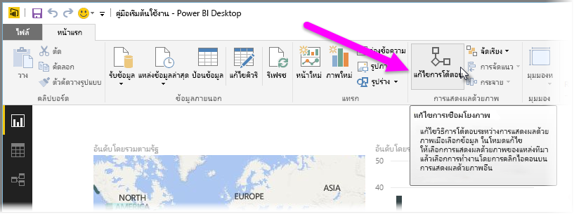
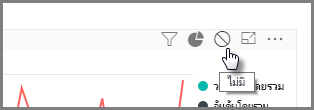
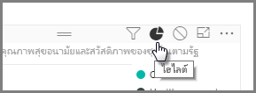
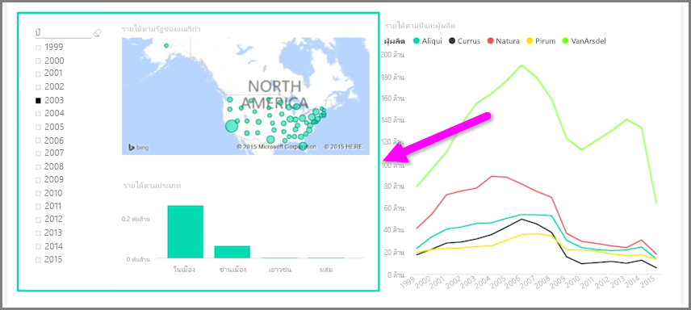

เมื่อคุณมีการจัดรูปแบบการแสดงข้อมูลหลายรายการอยู่บนหน้ารายงานเดียวกัน การเลือกส่วนเฉพาะโดยการคลิกหรือการใช้ตัวแบ่งส่วนข้อมูลจะส่งผลต่อการแสดงข้อมูลทั้งหมดบนหน้านั้น ในบางกรณี คุณอาจต้องการแบ่งส่วนการแสดงผลด้วยภาพเฉพาะ โดยเฉพาะอย่างยิ่งเมื่อใช้องค์ประกอบ เช่น แผนภูมิการลงจุดกระจาย ที่การจำกัดข้อมูลให้อยู่ในเฉพาะส่วนจะนำความหมายที่สำคัญออก โชคดีที่ Power BI Desktop ช่วยให้คุณสามารถควบคุมการโต้ตอบระหว่างการแสดงข้อมูลได้

เมื่อต้องการเปลี่ยนการโต้ตอบระหว่างการจัดรูปแบบการแสดงข้อมูลของคุณ ให้เลือก **แก้ไข** จากส่วนการแสดงข้อมูลของ Ribbon **หน้าแรก** เพื่อเปิด **โหมดแก้ไข**

>[!NOTE]
>ไอคอน **แก้ไขการโต้ตอบ** ใน Power BI Desktop มีการเปลี่ยนแปลงตั้งแต่ตอนบันทึกวิดีโอ
> 
> 

ในตอนนี้ เมื่อคุณเลือกการแสดงข้อมูลบนพื้นที่รายงานของคุณ คุณจะเห็นไอคอน*ตัวกรอง*ทึบแสงขนาดเล็กที่มุมขวาบนของการแสดงข้อมูลอื่นทั้งหมดที่ได้รับผลกระทบ เมื่อต้องการยกเว้นการแสดงผลด้วยภาพจากการโต้ตอบ ให้คลิกสัญลักษณ์ *ไม่มี* ที่มุมขวาบน ใกล้กับไอคอน*ตัวกรอง*

ในบางอินสแตนซ์ คุณสามารถปรับชนิดของการโต้ตอบตัวกรองที่เกิดขึ้นระหว่างการแสดงข้อมูล เมื่อ**โหมดแก้ไข**เปิดอยู่ ให้เลือกการแสดงผลด้วยภาพที่คุณใช้ในการกรอง ถ้าคุณเปลี่ยนชนิดของการโต้ตอบบนการแสดงข้อมูลอื่น ไอคอน*แผนภูมิวงกลม*จะปรากฏอยู่ถัดจากไอคอนตัวกรองที่มุมขวาบน

คลิกไอคอน*แผนภูมิวงกลม*เพื่อเน้นข้อมูลที่แบ่งส่วนแล้ว มิฉะนั้น ข้อมูลจะถูกกรอง เหมือนกับก่อนหน้านี้ คุณสามารถคลิกไอคอน *ไม่มี* เพื่อนำการโต้ตอบทั้งหมดออก

เคล็ดลับการออกแบบที่เป็นประโยชน์คือให้วาดรูปร่างโปร่งแสงรอบๆ การแสดงข้อมูลที่โต้ตอบกันและกัน ดังนั้น ผู้ใช้จึงเห็นได้อย่างชัดเจนว่ามีความสัมพันธ์การโต้ตอบ

