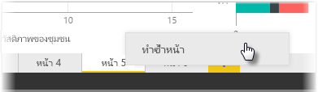

แต่ละหน้าของรายงานอาจค่อนข้างซับซ้อน ด้วยการจัดรูปแบบการแสดงข้อมูลแบบหลายรายการที่โต้ตอบในลักษณะเฉพาะและมีการจัดรูปแบบที่แม่นยำ ในบางครั้งคุณอาจต้องใช้การแสดงผลด้วยภาพและเค้าโครงเดียวกันสำหรับหัวข้อของหน้าที่แตกต่างกันสองหน้าเมื่อสร้างรายงาน ตัวอย่างเช่น ถ้าคุณเพิ่งรวบรวมหน้ารายงานรายได้รวม คุณอาจต้องการหน้าที่แทบจะเหมือนกันทุกประการเกี่ยวกับรายได้สุทธิ

การทำงานซ้ำทั้งหมดอีกครั้งเป็นเรื่องยุ่งยาก แต่ด้วย Power BI Desktop คุณสามารถทำสำเนาหน้ารายงานได้

เพียงคลิกขวาบนแท็บที่คุณต้องการทำสำเนาและเลือก **ทำซ้ำหน้า**

แล้วคุณจึงจะสามารถเปลี่ยนชื่อแท็บหน้าใหม่ให้เหมาะสม อัปเดตชื่อข้อความถ้ามี แล้วจึงอัปเดตเขตข้อมูลใหม่ที่คุณต้องการติดตามในการแสดงผลด้วยภาพของคุณ

