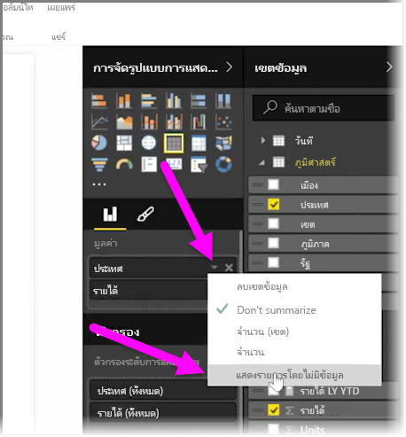
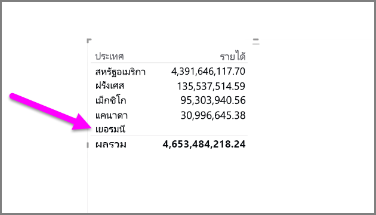
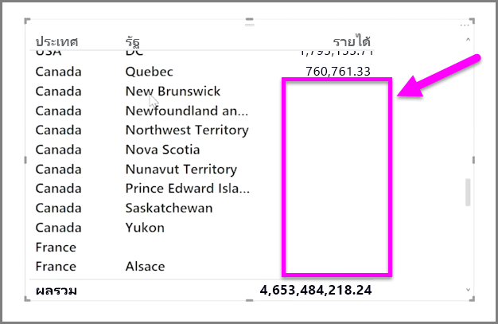

ตามค่าเริ่มต้นแล้ว ส่วนหัวของคอลัมน์จะแสดงในรายงานของคุณก็ต่อเมื่อคอลัมน์เหล่านั้นมีข้อมูล ตัวอย่างเช่น ถ้าคุณกำลังแสดงรายได้ตามประเทศและไม่มียอดขายในประเทศนอร์เวย์ คอลัมน์ประเทศนอร์เวย์ก็จะไม่ปรากฏในการจัดรูปแบบการแสดงข้อมูลของคุณ

เมื่อต้องการแสดงประเภทที่ว่างเปล่า ให้คลิกลูกศรชี้ลงในเขตข้อมูลที่คุณต้องเปลี่ยนในบานหน้าต่าง **การจัดรูปแบบการแสดงข้อมูล** และเลือก **แสดงรายการที่ไม่มีข้อมูล**

แล้วคอลัมน์ที่ว่างเปล่าทุกคอลัมน์จะแสดงในการแสดงผลด้วยภาพของคุณพร้อมค่าว่าง

เมื่อคุณเลือก **แสดงรายการที่ไม่มีข้อมูล** สำหรับทุกเขตข้อมูลในบานหน้าต่าง **การจัดรูปแบบการแสดงข้อมูล** การตั้งค่านี้จะถูกนำไปใช้กับทุกเขตข้อมูลที่แสดงในบานหน้าต่างการจัดรูปแบบการแสดงข้อมูล ดังนั้นถ้าคุณเพิ่มเขตข้อมูลใหม่ รายการที่ไม่มีข้อมูลจะแสดงด้วยโดยไม่ต้องเข้าไปทีเมนูดรอปดาวน์อีกครั้ง

