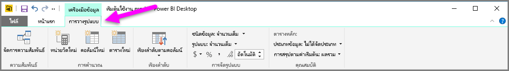
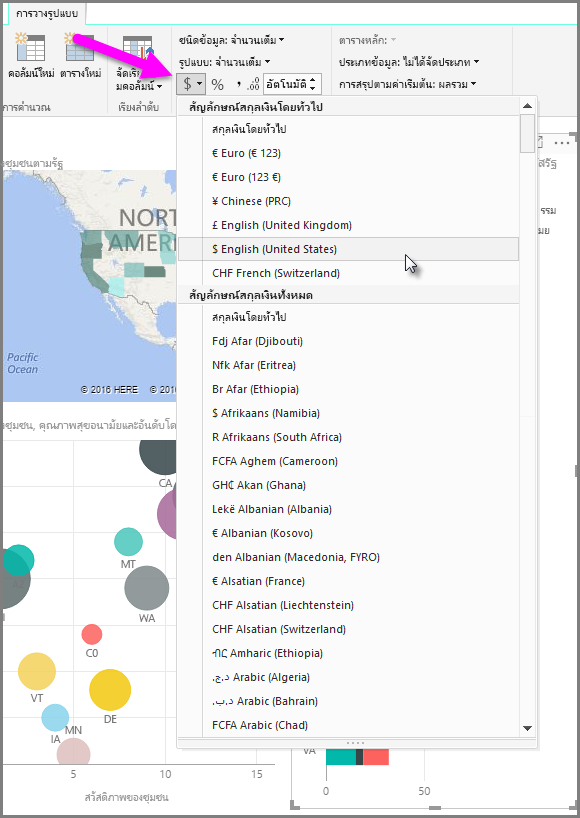
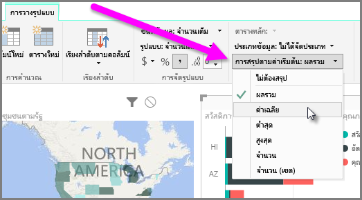
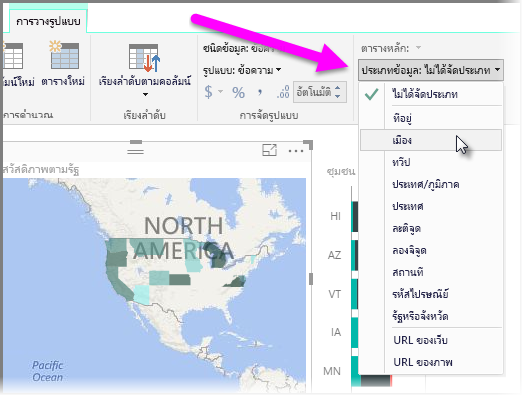

Power BI มีคุณสมบัติที่คุณสามารถกำหนดให้กับเขตข้อมูลในรูปแบบของคุณ ซึ่งสามารถช่วยรายงานและแสดงภาพ และนำเสนอข้อมูลในแบบที่ชัดเจนมากขึ้น ตัวอย่างเช่น บางครั้งคุณต้องการเฉลี่ยรายการของกลุ่มตัวเลข แต่ Power BI รวมผลรวมของรายการนั้นโดยอัตโนมัติ ด้วย Power BI คุณสามารถปรับแต่งวิธีสรุปรายการตัวเลขเหล่านั้นได้

## การควบคุมตัวเลขในการสรุป
มาลองแสดงตัวอย่างและสาธิตวิธีควบคุมการสรุปเขตข้อมูลตัวเลขของ Power BI

เลือกการแสดงผลด้วยภาพบนพื้นที่ทำงานของรายงานของคุณแล้วจึงเลือกเขตข้อมูลในบานหน้าต่าง **เขตข้อมูล** แท็บ **การวางรูปแบบ** ปรากฏใน Ribbon และแสดงตัวเลือกสำหรับการจัดรูปแบบข้อมูลและคุณสมบัติข้อมูล

คุณสามารถเลือกชนิดของสัญลักษณ์สกุลเงินที่ใช้โดยการเลือกดรอปดาวน์สัญลักษณ์สกุลเงินที่แสดงในรูปภาพต่อไปนี้

มีตัวเลือกมากมายแตกต่างกันไปสำหรับการจัดรูปแบบเขตข้อมูล ตัวอย่างเช่น คุณสามารถเปลี่ยนรูปแบบจากสกุลเงินเป็นเปอร์เซ็นต์ได้

คุณสามารถเปลี่ยนวิธีที่ Power BI สรุปข้อมูลได้ด้วยเช่นกัน เลือกไอคอน **การสรุปตามค่าเริ่มต้น** เพื่อเปลี่ยนแปลงวิธีสรุปเขตข้อมูล รวมถึงการแสดงผลรวม จำนวน หรือค่าเฉลี่ย

## จัดการและทำให้ข้อมูลตำแหน่งที่ตั้งของคุณเข้าใจง่าย
คุณสามารถเปลี่ยนแปลงสิ่งที่คล้ายกันได้เมื่อลงตำแหน่งบนแผนที่ เลือกแผนที่ของคุณ แล้วจึงเลือกเขตข้อมูลในบานหน้าต่าง **เขตข้อมูล** ที่คุณใช้สำหรับค่า *ตำแหน่งที่ตั้ง* ในแท็บ **การวางรูปแบบ** ให้เลือก **ประเภทข้อมูล** จากนั้นเลือกประเภทที่แสดงข้อมูลตำแหน่งที่ตั้งของคุณจากเมนูดรอปดาวน์ ตัวอย่างเช่น เลือกรัฐ เขตปกครอง หรือเมือง

