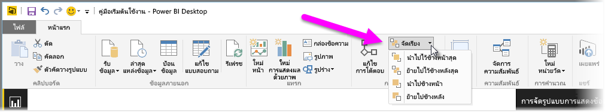
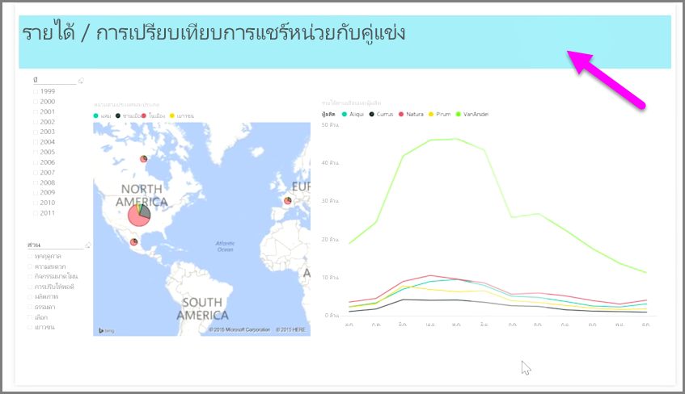

เมื่อคุณมีองค์ประกอบมากมายในรายงาน Power BI จะช่วยให้คุณสามารถจัดการวิธีทับซ้อนองค์ประกอบได้ วิธีการจัดชั้นหรือจัดให้องค์ประกอบหนึ่งอยู่ด้านบนของอีกองค์ประกอบหนึ่งมักเรียกว่าการจัดลำดับแบบ z

เมื่อต้องการจัดลำดับแบบ z ขององค์ประกอบในรายงาน ให้เลือกองค์ประกอบแล้วใช้ปุ่ม **จัดเรียง** บนแท็บ **หน้าแรก** ของ Ribbon เพื่อเปลี่ยนลำดับแบบ z ขององค์ประกอบ

ด้วยการใช้ตัวเลือกในเมนูปุ่ม **จัดเรียง** คุณสามารถจัดลำดับองค์ประกอบในรายงานของคุณในแบบที่คุณต้องการ คุณสามารถย้ายการแสดงผลด้วยภาพหนึ่งเลเยอร์ไปข้างหน้าหรือข้างหลัง หรือส่งไปหน้าสุดของด้านหลังลำดับ

การใช้ปุ่มจัดเรียงจะมีประโยชน์อย่างยิ่งเมื่อใช้รูปร่างเป็นพื้นหลังตกแต่งหรือเส้นขอบ หรือเพื่อเน้นส่วนใดส่วนหนึ่งของแต่ละแผนภูมิหรือกราฟ คุณยังสามารถใช้เพื่อสร้างพื้นหลัง อย่างเช่น สี่เหลี่ยมผืนผ้าสีฟ้าต่อไปนี้ที่ใช้เป็นพื้นหลังของรายงาน

