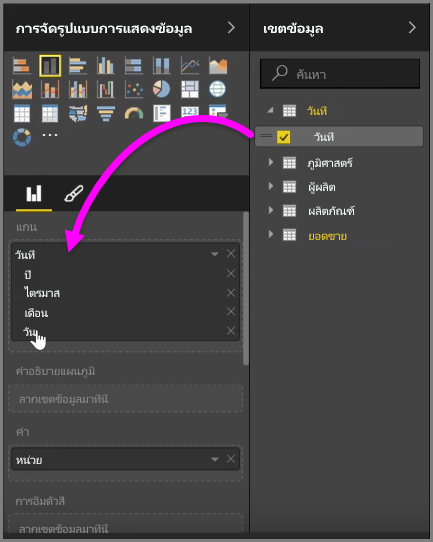
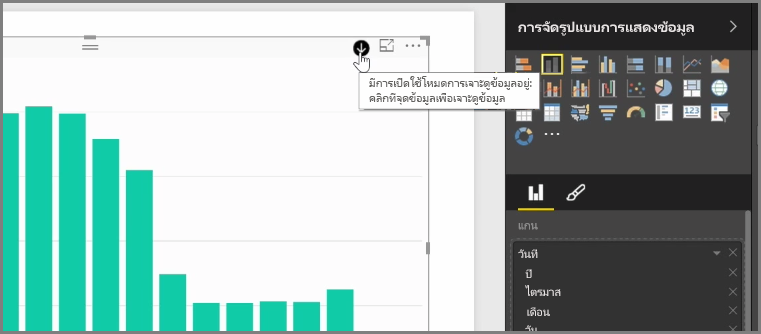
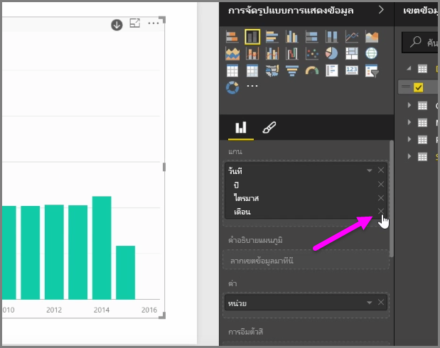
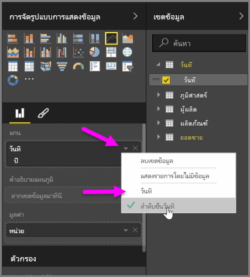
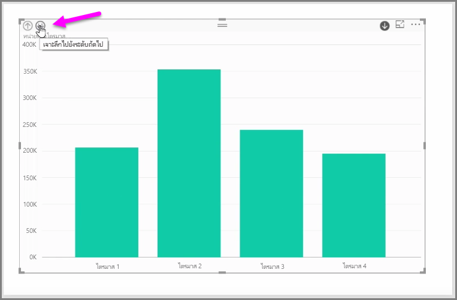

เมื่อคุณเพิ่มเขตข้อมูล*วันที่*ไปยังการแสดงผลด้วยภาพในบักเก็ตเขตข้อมูล*แกน* Power BI จะเพิ่มลำดับชั้นเวลาที่รวมถึง*ปี* *ไตรมาส* *เดือน* และ*วัน* โดยอัตโนมัติ ด้วยการทำเช่นนี้ Power BI จะช่วยให้การแสดงผลด้วยภาพของคุณมีปฏิสัมพันธ์ตามเวลากับผู้ที่ดูรายงานของคุณ โดยให้ผู้ใช้ดูรายละเอียดแนวลึกผ่านระดับเวลาที่ต่างกัน

ด้วยลำดับชั้นที่พร้อมแล้ว คุณสามารถเริ่มดูรายละเอียดแนวลึกผ่านลำดับชั้นของเวลาได้ ตัวอย่างเช่น การคลิกปีในแผนภูมิจะดูรายละเอียดแนวลึกไปยังระดับถัดไปในลำดับชั้น ซึ่งในกรณีนี้คือ*ไตรมาส*ที่จะแสดงในการแสดงผลด้วยภาพ

ในลำดับชั้นที่สร้างขึ้นโดยอัตโนมัติ คุณยังสามารถจัดการว่ารายงานที่แชร์อนุญาตให้ผู้อื่นสามารถดูรายละเอียดแนวลึกได้ถึงระดับใด เมื่อต้องการทำเช่นนี้ เพียงคลิก X ข้างลำดับชั้นที่คุณต้องการนำออกในบานหน้าต่างการจัดรูปแบบการแสดงข้อมูล ระดับที่ถูกลบจะถูกนำออกจากรายงานและการดูรายละเอียดแนวลึกจะไม่แสดงระดับดังกล่าวอีกต่อไป

ถ้าคุณต้องการนำระดับของลำดับชั้นนั้นกลับมา เพียงนำเขตข้อมูล*วันที่* ออก จากนั้นเพิ่มเข้าไปอีกครั้งจากบานหน้าต่าง**เขตข้อมูล** แล้วลำดับชั้นจะสร้างขึ้นให้คุณโดยอัตโนมัติ

บางครั้งคุณอาจไม่ต้องการใช้ลำดับชั้นสำหรับการแสดงผลด้วยภาพ คุณสามารถควบคุมได้โดยปุ่มลูกศรชี้ลงข้างเขตข้อมูล*วันที่* (เมื่อคุณได้เพิ่มเขตข้อมูลไปยังการแสดงผลด้วยภาพแล้ว) และเลือก**วันที่** แทนที่จะเป็น**ลำดับชั้นวันที่** ซึ่งจะพร้อมท์ให้ Power BI แสดงค่าวันที่ดิบในการแสดงผลด้วยภาพ

นอกจากนี้คุณยังสามารถขยายองค์ประกอบข้อมูลทั้งหมดที่มองเห็นอยู่ได้ในครั้งเดียวแทนการเลือกไตรมาสเดียวหรือปีเดียว เมื่อต้องการทำเช่นนั้น ให้เลือกไอคอน *ดูรายละเอียดแนวลึกทั้งหมด* ที่ด้านซ้ายบนของการแสดงผลด้วยภาพที่เป็นไอคอนลูกศรชี้ลงสองอัน

