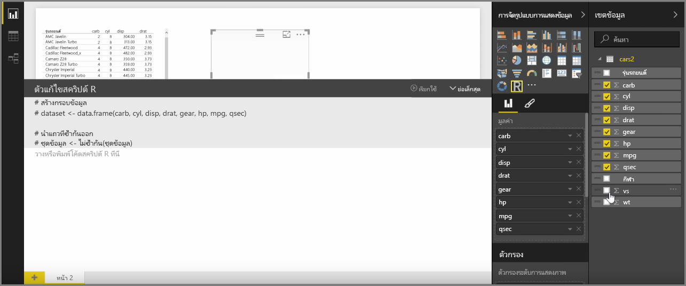
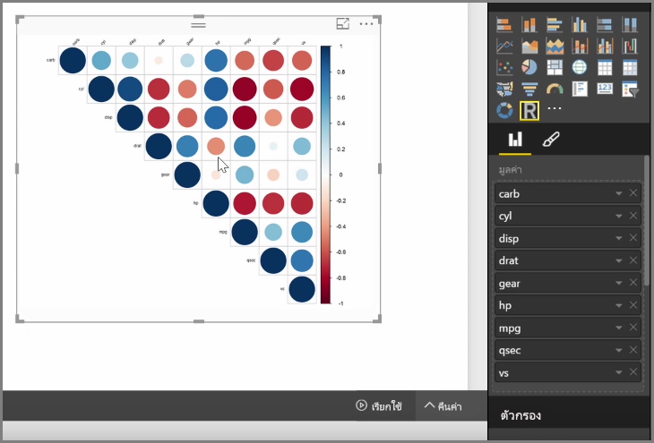
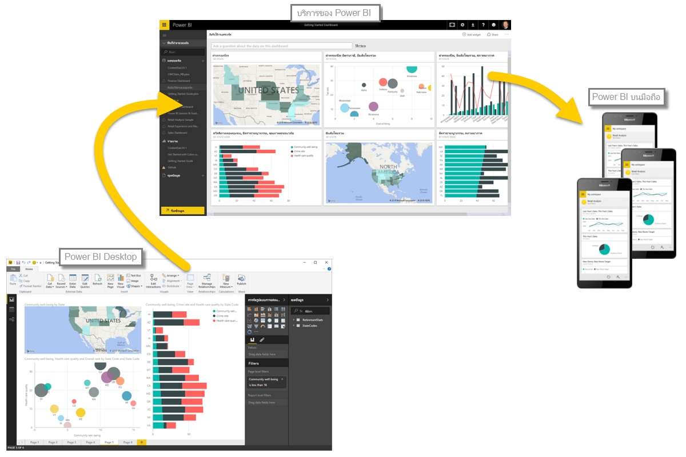

ด้วย Power BI Desktop คุณสามารถวิเคราะห์เชิงวิเคราะห์และวิเคราะห์เชิงสถิติและสร้างการแสดงผลด้วยภาพที่น่าสนใจโดยผสานรวมกับ R คุณสามารถโฮสต์การจัดรูปแบบการแสดงข้อมูลแบบ R เหล่านั้นภายในรายงาน Power BI Desktop

เมื่อคุณเลือกไอคอน **การแสดงผลด้วยภาพแบบ R** จากบานหน้าต่าง **การจัดรูปแบบการแสดงข้อมูล** Power BI จะสร้างตัวแทนบนพื้นที่ทำงานเพื่อโฮสต์การแสดงผลด้วยภาพแบบ R ของคุณ แล้วจึงแสดงตัวแก้ไขสคริปต์ R ให้คุณใช้บนพื้นที่ทำงานได้โดยตรง เมื่อคุณเพิ่มเขตข้อมูลลงในการแสดงผลด้วยภาพแบบ R, Power BI Desktop จะเพิ่มเขตข้อมูลลงในบานหน้าต่างตัวแก้ไขสคริปต์ R

ภายใต้สิ่งที่ Power BI สร้างขึ้นใน ตัวแก้ไขสคริปต์ R คุณสามารถเริ่มต้นสร้างสคริปต์ R ของคุณเพื่อสร้างการแสดงผลด้วยภาพ เมื่อสคริปต์ของคุณเสร็จสมบูรณ์ ให้เลือก **เรียกใช้** แล้วเหตุการณ์ต่อไปนี้จะเกิดขึ้น:

1. ข้อมูลที่เพิ่มเข้าไปยังการแสดงผลด้วยภาพ (จากบานหน้าต่าง **เขตข้อมูล**) ส่งมาจาก Power BI Desktop เพื่อการติดตั้ง R ภายในเครื่อง
2. สคริปต์ที่สร้างในตัวแก้ไขสคริปต์ R ของ Power BI Desktop ทำงานบนการติดตั้ง R ภายในเครื่อง
3. จากนั้น Power BI Desktop จะได้รับการแสดงผลด้วยภาพกลับมาจากการติดตั้ง R และแสดงบนพื้นที่ทำงาน

ทั้งหมดเกิดขึ้นค่อนข้างรวดเร็วและผลจะปรากฏในการจัดรูปแบบการแสดงข้อมูล**การแสดงผลด้วยภาพแบบ R** บนพื้นที่ทำงาน

คุณสามารถเปลี่ยนแปลงการแสดงผลด้วยภาพแบบ R โดยการปรับสคริปต์ R แล้วจึงเลือก **เรียกใช้** อีกครั้ง ในรูปต่อไปนี้ เราได้เปลี่ยนแปลงการแสดงผลด้วยภาพ เพื่อแสดงวงกลมแทนที่สี่เหลี่ยม

และเนื่องจากการแสดงผลด้วยภาพแบบ R นั้นเหมือนกันกับการแสดงผลด้วยภาพอื่นๆ ใน Power BI Desktop คุณสามารถโต้ตอบกับการแสดงผลด้วยภาพแบบ R และเชื่อมต่อกับการแสดงผลด้วยภาพอื่นๆ บนพื้นที่ทำงานได้ด้วยเช่นกัน เมื่อคุณโต้ตอบกับการแสดงผลด้วยภาพอื่นๆ บนพื้นที่ทำงานผ่านตัวกรองหรือการเน้น การแสดงผลด้วยภาพแบบ R จะตอบสนองเหมือนการแสดงผลด้วยภาพ Power BI อื่นๆ โดยอัตโนมัติโดยไม่จำเป็นต้องปรับสคริปต์ R

ซึ่งเป็นวิธีที่ยอดเยี่ยมในการใช้พลังของ R โดยตรงใน Power BI Desktop

## ขั้นตอนถัดไป
**ยินดีด้วย!** คุณได้เรียนรู้ส่วน**การจัดรูปแบบการแสดงข้อมูล**ของหลักสูตร**การเรียนรู้ตามคำแนะนำ**สำหรับ Power BI เสร็จสมบูรณ์แล้ว คุณสามารถพิจารณาตัวเองว่ามีความรอบรู้ในการจัดรูปแบบการแสดงข้อมูลหลายแบบที่มีใน Power BI แล้ว และยังมีความรู้เกี่ยวกับวิธีการใช้ ปรับเปลี่ยน และกำหนดการจัดรูปแบบการแสดงข้อมูลด้วยตนเองอีกด้วย ข่าวดี: การจัดรูปแบบการแสดงข้อมูลมีพื้นฐานเหมือนกันใน Power BI Desktop และบริการของ Power BI ดังนั้นสิ่งที่คุณเรียนรู้สามารถนำไปใช้ได้กับทั้งคู่

ตอนนี้คุณก็พร้อมแล้วที่จะไปยังระบบคลาวด์และจดจ่อกับบริการของ Power BI ที่คุณสามารถ**สำรวจข้อมูล**ได้ ตามที่คุณทราบ โฟลว์ของงานมีลักษณะดังต่อไปนี้:

* นำข้อมูลเข้าไปยัง **Power BI Desktop** และสร้างรายงาน
* เผยแพร่ไปยังบริการของ Power BI ที่คุณสามารถสร้าง**การจัดรูปแบบการแสดงข้อมูล**ใหม่ได้ และสร้างแดชบอร์ด
* **แชร์**แดชบอร์ดของคุณกับผู้อื่น โดยเฉพาะผู้ที่กำลังเดินทาง
* ดูและโต้ตอบกับแดชบอร์ดและรายงานที่แชร์ในแอป **Power BI บนมือถือ**

ไม่ว่าคุณจะสร้างรายงานหรือเพียงแค่ดูและโต้ตอบกับรายงาน ตอนนี้คุณก็ได้รู้วิธีการสร้างการแสดงผลด้วยภาพสุดเจ๋ง และวิธีการเชื่อมต่อการแสดงผลด้วยภาพเข้ากับข้อมูล ถัดไปเราจะได้เห็นการแสดงผลด้วยภาพและรายงานในการดำเนินการ

พบกันในส่วนถัดไป!

