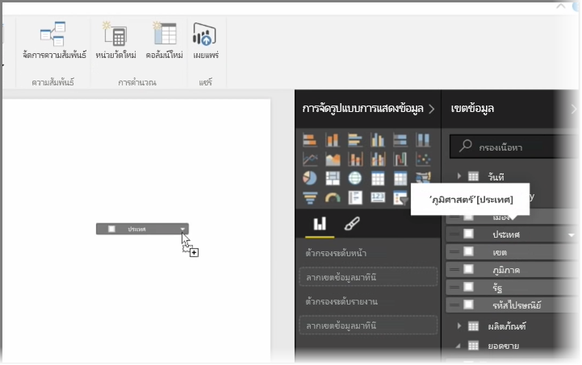
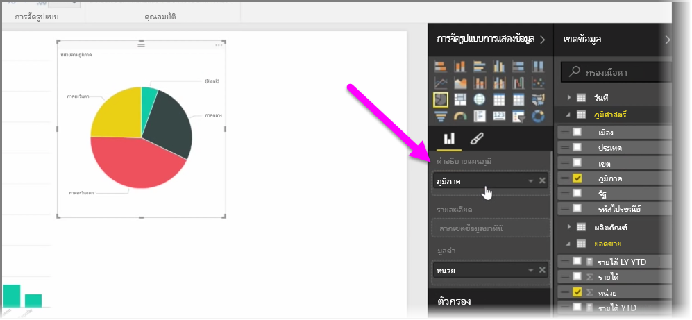
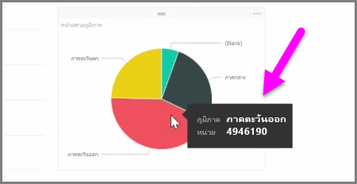
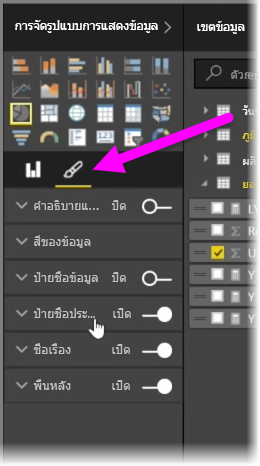

ในบทความนี้คุณจะได้เรียนรู้วิธีสร้างแผนภูมิแท่ง แผนภูมิวงกลม และแผนภูมิทรีแมป และการปรับแต่งแผนภูมิให้เหมาะสมกับรายงานของคุณ

มีวิธีการสร้างการจัดรูปแบบการแสดงข้อมูลใหม่ใน Power BI Desktop สองวิธีคือ:

* คุณสามารถลากชื่อเขตข้อมูลจากบานหน้าต่าง **เขตข้อมูล** และวางลงในพื้นที่ทำงานของรายงาน ตามค่าเริ่มต้น การจัดรูปแบบการแสดงข้อมูลของคุณจะปรากฏเป็นตารางข้อมูล
  
  
* คุณยังสามารถคลิกชนิดการจัดรูปแบบการแสดงข้อมูลที่คุณต้องการสร้างในบานหน้าต่าง **การจัดรูปแบบการแสดงข้อมูล** ด้วยวิธีนี้ ค่าเริ่มต้นของการแสดงผลด้วยภาพจะเป็นตัวแทนว่างเปล่าที่เหมือนกับชนิดของการแสดงผลด้วยภาพที่คุณเลือก
  
  

เมื่อคุณสร้างกราฟ แผนที่ หรือแผนภูมิของคุณ คุณสามารถเริ่มต้นลากเขตข้อมูลของข้อมูลไปยังส่วนของบานหน้าต่าง **การจัดรูปแบบการแสดงข้อมูล** เพื่อสร้างและจัดการการแสดงผลด้วยภาพของคุณ เขตข้อมูลที่ใช้ได้จะเปลี่ยนตามชนิดของ การจัดรูปแบบการแสดงข้อมูลที่คุณเลือก เมื่อคุณลากและปล่อยเขตข้อมูลของข้อมูล การจัดรูปแบบการแสดงข้อมูลของคุณจะอัปเดตการเปลี่ยนแปลงโดยอัตโนมัติ

คุณสามารถปรับขนาดการจัดรูปแบบการแสดงข้อมูลของคุณโดยการเลือกและลากตัวจัดการเข้าหรือออก คุณยังสามารถย้ายการจัดรูปแบบการแสดงข้อมูลของคุณไปได้ทุกที่บนพื้นที่ทำงานโดยการคลิกและลาก ถ้าคุณต้องการแปลงชนิดการจัดรูปแบบการแสดงข้อมูลเป็นชนิดอื่น ให้เลือกการแสดงผลด้วยภาพที่คุณต้องการเปลี่ยนแปลง และเลือกการแสดงผลด้วยภาพอื่นจากไอคอนในบานหน้าต่าง **การจัดรูปแบบการแสดงข้อมูล** Power BI จะพยายามแปลงเขตข้อมูลที่คุณเลือกเป็นการแสดงผลด้วยภาพชนิดใหม่ที่ใกล้เคียงที่สุดเท่าที่จะเป็นไปได้

เมื่อคุณโฮเวอร์เหนือส่วนการจัดรูปแบบการแสดงข้อมูลของคุณ คุณจะได้รับคำแนะนำเครื่องมือที่มีรายละเอียดเกี่ยวกับส่วนนั้น เช่น ป้ายกำกับและค่าทั้งหมด

เลือกไอคอน **พู่กัน** บนบานหน้าต่าง **การจัดรูปแบบการแสดงข้อมูล** เพื่อเปลี่ยนแปลงลักษณะการแสดงผลด้วยภาพของคุณ เช่น การจัดแนวพื้นหลัง ข้อความหัวข้อ และสีข้อมูล

ตัวเลือกการเปลี่ยนแปลงลักษณะการแสดงผลด้วยภาพที่พร้อมใช้งานขึ้นอยู่กับชนิดการแสดงผลด้วยภาพที่คุณเลือก

