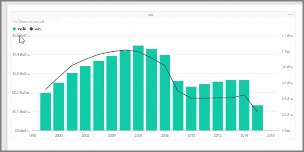
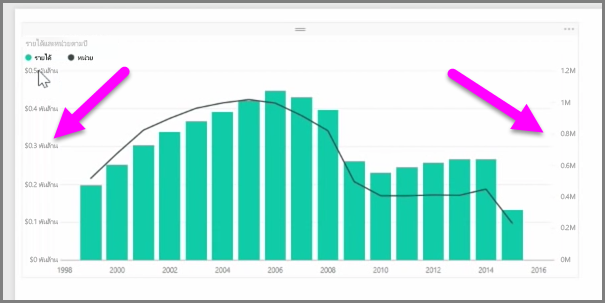
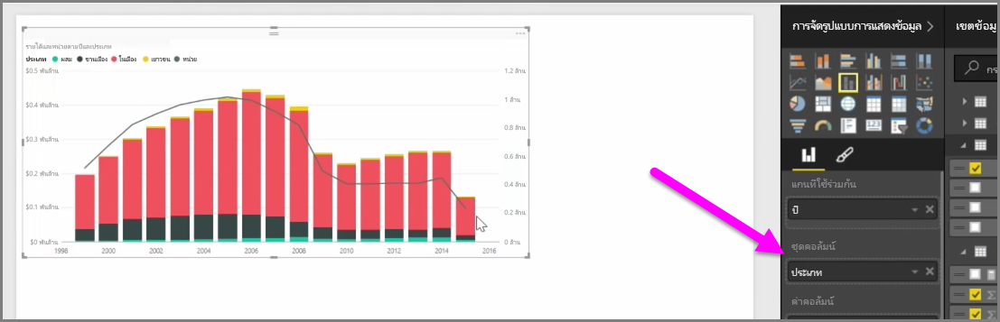

เมื่อคุณต้องการแสดงภาพสองหน่วยวัดที่มีมาตราส่วนแตกต่างกันมาก เช่น รายได้และหน่วย **แผนภูมิผสม** ที่แสดงเส้นและแท่งด้วยมาตราส่วนแกนที่แตกต่างกันจะมีประโยชน์มาก Power BI รองรับแผนภูมิผสมหลายชนิดแตกต่างกันตามค่าเริ่มต้น รวมถึงแผนภูมิ**เส้น**และแผนภูมิ**คอลัมน์แบบเรียงซ้อน**

เมื่อคุณสร้างแผนภูมิผสมคุณจะเห็นเขตข้อมูลสำหรับ**แกนที่ใช้ร่วมกัน** (แกน X) และค่าสำหรับเขตข้อมูลสองเขตข้อมูลของคุณซึ่งในกรณีนี้เป็นคอลัมน์และเส้น คำอธิบายแผนภูมิแกน Y สองรายการจะปรากฏที่ข้างใดข้างหนึ่งของการจัดรูปแบบการแสดงข้อมูล

คุณยังสามารถแยกคอลัมน์ตามประเภทโดยการลากประเภทลงในเขตข้อมูลชุดคอลัมน์ในบานหน้าต่างการจัดรูปแบบการแสดงข้อมูล เมื่อทำเช่นนั้น แต่ละแท่งจะมีสีตามสัดส่วนตามค่าภายในแต่ละประเภท

แผนภูมิผสมเป็นวิธีที่มีประสิทธิภาพในการแสดงภาพแบบหลายหน่วยวัดที่มีมาตราส่วนแตกต่างกันมากในการจัดรูปแบบการแสดงข้อมูลเดียว

