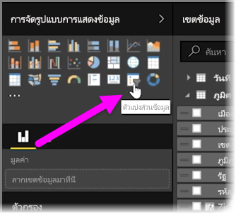
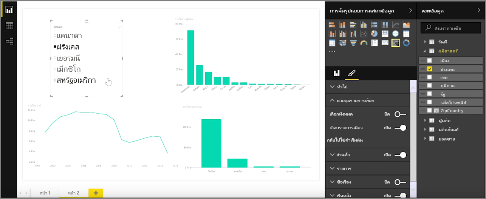
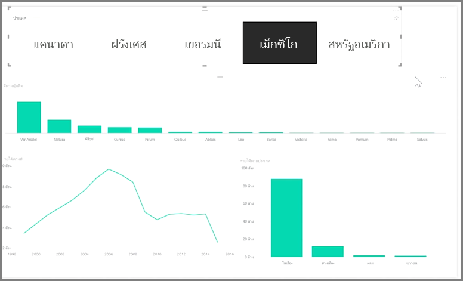

ตัวแบ่งส่วนข้อมูลเป็นหนึ่งในชนิดการจัดรูปแบบการแสดงข้อมูลที่มีประสิทธิภาพมากที่สุดโดยเฉพาะอย่างยิ่งเมื่อเป็นส่วนหนึ่งของรายงานที่ซับซ้อน **ตัวแบ่งส่วนข้อมูล**เป็นตัวกรองการแสดงผลด้วยภาพบนพื้นที่ทำงานใน **Power BI Desktop** ที่ช่วยให้ทุกคนสามารถดูรายงาน ในส่วนของข้อมูลตามค่าที่เฉพาะเจาะจง เช่น ตามปีหรือตามตำแหน่งที่ตั้งทางภูมิศาสตร์

เมื่อต้องการเพิ่มตัวแบ่งส่วนข้อมูลไปยังรายงานของคุณ ให้เลือก **ตัวแบ่งส่วนข้อมูล** จากบานหน้าต่าง **การจัดรูปแบบการแสดงข้อมูล**

ลากเขตข้อมูลที่คุณต้องการแบ่งและวางเขตข้อมูลนั้นด้านบนของตัวแทนตัวแบ่งส่วนข้อมูล การจัดรูปแบบการแสดงข้อมูลจะเปลี่ยนเป็นรายการองค์ประกอบที่มีกล่องกาเครื่องหมาย องค์ประกอบเหล่านี้คือตัวกรองของคุณ - เลือกกล่องถัดจากส่วนหนึ่ง แล้วการจัดรูปแบบการแสดงข้อมูลส่วนอื่นทั้งหมดในหน้ารายงานเดียวกันจะถูกกรอง หรือ*แบ่ง*ตามการเลือกของคุณ

มีตัวเลือกอื่นๆ เล็กน้อยสำหรับการจัดรูปแบบตัวแบ่งส่วนข้อมูลของคุณ คุณสามารถตั้งค่าให้ตัวแบ่งส่วนข้อมูลยอมรับการป้อนหลายข้อมูลในครั้งเดียว หรือสลับเป็นโหมด **เลือกรายการเดียว** เพื่อใช้การป้อนข้อมูลครั้งละหนึ่งรายการ คุณยังสามารถเพิ่มตัวเลือก **เลือกทั้งหมด** ไปยังองค์ประกอบตัวแบ่งส่วนข้อมูลของคุณซึ่งจะเป็นประโยชน์เมื่อคุณมีรายการที่ยาวเป็นพิเศษ เปลี่ยนการวางแนวตัวแบ่งของคุณจากค่าเริ่มต้นแนวตั้งเป็นแนวนอน แล้วตัวแบ่งจะกลายเป็นแถบการเลือกแทนที่รายการตรวจสอบ

