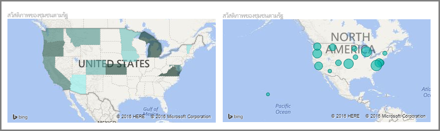
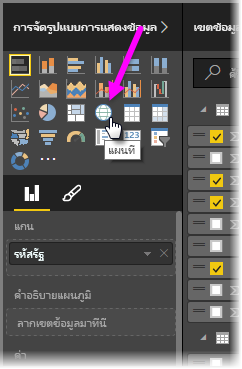
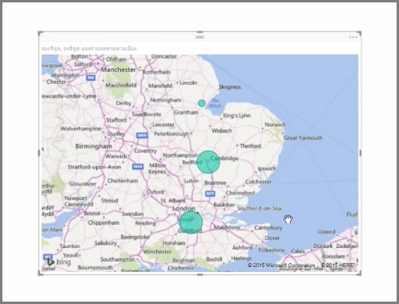
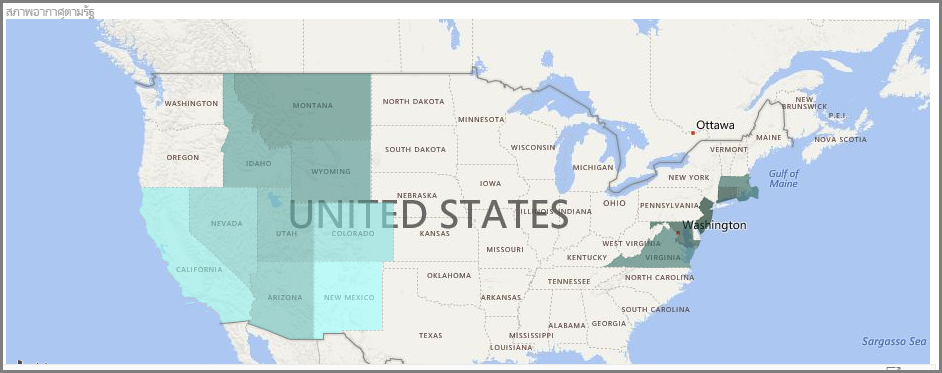
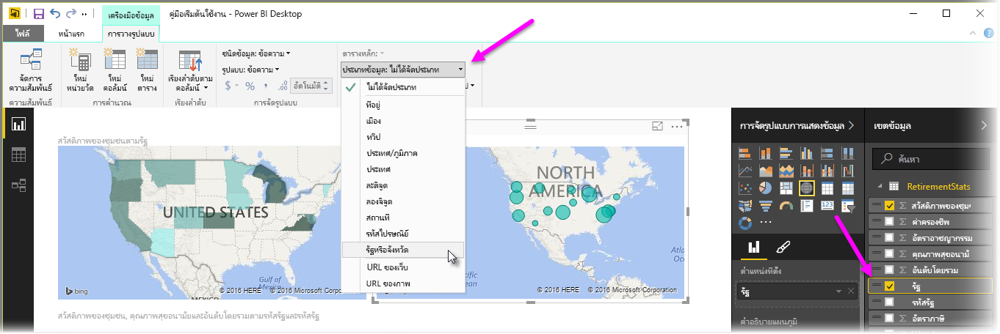

Power BI มีการจัดรูปแบบการแสดงข้อมูลแผนที่ที่แตกต่างกันอยู่สองชนิดคือ: แผนที่แบบฟองที่วางฟองเหนือจุดทางภูมิศาสตร์ และแผนที่รูปร่างที่แสดงเค้าร่างของพื้นที่ที่คุณต้องการแสดงภาพ

> [!NOTE]
> เมื่อทำงานกับประเทศหรือภูมิภาค ให้ใช้ตัวย่อสามตัวเพื่อให้แน่ใจว่าการเข้ารหัสทางภูมิศาสตร์ทำงานได้อย่างถูกต้องในการจัดรูปแบบการแสดงข้อมูลแผนที่ *อย่า*ใช้ตัวย่อสองตัวอักษร เนื่องจากอาจไม่รู้จักบางประเทศหรือบางภูมิภาค
> ถ้าคุณมีเพียงตัวย่อสองตัว ให้ดู[บล็อกโพสต์ภายนอกนี้](https://blog.ailon.org/how-to-display-2-letter-country-data-on-a-power-bi-map-85fc738497d6#.yudauacxp)สำหรับขั้นตอนวิธีการเชื่อมโยงตัวย่อประเทศ/ภูมิภาคแบบสองตัวของคุณเข้ากับตัวย่อประเทศ/ภูมิภาคแบบสามตัว
> 
> 

## สร้างแผนที่แบบฟอง
เมื่อต้องการสร้างแผนที่แบบฟอง ให้เลือกตัวตัวเลือก **แผนที่** ในบานหน้าต่าง **การจัดรูปแบบการแสดงข้อมูล** คุณต้องเพิ่มค่าไปยังบักเก็ต *ตำแหน่งที่ตั้ง* ในตัวเลือก **การจัดรูปแบบการแสดงข้อมูล** เพื่อใช้การแสดงผลด้วยภาพแผนที่

Power BI มีความยืดหยุ่นเกี่ยวกับชนิดของค่าตำแหน่งที่ตั้งที่ยอมรับ ตั้งแต่รายละเอียดเพิ่มเติม เช่น ชื่อเมืองหรือรหัสสนามบินลงไป จนถึงข้อมูลละติจูดและลองจิจูดที่เฉพาะเจาะจงอย่างมาก เพิ่มเขตข้อมูลไปยังบักเก็ต **ขนาด** เพื่อเปลี่ยนขนาดของฟองตามแต่ละตำแหน่งที่ตั้งของแผนที่

## สร้างแผนที่รูปร่าง
เมื่อต้องการสร้างแผนที่รูปร่าง ให้เลือกตัวเลือก **แผนที่แถบสี** ในบานหน้าต่างการจัดรูปแบบการแสดงข้อมูล เช่นเดียวกับแผนที่แบบฟอง คุณต้องเพิ่มค่าให้กับบักเก็ตตำแหน่งที่ตั้งเพื่อใช้การแสดงผลด้วยภาพนี้ เพิ่มเขตข้อมูลลงในบักเก็ตขนาดเพื่อเปลี่ยนความเข้มของสีเติมโดยสอดคล้องกัน

ไอคอนคำเตือนในมุมบนซ้ายของการแสดงผลด้วยภาพของคุณระบุว่า แผนที่จำเป็นต้องมีข้อมูลตำแหน่งที่ตั้งเพิ่มเติมเพื่อให้ลงค่าได้อย่างแม่นยำ ซึ่งเป็นปัญหาที่พบบ่อยเมื่อข้อมูลในเขตข้อมูลตำแหน่งที่ตั้งของคุณไม่ชัดเจน เช่น ใช้ชื่อพื้นที่อย่าง *วอชิงตัน* ที่อาจหมายถึงรัฐหรือเขต วิธีหนึ่งในการแก้ไขปัญหานี้คือการเปลี่ยนชื่อคอลัมน์ของคุณให้เจาะจงมากขึ้นเช่น *รัฐ* อีกวิธีหนึ่งในการแก้ปัญหาคือการรีเซ็ตประเภทข้อมูลด้วยตนเองโดยการเลือก **ประเภทข้อมูล** ในแท็บการวางรูปแบบ จากนั้นคุณสามารถกำหนดประเภทให้กับข้อมูลของคุณเช่น "รัฐ" หรือ "เมือง"

