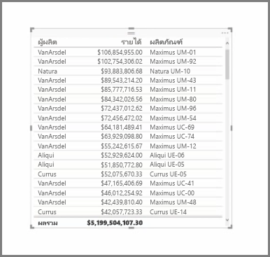
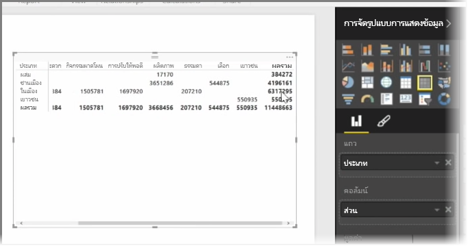

นอกจากแผนภูมิที่มากมายแล้ว Power BI Desktop ยังสนับสนุนการจัดรูปแบบการแสดงข้อมูลแบบตารางเพิ่มเติมอีกด้วย ที่จริงแล้ว เมื่อคุณจับเขตข้อมูลประเภทหรือเขตข้อมูลข้อความแล้วลากลงบนพื้นที่ทำงานของรายงาน คุณจะได้รับตารางผลลัพธ์ตามค่าเริ่มต้น คุณสามารถเลื่อนขึ้นและลงผ่านตารางได้ และตารางจะเรียงลำดับตามตัวอักษรในตอนแรก

หากคุณมีข้อมูลตัวเลขในตาราง เช่น รายได้ ยอดรวมจะปรากฏที่ด้านล่าง คุณสามารถเรียงลำดับตามแต่ละคอลัมน์ด้วยตนเอง โดยคลิกที่ส่วนหัวเพื่อสลับลำดับแบบเรียงจากน้อยไปมาก หรือเรียงจากมากไปน้อย ถ้าคอลัมน์ไม่กว้างพอที่จะแสดงเนื้อหาทั้งหมด ให้คลิกและลากส่วนหัวไปทางด้านข้างเพื่อขยาย

ลำดับของเขตข้อมูลในบักเก็ต *ค่า* ในบานหน้าต่าง **การจัดรูปแบบการแสดงข้อมูล** จะกำหนดลำดับที่ปรากฏในตารางของคุณ

**เมทริกซ์** มีลักษณะคล้ายกับตาราง แต่มีส่วนหัวของประเภทที่แตกต่างบนคอลัมน์และแถว เช่นเดียวกับตาราง ข้อมูลตัวเลขจะถูกรวมโดยอัตโนมัติที่ด้านล่างและด้านขวาของเมทริกซ์

มีตัวเลือกลักษณะจำนวนมากสำหรับเมทริกซ์ เช่น การกำหนดขนาดคอลัมน์อัตโนมัติ การสลับยอดรวมระหว่างแถวและคอลัมน์ การตั้งค่าสี และอื่นๆ เมื่อสร้างเมทริกซ์ให้ตรวจสอบว่าข้อมูลประเภทของคุณ (ข้อมูลที่ไม่ใช่ตัวเลข) อยู่ทางด้านซ้ายของเมทริกซ์และไฟล์ตัวเลขอยู่ทางด้านขวา เพื่อให้แน่ใจว่าแถบเลื่อนแนวนอนจะปรากฏขึ้นและการเลื่อนจะทำงานอย่างถูกต้อง

