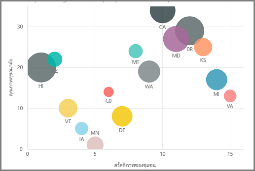
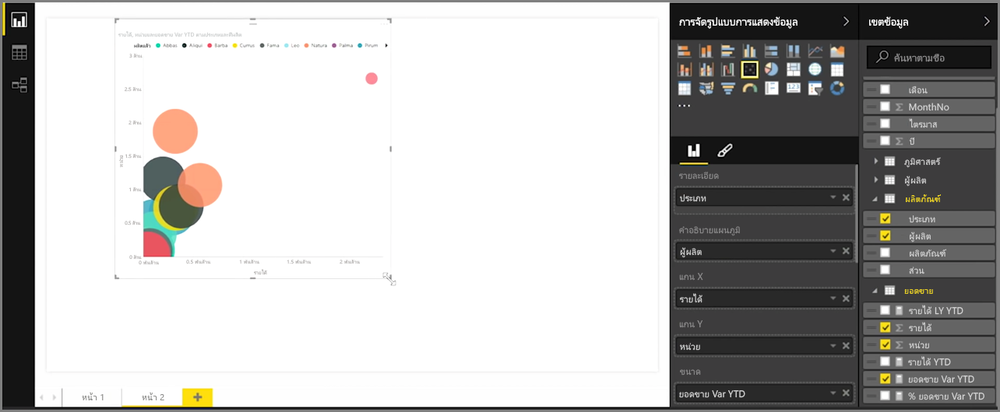
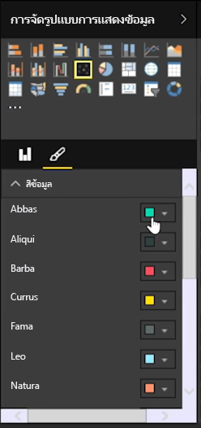
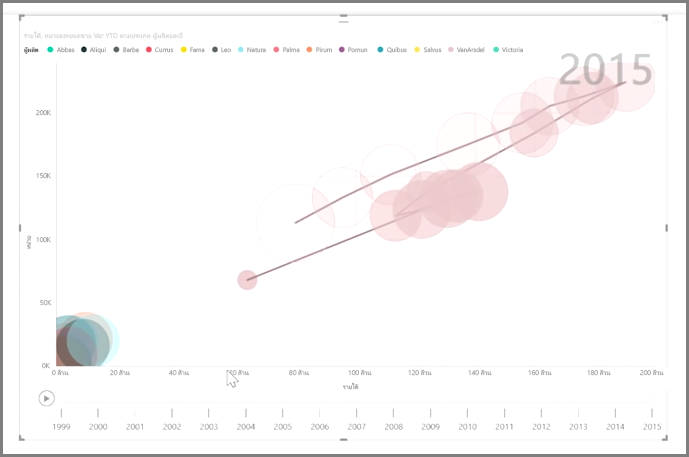

ถ้าคุณต้องการเปรียบเทียบสองหน่วยวัดที่แตกต่างกัน เช่น ยอดขายเป็นหน่วยต่อรายได้ การจัดรูปแบบการแสดงข้อมูลทั่วไปที่จะใช้ได้คือ แผนภูมิกระจาย

เมื่อต้องการสร้างแผนภูมิว่างเปล่า ให้เลือก **แผนภูมิกระจาย** จากบานหน้าต่าง **การจัดรูปแบบการแสดงข้อมูล** ลากและปล่อยสองเขตข้อมูลที่คุณต้องการเปรียบเทียบจากบานหน้าต่าง **เขตข้อมูล** ไปยังบักเก็ตตัวเลือก *แกน X* และ *แกน Y* ในตอนนี้แผนภูมิกระจายของคุณอาจมีฟองเล็กๆ อยู่ตรงกลางของการแสดงผลด้วยภาพ - คุณต้องเพิ่มหน่วยวัดไปยังบักเก็ต *รายละเอียด* เพื่อระบุวิธีที่คุณต้องการแยกส่วนข้อมูลของคุณ ตัวอย่างเช่น ถ้าเปรียบเทียบยอดขายของรายการและรายได้ คุณอาจต้องการแบ่งข้อมูลตามประเภท หรือตามผู้ผลิต หรือตามเดือนที่ขาย

การเพิ่มเขตข้อมูลเพิ่มเติมไปยังบักเก็ต *คำอธิบายแผนภูมิ* จะเป็นการให้รหัสสีแก่ฟองของคุณตามค่าของเขตข้อมูล นอกจากนี้คุณยังสามารถเพิ่มเขตข้อมูลไปยังบักเก็ต *ขนาด* เพื่อปรับขนาดฟองตามค่านั้น

แผนภูมิกระจายมีตัวเลือกการจัดรูปแบบการแสดงผลด้วยภาพมากมายเช่นกัน อย่างเช่นการเปิดเค้าร่างสำหรับแต่ละฟองสี และการสลับป้ายกำกับแต่ละป้าย คุณสามารถเปลี่ยนสีของข้อมูลสำหรับชนิดแผนภูมิอื่นได้เช่นกัน

คุณสามารถสร้างภาพเคลื่อนไหวของการเปลี่ยนแปลงแผนภูมิฟองของคุณเมื่อเวลาผ่านไปได้ โดยการเพิ่มเขตข้อมูลตามเวลาไปยังบักเก็ต *แกนเคลื่อนไหว* คลิกที่ฟองระหว่างการเคลื่อนไหว เพื่อดูร่องรอยของเส้นทาง

>[!NOTE]
>อย่าลืมว่า ถ้าคุณเห็นฟองเพียงฟองเดียวในแผนภูมิกระจาย นั่นเป็นเพราะ Power BI กำลังรวบรวมข้อมูลของคุณ ซึ่งเป็นลักษณะการทำงานเริ่มต้น เพิ่มประเภทไปยังบักเก็ต *รายละเอียด* ในบานหน้าต่าง **การจัดรูปแบบการแสดงข้อมูล** เพื่อเพิ่มจำนวนฟอง
> 
> 

