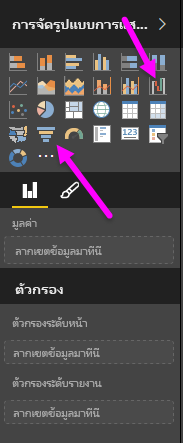
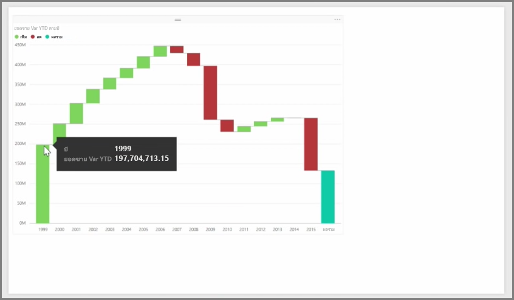
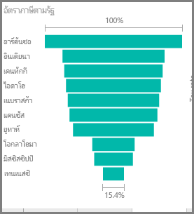

แผนภูมิวอเตอร์ฟอลและแผนภูมิกรวยเป็นการจัดรูปแบบการแสดงข้อมูลมาตรฐานสองประเภทที่น่าสนใจกว่า (และอาจเรียกได้ว่าพิเศษ) ที่รวมอยู่ใน Power BI เมื่อต้องการสร้างแผนภูมิว่างเปล่าประเภทใดก็ตาม ให้เลือกไอคอนจากบานหน้าต่าง **การจัดรูปแบบการแสดงข้อมูล**

**แผนภูมิวอเตอร์ฟอล**มักใช้เพื่อแสดงการเปลี่ยนแปลงในค่าเฉพาะเมื่อเวลาผ่านไป

Waterfalls เท่านั้นมีตัวเลือกกลุ่มที่สอง: *ประเภท*และ*แกน Y* ลากเขตข้อมูลตามเวลา เช่น *ปี* ไปยังบักเก็ต*ประเภท* และลากค่าที่คุณต้องการติดตามไปยังบักเก็ต*แกน Y* ช่วงเวลาที่มีการเพิ่มค่าจะแสดงเป็นสีเขียวตามค่าเริ่มต้น ในขณะที่ช่วงที่มีการลดค่าจะแสดงเป็นสีแดง

**แผนภูมิกรวย**มักใช้เพื่อแสดงการเปลี่ยนแปลงในกระบวนการเฉพาะ อย่างเช่นขั้นตอนการขายหรือความพยายามในการเก็บรักษาเว็บไซต์

ทั้ง**แผนภูมิวอเตอร์ฟอล**และ**แผนภูมิกรวย**สามารถแบ่งและปรับแต่งเองได้

