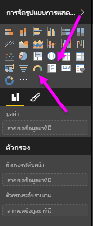
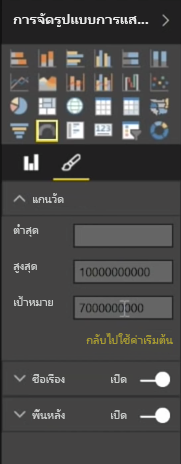
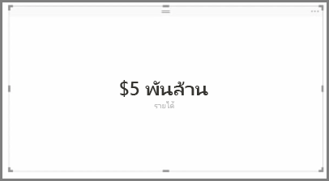
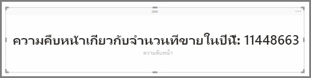

โดยทั่วไปการจัดรูปแบบการแสดงข้อมูลจะใช้เพื่อเปรียบเทียบค่าที่แตกต่างกันอย่างน้อยสองค่า อย่างไรก็ตาม บางครั้งเมื่อสร้างรายงาน คุณอาจต้องการติดตามดัชนีชี้วัดผลการปฏิบัติงานหลัก (KPI) หรือเมตริกเพียงรายการเดียวเมื่อเวลาผ่านไป ซึ่งวิธีที่จะสามารถทำเช่นนี้ได้ใน Power BI Desktop คือติดตามด้วย**มาตรวัด**หรือการแสดงผลด้วยภาพแบบบัตร**เลขตัวเดียว** เมื่อต้องการสร้างแผนภูมิว่างเปล่าประเภทใดก็ตาม ให้เลือกไอคอนจากบานหน้าต่าง **การจัดรูปแบบการแสดงข้อมูล**

มาตรวัดจะมีประโยชน์อย่างยิ่งเมื่อคุณกำลังสร้างหน้าแดชบอร์ดและต้องการแสดงความคืบหน้าไปสู่เป้าหมายที่เฉพาะเจาะจง เมื่อต้องการสร้างมาตรวัด ให้เลืกไอคอนมาตรวัดจากบานหน้าต่าง **การจัดรูปแบบการแสดงข้อมูล** แล้วลากเขตข้อมูลที่คุณต้องการติดตามไปในบักเก็ต *ค่า*

มาตรวัดจะปรากฏตามค่าเริ่มต้นที่ 50% หรือเป็นสองเท่าของ*ค่า* และมีสองวิธีในการปรับการตั้งค่านี้ เมื่อต้องการตั้งค่าแบบไดนามิก ให้ลากเขตข้อมูลไปยังบักเก็ตค่า*ต่ำสุด* ค่า*สูงสุด* และค่า*เป้าหมาย* อีกทางเลือกหนึ่งคือใช้ตัวเลือกการจัดรูปแบบการแสดงผลด้วยภาพเพื่อกำหนดช่วงมาตรวัดของคุณด้วยตัวเอง

การจัดรูปแบบการแสดงข้อมูลแบบบัตรจะแสดงเพียงการแสดงตัวเลขของเขตข้อมูล ตามค่าเริ่มต้น การแสดงผลด้วยภาพแบบบัตรจะใช้หน่วยแสดงผลเพื่อให้ตัวเลขสั้นลง เช่น แสดง "$5bn" แทนที่จะเป็น "$5,000,000,000" ใช้ตัวเลือกการจัดรูปแบบการแสดงผลด้วยภาพเพื่อเปลี่ยนหน่วยที่ใช้อยู่หรือปิดใช้งานหน่วยอย่างสมบูรณ์

การใช้บัตรที่น่าสนใจอย่างหนึ่งคือให้บัตรแสดงหน่วยวัดแบบกำหนดเองที่คุณได้เชื่อมเข้ากับข้อความ เมื่อต้องการใช้ตัวอย่างก่อนหน้านี้ ด้วยหน่วยวัดแบบกำหนดเอง บัตรของคุณอาจมีฟังก์ชัน DAX ขั้นสูงและแสดงข้อมูลเช่น "รายได้รวมในปีนี้: $5bn" หรือ "ความคืบหน้าในการขายปีนี้" จากนั้นเพิ่มหมายเลขที่แสดงความคืบหน้า

