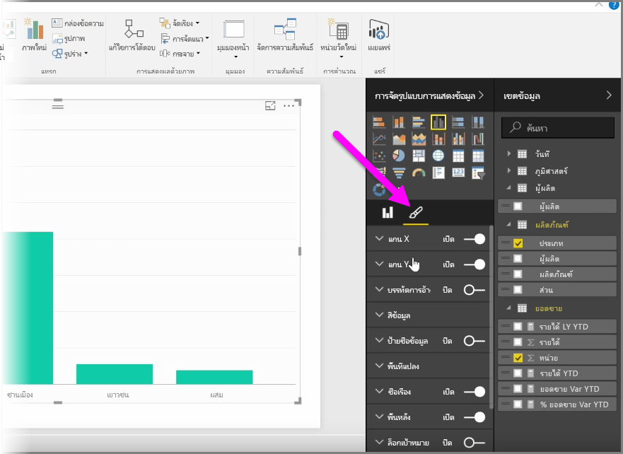
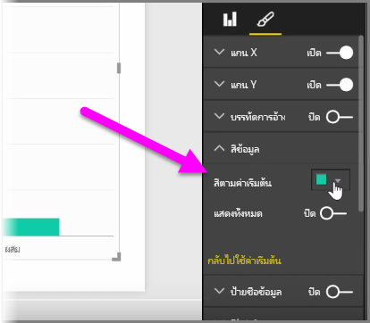
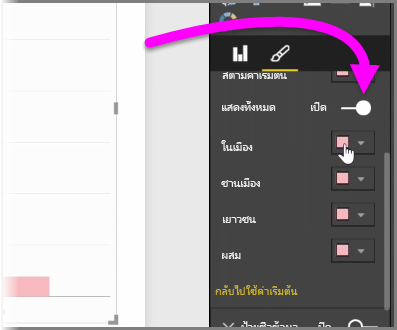
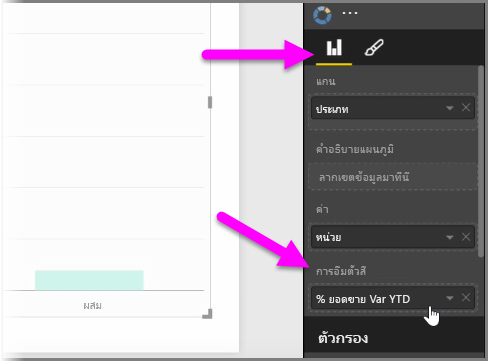
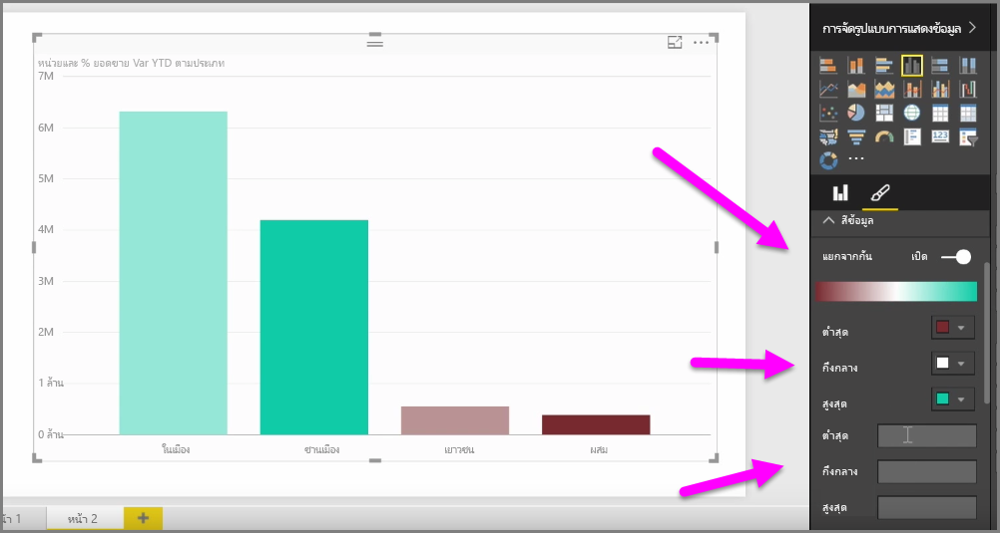
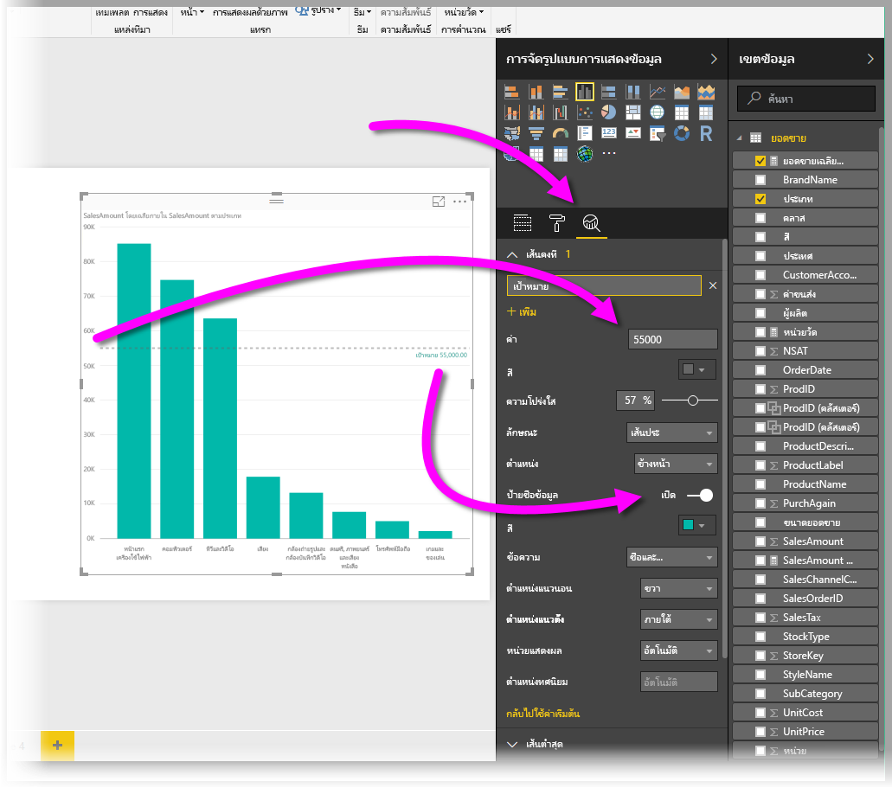
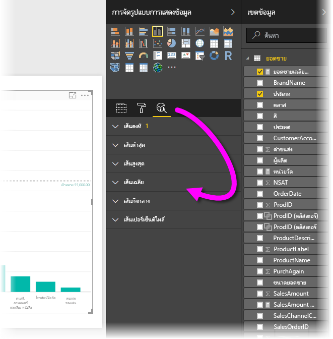

มีหลายครั้งที่คุณอาจต้องการปรับเปลี่ยนสีที่ใช้ในแผนภูมิหรือการแสดงผลด้วยภาพ Power BI ให้คุณควบคุมการแสดงสีได้อย่างเต็มที่ เมื่อต้องการเริ่มต้น ให้เลือกการแสดงผลด้วยภาพ จากนั้นในบานหน้าต่าง **การจัดรูปแบบการแสดงข้อมูล** ให้คลิกไอคอน **พู่กัน**

มีตัวเลือกมากมายสำหรับการเปลี่ยนสีหรือการจัดรูปแบบของการแสดงผลด้วยภาพ คุณสามารถเปลี่ยนสีแท่งของการแสดงผลด้วยภาพทั้งหมดโดยการเลือกตัวเลือกสีด้านข้าง**สีเริ่มต้น** จากนั้นเลือกสีที่คุณต้องการ

คุณยังสามารถเปลี่ยนสีของแต่ละแท่ง (หรือองค์ประกอบอื่นโดยขึ้นอยู่กับชนิดของการแสดงผลด้วยภาพที่คุณเลือก) ด้วยการสลับแถบเลื่อน **แสดงทั้งหมด** ไปที่เปิด เมื่อคุณสลับแถบเลื่อนดังกล่าว ตัวเลือกสีจะปรากฏขึ้นสำหรับแต่ละองค์ประกอบ

คุณยังสามารถเปลี่ยนสีตามค่าหรือหน่วยวัดได้อีกด้วย เมื่อต้องการทำเช่นนั้น ให้ลากเขตข้อมูลไปในบักเก็ต **การอิ่มตัวสี** ในบานหน้าต่างการจัดรูปแบบการแสดงข้อมูล (โปรดทราบว่าเครื่องมือนี้มีให้ใช้ในส่วน **แหล่งเขตข้อมูล** ไม่ใช่ในส่วน **พู่กัน**)

นอกจากนี้คุณยังสามารถเปลี่ยนระดับและสีที่ใช้ในการเติมสีองค์ประกอบข้อมูล นอกจากนี้คุณยังสามารถเลือกระดับแบบแยกออกจากกันโดยการสลับแถบเลื่อน แบบแยกออกจากกัน ไปที่เปิด ซึ่งจะช่วยให้สีปรับระดับระหว่างสามสี และคุณยังสามารถตั้งค่า*ต่ำสุด* ค่า*กลาง* และค่า*สูงสุด* ที่แสดงบนแผนภูมิของคุณได้

นอกจากนี้คุณยังสามารถใช้ค่าเหล่านี้เพื่อสร้างกฎได้ ตัวอย่างเช่น ตั้งค่าที่มากกว่าศูนย์ให้เป็นสีหนึ่ง และตั้งค่าที่ต่ำกว่าศูนย์ให้เป็นอีกสีหนึ่ง

อีกหนึ่งเครื่องมือที่มีประโยชน์สำหรับการใช้สีคือ การตั้งค่า*เส้นคงที่* ซึ่งบางครั้งเรียกว่า*เส้นอ้างอิง* คุณสามารถกำหนดค่าของเส้นคงที่ กำหนดสี และติดป้ายกำกับให้กับเส้นอ้างอิง เมื่อต้องการสร้างเส้นคงที่ (และเส้นที่น่าสนใจอื่นๆ) ให้เลือก **บานหน้าต่างการวิเคราะห์** (ลักษณะเหมือนแว่นขยาย) แล้วจึงขยายส่วน **เส้นอ้างอิง**

มีเส้นอื่นๆ อีกมากมายที่คุณสามารถสร้างขึ้นสำหรับการแสดงผลด้วยภาพที่พบได้ใน **บานหน้าต่างการวิเคราะห์** เช่น เส้นต่ำสุด เส้นสูงสุด เส้นค่าเฉลี่ย เส้นค่ามัธยฐาน และเส้นค่าเปอร์เซ็นต์ไทล์

สุดท้าย คุณสามารถสร้างเส้นขอบรอบแต่ละการจัดรูปแบบการแสดงข้อมูล และเช่นเดียวกับการควบคุมส่วนอื่น คุณสามารถระบุสีของเส้นขอบได้เช่นกัน

