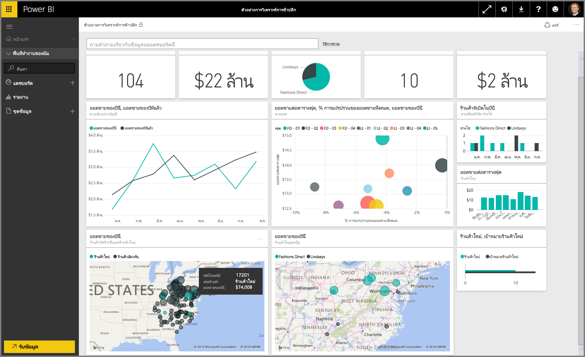
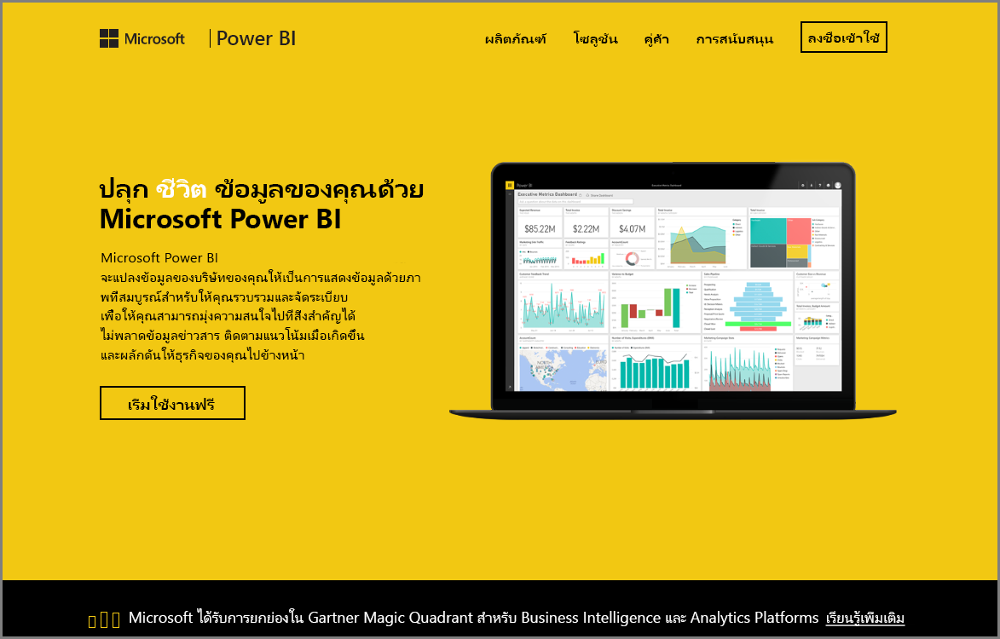

ยินดีต้อนรับสู่ส่วน **สำรวจข้อมูล** ของหลักสูตร **การเรียนรู้ตามคำแนะนำ** สำหรับ Power BI ตอนนี้คุณได้ทราบเกี่ยวกับ Power BI Desktop และวิธีการดูและแสดงข้อมูลแล้ว คุณก็พร้อมที่จะสำรวจข้อมูลในบริการของ BI Power แล้ว

มีหลายสิ่งหลายอย่างที่คุณจะได้เรียนรู้ในส่วนนี้ และการโต้ตอบพร้อมการใช้งานร่วมกันที่น่าสนใจของ Power BI จะโดดเด่นที่นี่ ดังนั้นเตรียมตัวให้พร้อมสำหรับส่วนที่น่าดึงดูดใจและน่าสนใจ

## แนะนำบริการของ Power BI
*ดูสิ่งที่บริการของ Power BI สามารถทำให้กับองค์กรของคุณ*

บริการของ Power BI เป็นส่วนขยายของ **Power BI Desktop** และมีฟีเจอร์ การอัปโหลดรายงาน การสร้างแดชบอร์ด และการถามคำถามเกี่ยวกับข้อมูลของคุณโดยใช้ภาษาที่เป็นธรรมชาติ คุณสามารถใช้บริการเพื่อตั้งเวลารีเฟรชข้อมูล แบ่งปันข้อมูลกับองค์กรของคุณ และสร้าง Service Pack ที่กำหนดเอง

ในหัวข้อต่อไปนี้ เราจะสำรวจบริการของ Power BI และแสดงให้คุณเห็นว่าจะช่วยเปลี่ยนข้อมูลอัจฉริยะของธุรกิจคุณให้เป็นข้อมูลเชิงลึกและสภาพแวดล้อมที่ขับเคลื่อนโดยการตัดสินใจร่วมกันได้อย่างไร

