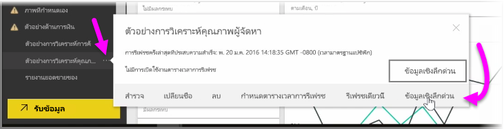
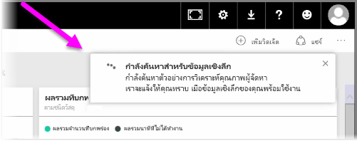
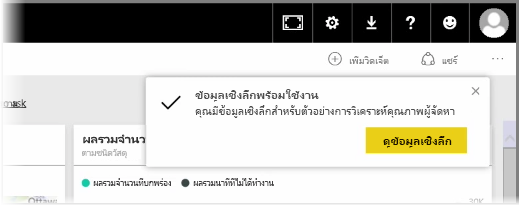
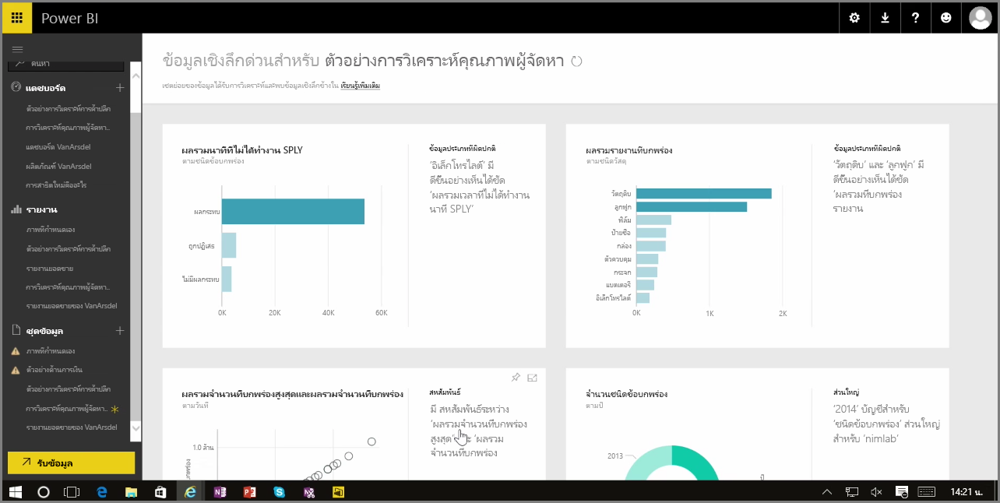

เมื่อคุณกำลังทำงานด้วยแดชบอร์ด รายงาน หรือชุดข้อมูลในบริการของ Power BI คุณสามารถใช้ Power BI ค้นหาข้อมูลเชิงลึกด่วนในข้อมูลได้ ใน Power BI จากส่วน **ชุดข้อมูล** ในบานหน้าต่างด้านซ้าย ให้เลือก *จุดไข่ปลา* (จุดสามจุด) ที่อยุ่ด้านข้างชุดข้อมูลที่คุณสนใจ เมนูตัวเลือกจะปรากฏขึ้น และทางด้านขวาคุณจะเห็นตัวเลือกที่เรียกว่า **ข้อมูลเชิงลึกด่วน**

เมื่อคุณเลือกข้อมูลเชิงลึกด่วน Power BI จะดำเนินการการเรียนรู้ของเครื่องบางอย่างและค้นหาข้อมูลนั้น และนำมาวิเคราะห์เพื่อหาข้อมูลเชิงลึกด่วน คุณจะเห็นการแจ้งเตือนที่ด้านบนขวาของบริการที่ระบุว่า Power BI กำลังทำงานเพื่อค้นหาข้อมูลเชิงลึก

หลังจากสิบห้าวินาทีหรือมากกว่านั้น การแจ้งเตือนจะเปลี่ยนไปเพื่อแจ้งให้คุณทราบว่า Power BI พบข้อมูลเชิงลึกบางอย่าง

เมื่อคุณเลือกปุ่ม **ดูข้อมูลเชิงลึก** บนการแจ้งเตือน คุณจะเห็นหน้าการแสดงผลด้วยภาพที่แสดงข้อมูลเชิงลึกที่ Power BI พบ ซึ่งคล้ายกับสิ่งที่คุณเห็นในรูปต่อไปนี้ ในหน้าจะมีข้อมูลเชิงลึกจำนวนหนึ่ง ซึ่งคุณสามารถเลื่อนลงได้ตลอดทั้งหน้าเพื่อดูและพิจารณา

เช่นเดียวกับการแสดงผลด้วยภาพอื่นๆ คุณสามารถโต้ตอบกับการแสดงผลด้วยภาพในหน้าข้อมูลเชิงลึกด่วนได้ และคุณยังสามารถปักหมุดรายการใดก็ได้ไว้กับแดชบอร์ดที่คุณอาจมี หรือกรองเพิ่มอย่างน้อยหนึ่งรายการ (หรือมากเท่าที่คุณต้องการ) เพื่อค้นหาข้อมูลเชิงลึกเพิ่มเติมที่อาจรอให้คุณค้นพบ

ด้วย **ข้อมูลเชิงลึกด่วน** คุณสามารถปล่อยให้ Power BI ระบุค่าผิดปกติและแนวโน้มในข้อมูลของคุณ แล้วใช้สิ่งที่พบเหล่านั้นในแดชบอร์ดของคุณ หรือปรับปรุงและกรองเพิ่มเติมเพื่อเข้าถึงข้อมูลเชิงลึกที่สำคัญที่สุดสำหรับคุณ

