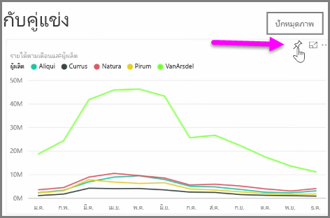
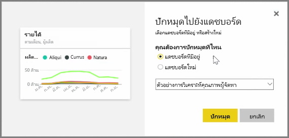
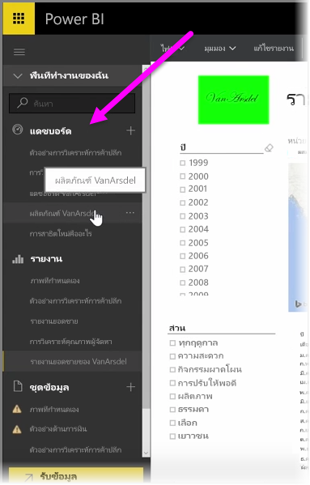
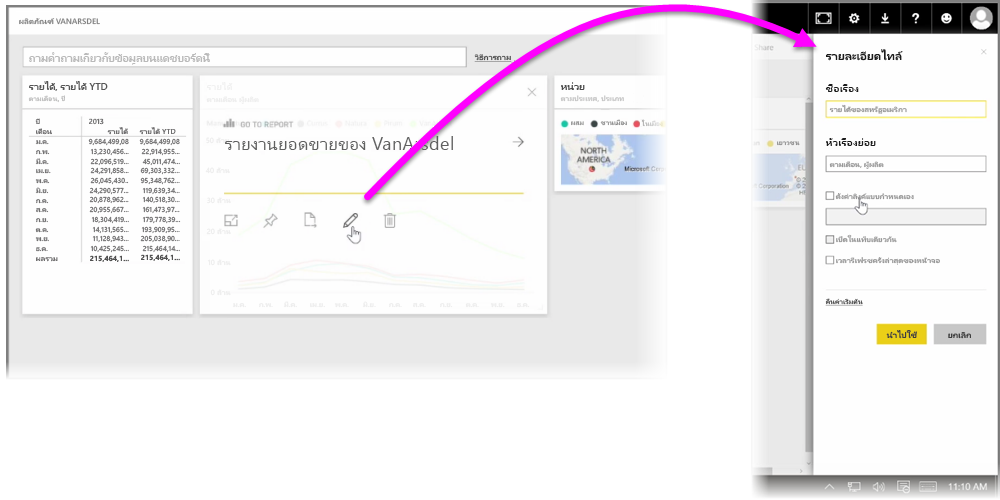

**แดชบอร์ด** ใน Power BI เป็นคอลเลกชันการจัดรูปแบบการแสดงข้อมูลแบบหน้าเดียวที่สร้างขึ้นจากภายในบริการของ Power BI คุณสร้างแดชบอร์ดโดย **ปักหมุด** การจัดรูปแบบการแสดงข้อมูลจากรายงานที่คุณเขียนและเผยแพร่โดยใช้ Power BI Desktop หรือการจัดรูปแบบการแสดงข้อมูลที่คุณสร้างขึ้นภายในบริการของ Power BI **การปักหมุด** การแสดงผลด้วยภาพไว้กับแดชบอร์ดก็เหมือนกับการปัดหมุดรูปภาพไว้กับกระดานไม้บนผนัง ซึ่งก็คือการติดการแสดงผลด้วยภาพไว้ตรงจุดเฉพาะเพื่อให้บุคคลอื่นมองเห็น เมื่อต้องการปักหมุดการแสดงผลด้วยภาพ ให้เปิดรายงานของการแสดงผลด้วยภาพในบริการ Power B โฮเวอร์เหนือการแสดงผลด้วยภาพที่คุณต้องการปักหมุดและเลือกไอคอนรูป **เข็มหมุด**

กล่องโต้ตอบจะปรากฏขึ้นให้คุณเลือกแดชบอร์ดปลายทางสำหรับการแสดงผลด้วยภาพจากเมนูดรอปดาวน์ หรือคุณสามารถสร้างแดชบอร์ดใหม่ได้ คุณยังจะได้รับตัวอย่างลักษณะของการแสดงผลด้วยภาพที่ปักหมุดในแดชบอร์ดเช่นกัน คุณสามารถปักหมุดการจัดรูปแบบการแสดงข้อมูลจากหลายรายงานและหน้าไว้ในแดชบอร์ดเดียวกันได้ ซึ่งทำให้คุณสามารถรวมชุดข้อมูลและแหล่งต่างๆ ไว้ในข้อมูลเชิงลึกหน้าเดียวได้

บน **แดชบอร์ด** คุณสามารถเพิ่มการจัดรูปแบบการแสดงผลข้อมูลทุกชนิด รวมถึง กราฟ แผนผัง รูปภาพ และรูปร่าง ได้โดย "ปักหมุด" เอาไว้ เมื่อปักหมุดการแสดงผลด้วยภาพไว้ในแดชบอร์ดแล้ว สิ่งนั้นจะเรียกว่า **ไทล์**

แดชบอร์ดของคุณรวมถึงแดชบอร์ดใหม่จะปรากฏในส่วน แดชบอร์ด ทางด้านซ้ายของบริการของ Power BI เลือกแดชบอร์ดจากรายการเพื่อดู

คุณสามารถเปลี่ยนเค้าโครงของการแสดงผลด้วยภาพบนแดชบอร์ดได้ตามที่คุณต้องการ เมื่อต้องการปรับขนาดไทล์ ให้ลากจุดจับเลื่อนเข้าหรือออก เมื่อต้องการย้ายไทล์ แค่คลิกและลากไปยังตำแหน่งที่ตั้งอื่นบนแดชบอร์ด โฮเวอร์เหนือไทล์แล้วคลิกไอคอน **ดินสอ** เพื่อเปิด **รายละเอียดไทล์** ซึ่งคุณสามารถเปลี่ยน **ชื่อเรื่อง** หรือ **ชื่อเรื่องรอง**

คลิกที่ไทล์แดชบอร์ดเพื่อดูรายงานที่สร้างจากไทล์แดชบอร์ด ขั้นตอนนี้จะช่วยให้คุณดูข้อมูลเบื้องต้นภายใต้การแสดงผลด้วยภาพได้อย่างรวดเร็ว คุณยังสามารถเปลี่ยนลิงก์นั้นโดยใช้เขตข้อมูล **ตั้งค่าลิงก์แบบกำหนดเอง** ใน **รายละเอียดไทล์**

คุณสามารถปักหมุดไทล์จากแดชบอร์ดหนึ่งไว้ในอีกแดชบอร์ดหนึ่ง ตัวอย่างเช่น ถ้าคุณมีคอลเลกชันของแดชบอร์ดและต้องการสร้างบอร์ดข้อมูลสรุปแดชบอร์ดเดียว กระบวนการก็จะเหมือนกัน ให้โฮเวอร์เหนือไทล์และเลือก **ไอคอนรูปเข็มหมุด** การสร้างและการเปลี่ยนแปลงแดชบอร์ดเป็นเรื่องง่าย และคุณสามารถกำหนดแดชบอร์ดได้เองเพื่อทำให้แดชบอร์ดแบบหน้าเดียวของคุณแสดงสิ่งที่ควรจะเป็นเท่านั้น

