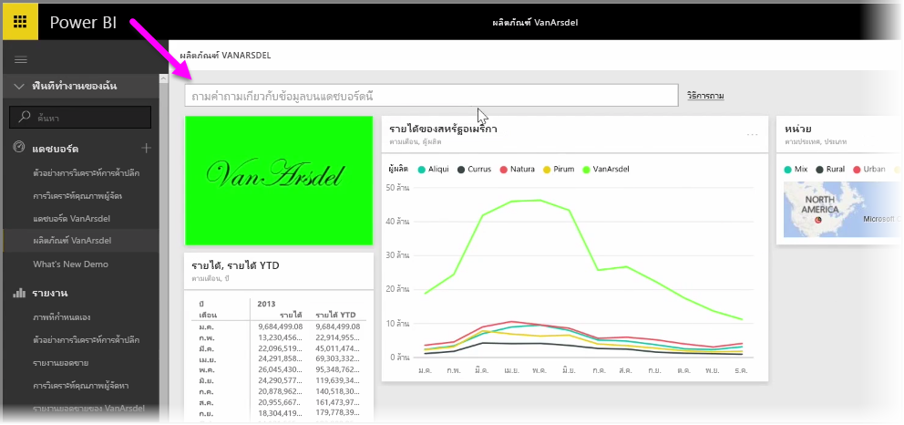
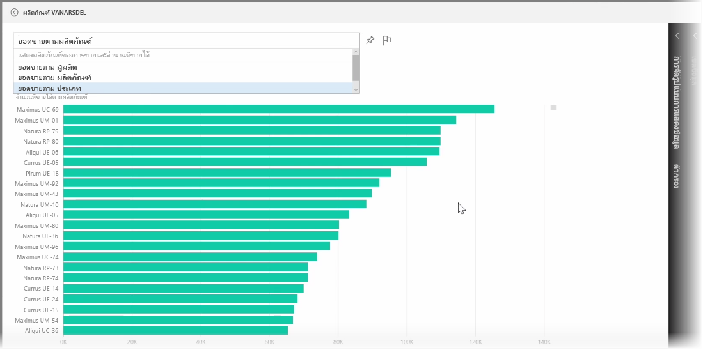
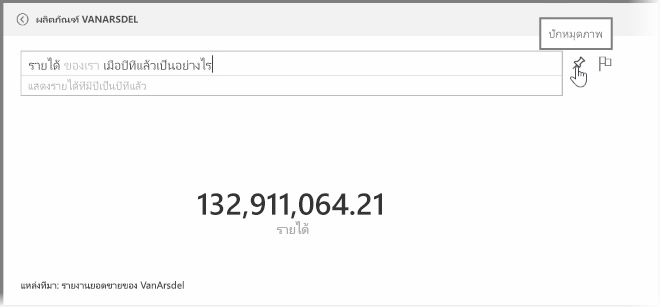
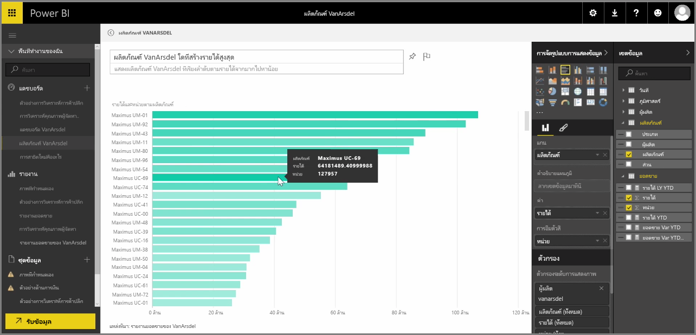

Power BI มาพร้อมกับกลไกการรู้จำภาษาที่มีประสิทธิภาพที่ช่วยให้คุณถามคำถามข้อมูลของคุณโดยใช้วลีและคำถามต่างๆ แบบในการสนทนา นอกจากการสร้างรายงานและการจัดรูปแบบการแสดงข้อมูลด้วย Power BI คุณยังสามารถสร้างแผนภูมิและกราฟโดยแค่ถามคำถามง่ายๆ

เมื่อต้องการถามคำถามจากข้อมูลของคุณ ให้เปิดแดชบอร์ดใน Power BI และที่ด้านบนของหน้าจอคุณจะเห็นกล่องป้อนค่าที่คุณสามารถถามคำถามเกี่ยวกับข้อมูลที่แสดง บางครั้ง ฟีเจอร์นี้เรียกว่า *คำถามและคำตอบ* หรือมักจะย่อว่า **Q&A**

เมื่อคุณคลิกในกล่อง Power BI จะแสดงพร้อมท์ที่มีคำที่แนะนำบางส่วนโดยอ้างอิงตามข้อมูลของคุณ เช่น "รายได้ YTD" คุณสามารถคลิกที่คำที่แนะนำเพื่อดูผลลัพธ์ ซึ่งมักจะแสดงเป็นตารางหรือบัตรทั่วไป เมื่อคุณเลือกหนึ่งในวลีที่แนะนำ Power BI จะสร้างการแสดงผลด้วยภาพโดยยึดตามส่วนที่เลือกของคุณโดยอัตโนมัติในแบบเรียลไทม์

คุณยังสามารถถามคำถามโดยใช้ภาษาทั่วไป เช่น "รายได้ของเราเมื่อปีที่แล้วเป็นอย่างไรบ้าง" หรือ "ผลิตภัณฑ์ใดมียอดขายสูงที่สุดในเดือนมีนาคม 2014" Power BI จะแสดงการแปลคำถามของคุณ และเลือกชนิดการแสดงผลด้วยภาพที่ดีที่สุดเพื่อแทนคำตอบ และเช่นเดียวกับการแสดงผลด้วยภาพอื่นๆ ใน Power BI คุณสามารถ **ปักหมุด** การแสดงผลด้วยภาพนั้นไว้บนแดชบอร์ดที่คุณเลือกโดยเลือกไอคอนรูป **เข็มหมุด**

ไม่ว่าจะอยู่ที่ขั้นตอนใดในกระบวนการ คุณสามารถแก้ไขการแสดงผลด้วยภาพที่สร้างขึ้นจากคำถามหรือวลีแบบภาษาธรรมชาติของคุณ แค่ใช้บานหน้าต่าง **การจัดรูปแบบการแสดงข้อมูล** และ **เขตข้อมูล** ทางด้านขวาของหน้าจอ เช่นเดียวกับการแสดงผลด้วยภาพอื่นใน Power BI คุณสามารถเลือกเค้าโครง ปรับตัวกรอง และเปลี่ยนการป้อนค่าเขตข้อมูลได้

เมื่อต้องการบันทึกการจัดรูปแบบการแสดงข้อมูลไปยังแดชบอร์ดหลังจากที่คุณสร้างการแสดงผลด้วยภาพที่สมบูรณ์แบบเสร็จแล้ว ให้เลือกไอคอน **เข็มหมุด** ที่อยู่ถัดจากกล่องป้อนคำถาม

