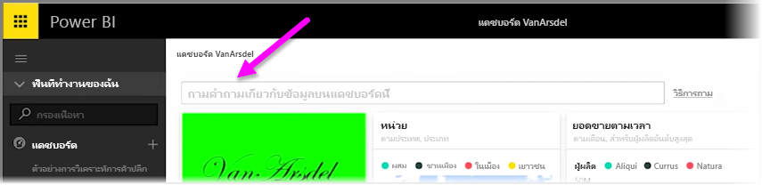
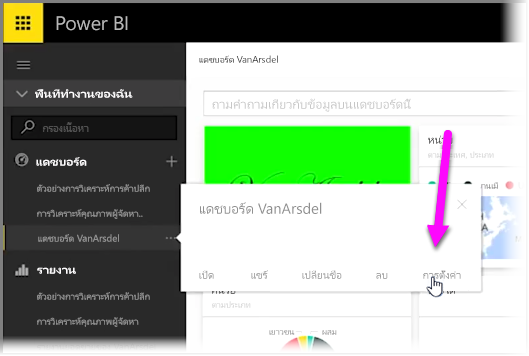
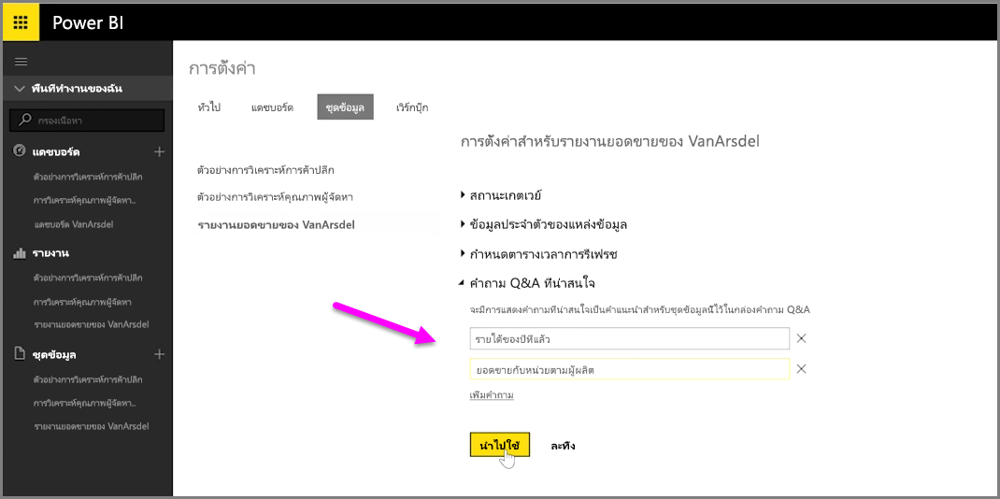

ด้วย Power BI คุณสามารถเพิ่มคำถามที่แนะนำของคุณเองสำหรับผู้ใช้รายอื่นที่ใช้กล่องคิวรีที่เป็นภาษาทั่วไปสำหรับแดชบอร์ดได้ ซึ่งมักจะเรียกว่ากล่อง **Q&A** คำถามที่แนะนำเหล่านี้คือสิ่งที่ผู้ใช้จะเห็นเมื่อคลิกที่กล่องป้อนค่าที่ด้านบนของแดชบอร์ด

เมื่อต้องการเพิ่มคำถามของคุณเอง ให้เลือกจุดไข่ปลา (จุดสามจุด ...) ที่อยู่ถัดจากชื่อของแดชบอร์ดที่คุณต้องการใช้ แล้วเลือก **การตั้งค่า** จากเมนู

 ขั้นตอนนี้จะเปิดหน้า **การตั้งค่า** สำหรับแดชบอร์ดและชุดข้อมูลหรือเวิร์กบุ๊กเบื้องต้น คุณสามารถปิดใช้งานกล่องป้อนคำค้นหา Q&A ได้จากส่วน **แดชบอร์ด** ของหน้า **การตั้งค่า** แต่เราต้องการเพิ่มคำถาม เราจึงเลือกส่วน **ชุดข้อมูล**

ในส่วน **ชุดข้อมูล** ชุดข้อมูลทั้งหมดที่เกี่ยวข้องกับแดชบอร์ดจะแสดงขึ้น เลือกชุดข้อมูลที่เกี่ยวข้องกับแดชบอร์ดของคุณจากรายการ เลือก **คำถาม Q&A ที่แนะนำ** แล้วเลือกลิงก์ **เพิ่มคำถาม** ใส่คำถามหรือพร้อมท์ของคุณลงในกล่องป้อนค่าแล้วเลือก **นำไปใช้**

ในขณะนี้ ถ้ามีคนคลิกที่กล่องป้อนคำค้นหาบนแดชบอร์ดที่เลือก พวกเขาจะเห็นรายการที่แนะนำของคุณที่ด้านบนของรายการพร้อมท์ และการเลือกคำถามนั้นจะนำพวกเขาไปที่คำตอบของ Q&A ทันที นี่เป็นวิธีที่มีประโยชน์ในการทำให้ผู้ใช้แดชบอร์ดคิดถึงชนิดของข้อมูลที่มี และวิธีที่สามารถใช้งานได้ดีที่สุด

