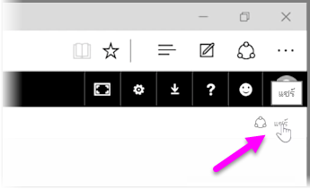
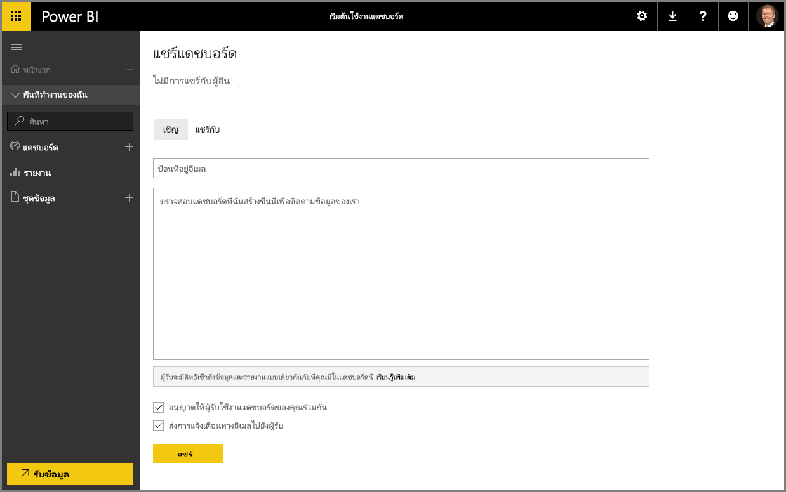

เราได้เห็นวิธีที่ Power BI ช่วยคุณค้นหาข้อมูล รวบรวมไว้ในรูปแบบข้อมูล และสร้างรายงานและการจัดรูปแบบการแสดงข้อมูลเกี่ยวกับการใช้งานข้อมูลนั้นไปแล้ว เรายังได้เห็นวิธีที่คุณเผยแพร่รายงานเหล่านั้นไปยังบริการของ Power BI และสร้างแดชบอร์ดที่จะช่วยคุณตรวจสอบข้อมูลของคุณตลอดเวลา ฟีเจอร์ทั้งหมดนี้จะมีประสิทธิภาพมากยิ่งขึ้นเมื่อคุณแชร์ข้อมูลเชิงลึกของคุณกับบุคคลอื่นในองค์กรของคุณ โชคดีที่การแชร์แดชบอร์ดของคุณเป็นเรื่องง่าย

เมื่อต้องการแชร์บอร์ดของคุณ ให้เปิดในบริการของ Power BI และเลือกลิงก์ **แชร์** ที่มุมบนขวา

หน้า **แชร์แดชบอร์ด** จะปรากฏขึ้น ซึ่งคุณสามารถเลือกตัวเลือก **เชิญ** และใส่บุคคลที่คุณต้องการให้เข้าถึงแดชบอร์ดของคุณลงในกล่องป้อนค่า **ที่อยู่อีเมล** ขณะที่คุณพิมพ์ Power BI จะตรวจสอบที่อยู่อีเมลกับบัญชีในโดเมนของคุณและโดเมน Office 365 และดำเนินการให้เสร็จสิ้นโดยอัตโนมัติถ้าเป็นไปได้ คุณยังสามารถคัดลอกและวางที่อยู่อีเมลลงในกล่องนี้ หรือใช้รายการการแจกจ่าย กลุ่มความปลอดภัย หรือกลุ่ม Office 365 เพื่อเข้าถึงหลายๆ คนพร้อมกัน

ถ้าคุณเลือกกล่องกาเครื่องหมาย (ที่อยู่ใกล้ด้านล่าง) เพื่อ *ส่งการแจ้งเตือนทางอีเมลถึงผู้รับ* ผู้รับของคุณจะได้รับอีเมลที่แจ้งให้พวกเขาทราบว่าคุณได้แชร์แดชบอร์ดกับพวกเขา พร้อมทั้งลิงก์ไปยังแดชบอร์ด คุณสามารถเพิ่มบันทึกย่อลงในอีเมลที่พวกเขาจะได้รับ หรือส่งบันทึกย่อที่ Power BI สร้างขึ้นให้คุณ (ซึ่งอยู่ในกล่องด้านล่างตรงตำแหน่งที่คุณใส่ที่อยู่อีเมลของพวกเขา)

>[!NOTE]
>ผู้รับที่ไม่มีบัญชี Power BI จะถูกนำไปที่กระบวนการการลงทะเบียนก่อนที่จะดูแดชบอร์ดของคุณ
> 
> 

ทุกคนที่คุณแชร์แดชบอร์ดให้สามารถดูและโต้ตอบกับแดชบอร์ดได้เหมือนที่คุณทำ อย่างไรก็ตาม พวกเขามีการเข้าถึงรายงานเบื้องต้นแบบ *อ่านอย่างเดียว* และพวกเขา*ไม่มีการเข้าถึง*ชุดข้อมูลเบื้องต้น

คุณยังสามารถเลือกแท็บ **แชร์กับ** บนหน้าแชร์แดชบอร์ดเพื่อดูบุคคลที่คุณได้แชร์แดชบอร์ดนี้ด้วยก่อนหน้านี้

