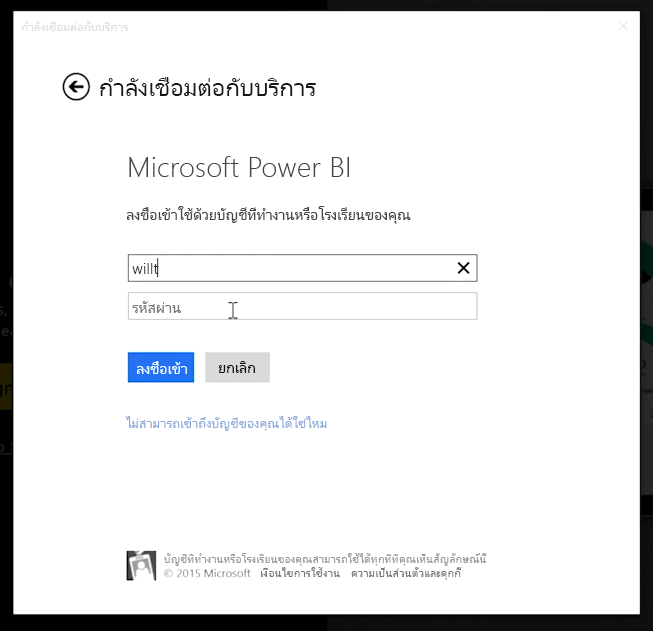
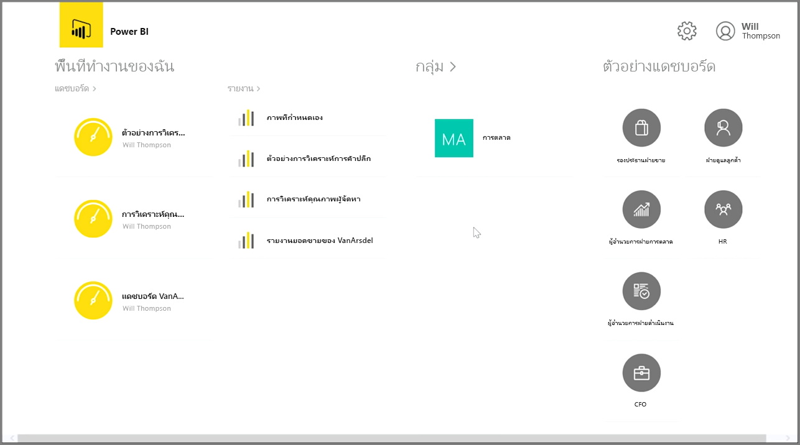
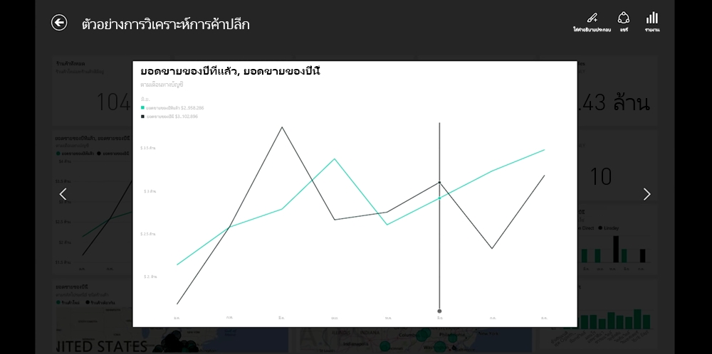
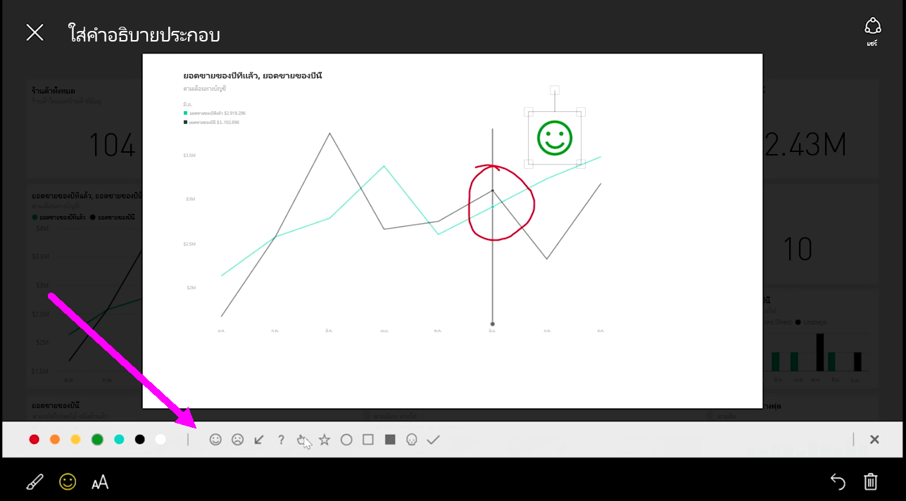

ถ้าคุณต้องการติดตามข้อมูลของคุณขณะที่คุณเดินทาง คุณสามารถใช้แอปพลิเคชันสำหรับอปุกรณ์เคลื่อนที่ของ Power BI สำหรับอุปกรณ์ iOS, Android และ Windows ได้

เมื่อใช้แอป Power BI ก่อนอื่นให้ลงชื่อเข้าใช้บัญชีของคุณโดยใช้ข้อมูลบัญชีบริการของ Power BI ของคุณ บนอุปกรณ์เคลื่อนที่ Windows (ในกรณีนี้คือแท็บเล็ต) การลงชื่อเข้าใช้จะเป็นดังต่อไปนี้

หน้าจอแรกที่คุณจะเห็นแสดงเนื้อหาทั้งหมดที่คุณมีการเข้าถึง รวมถึงรายงาน แดชบอร์ด และกลุ่ม ยังมีตัวอย่างแดชบอร์ดที่คุณสามารถใช้เป็นแรงบันดาลใจ หรือแค่ใช้เพื่อดูความสามารถของ Power BI แอปนี้ออกแบบมาเพื่อใช้งานแบบสัมผัสได้ง่าย: แตะที่แดชบอร์ดหรือรายงานเพื่อดูแบบเต็มหน้าจอและเลื่อนผ่านโดยใช้นิ้วมือ

คุณสามารถเปิดแดชบอร์ดได้โดยการแตะ ภายในแดชบอร์ด คุณสามารถแตะที่ไทล์แดชบอร์ดเพื่อโฟกัสไทล์ในมุมมองที่ใหญ่ขึ้น

คุณยังสามารถใส่คำอธิบายประกอบข้อมูลเชิงลึกใดๆ ที่คุณค้นพบโดยแตะปุ่ม **ใส่คำอธิบายประกอบ** ที่มุมบนขวา ซึ่งจะทำให้คุณสามารถวาดบนไทล์ที่โฟกัสเพื่อไฮไลต์เฉพาะพื้นที่ที่สนใจ พบเครื่องมือการใส่คำอธิบายประกอบได้ที่ด้านล่างของหน้าจอ

แชร์ไทล์ที่ใส่คำอธิบายประกอบโดยแตะลิงก์ **แชร์** ที่มุมบนขวา

แตะลิงก์ **รายงาน** ที่มุมบนขวาเพื่อดูรายงานเบื้องต้นสำหรับไทล์ ซึ่งจะแสดงการจัดรูปแบบการแสดงข้อมูลแบบเดียวกันกับที่คุณจะเห็นในเว็บเราว์เซอร์หรือใน Power BI Desktop และยังมีความสามารถในการโต้ตอบกับรายงานโดยแตะที่แถบ ดูรายละเอียดแนวลึก หรือใช้ตัวแบ่งส่วนข้อมูล

