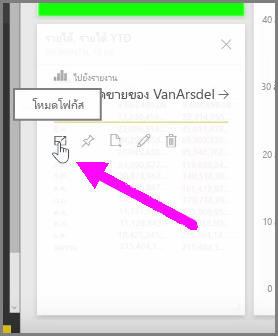
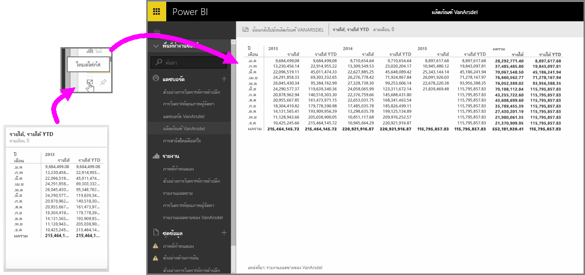

เมื่อคุณกำลังดูที่แดชบอร์ดหรือรายงานในบริการของ Power BI บางครั้งอาจเป็นประโยชน์ในการโฟกัสบนแผนผังรายบุคคลหรือการจัดรูปแบบการแสดงข้อมูล คุณสามารถทำได้ในสองวิธีที่แตกต่างกัน

เมื่อคุณอยู่บนแดชบอร์ด ให้โฮเวอร์เหนือไทล์เพื่อดูตัวเลือกไอคอนที่แตกต่างกันสองสามรายการที่มุมบนขวา เมื่อคุณเลือกจุดไข่ปลา (จุดสามจุด) คุณจะเห็นคอลเลกชันของไอคอนที่แสดงถึงการดำเนินการที่คุณสามารถนำมาไว้บนไทล์ได้

ไอคอนด้านซ้ายสุดที่มีป้ายชื่อ **โหมดโฟกัส** เลือกไอคอนนั้นเพื่อขยายไทล์ให้ครอบคลุมพื้นที่แดชบอร์ดทั้งหมด

**โหมดโฟกัส** ทำให้คุณสามารถดูรายละเอียดเพิ่มเติมเกี่ยวกับการแสดงผลด้วยภาพและคำอธิบายแผนภูมิของคุณ ตัวอย่างเช่น เมื่อคุณปรับขนาดไทล์ใน Power BI บางคอลัมน์อาจไม่แสดงเนื่องจากพื้นที่ที่มีในไทล์ไม่เพียงพอ

ใน **โหมดโฟกัส** คุณสามารถดูข้อมูลทั้งหมดได้ คุณยังสามารถปักหมุดการแสดงผลด้วยภาพได้โดยตรงจากโหมดโฟกัสไว้ในแดชบอร์ดอื่นโดยเลือกไอคอนรูป **เข็มหมุด** เมื่อต้องการออกจาก **โหมดโฟกัส** ให้เลือกไอคอน **กลับไปที่...** ที่มุมบนซ้ายของ **โหมดโฟกัส**

กระบวนการจะคล้ายกับเมื่อดูรายงาน โฮเวอร์เหนือการแสดงผลด้วยภาพเพื่อดูไอคอนสามรายการที่มุมบนขวา และเลือกไอคอน **โหมดโฟกัส** การเลือกไอคอนนี้จะขยายการจัดรูปแบบการแสดงข้อมูลของคุณให้ครอบคลุมพื้นที่รายงานแบบเต็ม การแสดงผลด้วยภาพยังคงโต้ตอบได้ในโหมดนี้ แม้ว่าคุณจะสูญเสียเอฟเฟ็กต์ตัวกรองระหว่างการจัดรูปแบบการแสดงข้อมูลไปชั่วคราว

โฮเวอร์เหนือไทล์หรือรายงานที่ขยาย แล้วเลือกไอคอนอักขระ ^ ซ้าย **กลับไปที่...** ที่มุมบนซ้ายเพื่อกลับไปที่มุมมองก่อนหน้า

