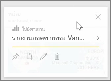
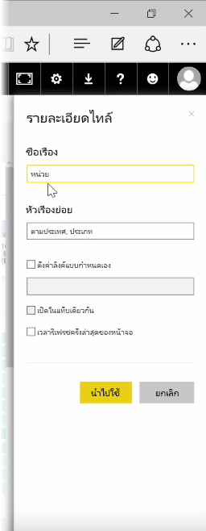
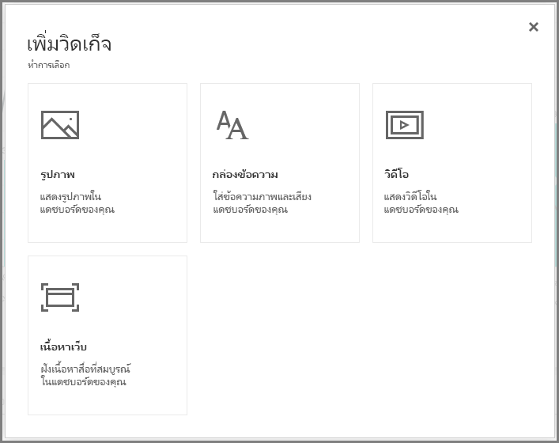
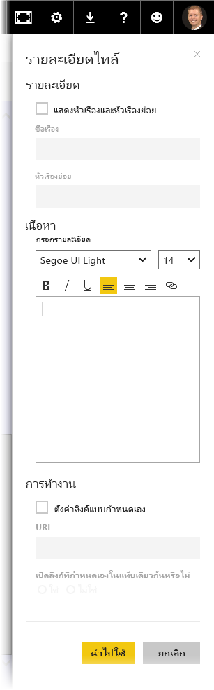

เมื่อคุณสร้างแดชบอร์ด คุณสามารถแก้ไข **ไทล์* ในบริการของ Power BI เพื่อสร้างการเปลี่ยนแปลงการจัดรูปแบบสองสามรายการ

เมื่อต้องการเปลี่ยนแปลงไทล์ ให้โฮเวอร์เหนือไทล์และเลือกจุดไข่ปลา (จุดสามจุด) เพื่อแสดงคอลเลกชันไอคอนที่ช่วยคุณเปลี่ยนแปลงไทล์

เลือกไอคอน **ปากกา** เพื่อเปิดบานหน้าต่าง **รายละเอียดไทล์** จากตรงนี้ คุณสามารถเปลี่ยน **ชื่อเรื่อง** **คำบรรยาย** รวมถึงเวลาและวันที่รีเฟรชล่าสุด และรายละเอียดอื่นๆ เช่น การสร้างลิงก์แบบกำหนดเอง ของไทล์ได้

ตามค่าเริ่มต้น เมื่อคุณคลิกที่ไทล์แดชบอร์ด คุณจะไปที่รายงานที่เป็นข้อมูลเบื้องต้นของไทล์ เมื่อต้องการเปลี่ยนลักษณะการทำงานนี้ ให้ใช้เขตข้อมูล **ตั้งค่าลิงก์แบบกำหนดเอง** ในบานหน้าต่าง **รายละเอียดไทล์** หนึ่งในการใช้งานยอดนิยมของฟีเจอร์นี้คือการนำผู้ใช้ไปที่โฮมเพจขององค์กรเมื่อคลิกที่รูปโลโก้

## เพิ่มวิดเจ็ตลงในแดชบอร์ดของคุณ
คุณสามารถเพิ่มวิดเจ็ตลงในแดชบอร์ดของคุณได้เช่นกัน **วิดเจ็ต** คือไทล์แดชบอร์ดพิเศษที่มีรายการอื่นๆ เช่น รูป วิดีโอแบบออนไลน์ กล่องข้อความ หรือเนื้อหาเว็บแบบสมบูรณ์ แทนที่จะเป็นการจัดรูปแบบการแสดงข้อมูล

เมื่อคุณเลือกลิงก์ เพิ่มวิดเจ็ต ที่มุมบนขวาของแดชบอร์ด กล่องโต้ตอบ **เพิ่มวิดเจ็ต** จะปรากฏขึ้น

ตัวอย่างเช่น เมื่อคุณเพิ่มกล่องข้อความ บานหน้าต่าง **รายละเอียดไทล์** จะปรากฏขึ้นทางด้านขวา ซึ่งคุณสามารถแก้ไขรายละเอียดได้คล้ายกันกับเมื่อแก้ไขรายละเอียดของไทล์อื่นๆ แต่ด้วยวิดเจ็ต คุณจะมีส่วนให้กำหนดหรือปรับเปลี่ยนเนื้อหาของวิดเจ็ตด้วย เช่น ตัวแก้ไข Rich text สำหรับกล่องข้อความ

ด้วยวิดเจ็ตและความสามารถในการแก้ไขรายละเอียดไทล์ คุณสามารถกำหนดแดชบอร์ดของคุณเองและทำให้มีลักษณะในแบบที่คุณต้องการ

