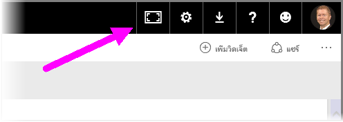
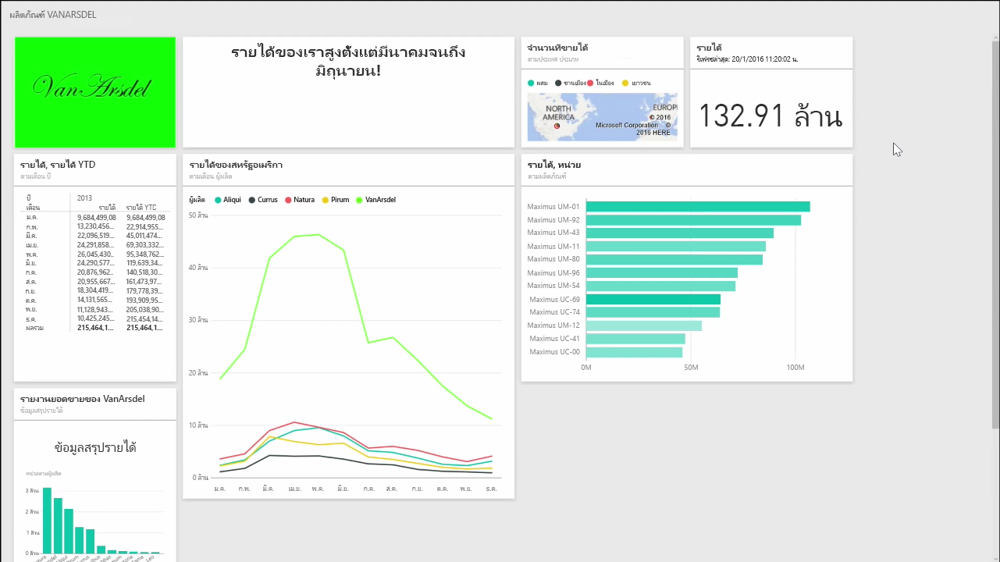
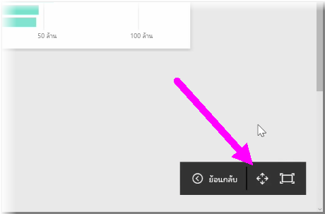

คุณอาจพบว่าบางครั้งเมื่อคุณสร้างแดชบอร์ดของคุณ คุณมีเนื้อหามากเกินกว่าจะสามารถใส่ลงในพื้นที่ทำงานได้หมด มีโซลูชันสองสามอย่างที่จะช่วยคุณจัดการวิธีแสดงพื้นที่แดชบอร์ดของคุณเพื่อให้คุณสามารถดูเนื้อหาแดชบอร์ดทั้งหมดได้

วิธีการแสดงทั้งแดชบอร์ดในหน้าจอเดียวที่ง่ายที่สุดคือการเลือกปุ่ม **โหมดเต็มหน้าจอ** ที่มุมบนขวาของแดชบอร์ด

การเลือกปุ่ม **โหมดเต็มหน้าจอ** จะทำให้เบราว์เซอร์ของคุณเข้าสู่โหมดเต็มหน้าจอ โดยนำองค์ประกอบของกรอบทั้งหมดออกจากรอบแดชบอร์ด และเพิ่มจำนวนพื้นที่รับชมภายในแดชบอร์ด

จากภายใน **โหมดเต็มหน้าจอ** คุณสามารถเลือกตัวเลือก **พอดีหน้าจอ** เพื่อย่อไทล์ทั้งหมดให้พอดีในหน้าจอเดียวได้ โดยไม่จำเป็นต้องใช้แถบเลื่อน โดยทั่วไปเรียกว่า *โหมดทีวี* และเป็นประโยชน์สำหรับการนำเสนอด้วยแดชบอร์ด หรือแสดงแดชบอร์ดบนหน้าจอแสดงผลของห้องโถง

อีกวิธีหนึ่งในการจัดการพื้นที่แดชบอร์ดคือการยุบบานหน้าต่างนำทางที่อยู่ด้านซ้ายของหน้า โดยเลือกไอคอนรูปแฮมเบอร์เกอร์ เมื่อต้องการขยายบานหน้าต่างนำทาง ให้คลิกไอคอนอีกครั้ง

คุณสามารถมั่นใจได้ว่าแดชบอร์ดจะยุบแถบนำทางอยู่เสมอโดยผนวกสิ่งต่อไปนี้เข้ากับส่วนท้ายของ URL:

> ?collapseNavigation=true
> 
> 

ผู้ใช้ที่ติดตามลิงก์นั้นจะเปิดแดชบอร์ดที่มีแถบนำทางแบบยุบ

