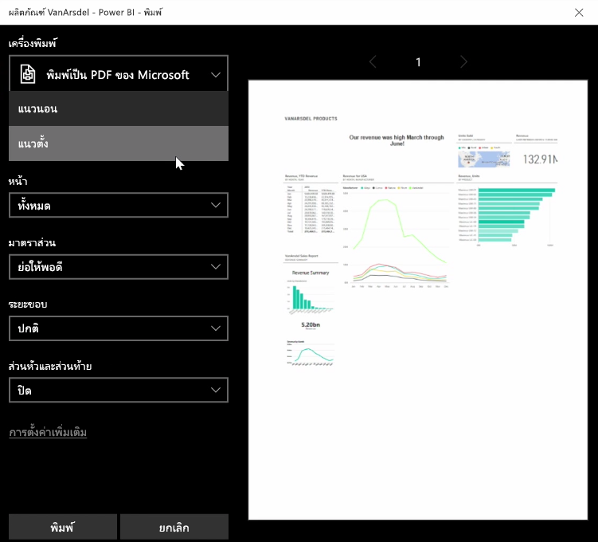
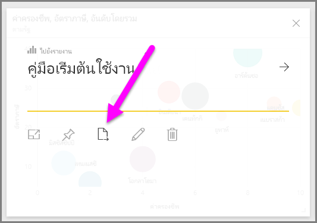
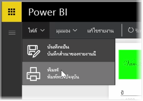

บางครั้ง คุณอาจต้องการนำรายงานหรือแดชบอร์ดที่พิมพ์ออกมาเข้าร่วมประชุม หรือคุณจึงสามารถแชร์กับบุคคลอื่นได้ ด้วย Power BI คุณสามารถพิมพ์ภาพออกมาได้หลายวิธี

ในบริการของ Power BI ให้เลือกจุดไข่ปลา (จุดสามจุด) ที่มุมบนขวาของบริการ แล้วเลือก **พิมพ์แดชบอร์ด**

กล่องโต้ตอบ **พิมพ์** จะปรากฏขึ้น ซึ่งคุณสามารถเลือกเครื่องพิมพ์ที่คุณต้องการส่งแดชบอร์ดได้ รวมถึงตัวเลือกการพิมพ์มาตรฐาน เช่น การวางแนว *แนวตั้ง* หรือ *แนวนอน*

## ส่งออกข้อมูลจากการแสดงผลด้วยภาพ
คุณยังสามารถส่งออกข้อมูลจากการแสดงผลด้วยภาพใดๆ ในบริการของ Power BI แค่เลือกจุดไข่ปลาในทุกการแสดงผลด้วยภาพ แล้วเลือกปุ่ม **ส่งออกข้อมูล** (ปุ่มกลาง) เมื่อคุณทำเช่นนั้น ไฟล์ CSV จะถูกสร้างขึ้นและถูกดาวน์โหลดลงในคอมพิวเตอร์ของคุณ และข้อความจะปรากฏขึ้นบนเบราว์เซอร์ (เหมือนกับการดาวน์โหลดที่เริ่มต้นในเบราว์เซอร์อื่น) ซึ่งแจ้งให้คุณทราบว่าการดาวน์โหลดเสร็จสมบูรณ์แล้ว

คุณยังสามารถพิมพ์หรือส่งออกได้โดยตรงจากรายงาน เมื่อดูรายงานในบริการของ Power BI ให้เลือก **ไฟล์ > พิมพ์** เพื่อเปิดกล่องโต้ตอบการพิมพ์

และเหมือนกับแดชบอร์ด คุณสามารถส่งออกข้อมูลจากการแสดงผลด้วยภาพภายในรายงานได้เช่นกัน โดยเลือกปุ่มส่งออกในการแสดงผลด้วยภาพ

