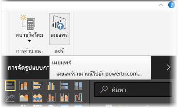
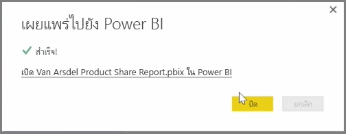

คุณสามารถอัปเดตรายงานและชุดข้อมูลที่คุณเผยแพร่แล้วจาก Power BI Desktop ไปยังบริการของ Power BI ได้ เมื่อต้องการดำเนินการขั้นตอนดังกล่าว ให้เลือก **เผยแพร่** จากแท็บ **หน้าแรก** ใน Ribbon

เมื่อคุณเผยแพร่รายงานที่มีอยู่แล้วในบริการของ Power BI คุณจะได้รับพร้อมท์ให้ยืนยันว่าคุณต้องการแทนที่ชุดข้อมูลและรายงานก่อนหน้าด้วยเวอร์ชันที่แก้ไขแล้วที่คุณเพิ่งเลือกให้อัปเดต

เมื่อคุณเลือก **แทนที่** ชุดข้อมูลและรายงานในบริการของ Power BI จะถูกเขียนทับด้วยชุดข้อมูลและรายงานในไฟล์ Power BI Desktop เวอร์ชันล่าสุด

และเหมือนกับเหตุการณ์ **เผยแพร่** อื่นๆ จาก Power BI Desktop คุณจะเห็นกล่องโต้ตอบที่บอกคุณว่าเหตุการณ์เผยแพร่เสร็จสมบูรณ์แล้ว และคุณจะได้รับลิงก์ไปยังรายงานในบริการของ Power BI

นี่คือวิธีการรีเฟรชข้อมูลด้วยตนเอง คุณยังสามารถอัปเดตชุดข้อมูลและรายงานได้โดยอัตโนมัติ ซึ่งกระบวนการดังกล่าวจะถูกพูดถึงในหัวข้อการเรียนรู้อื่น

