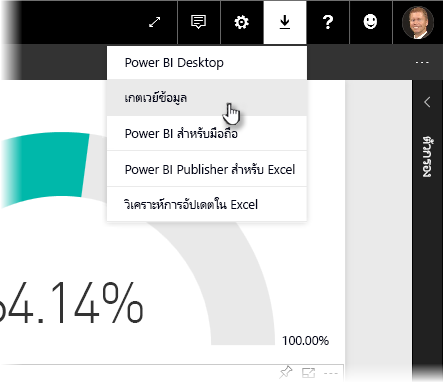
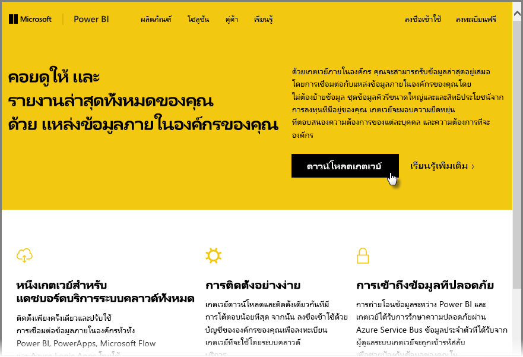
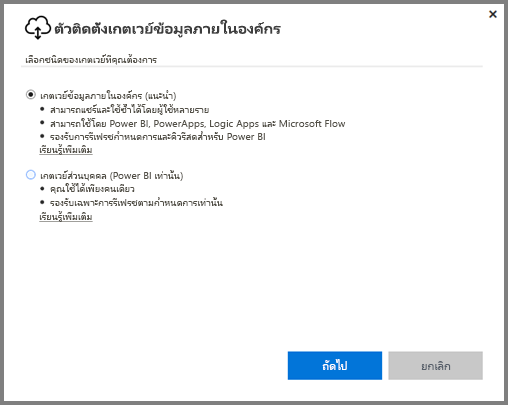
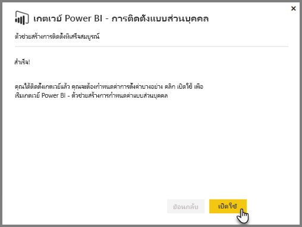
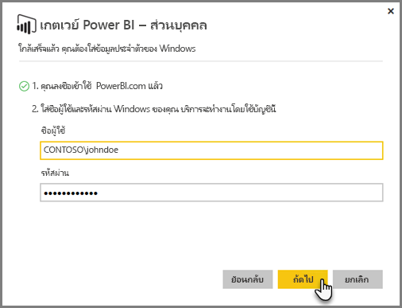
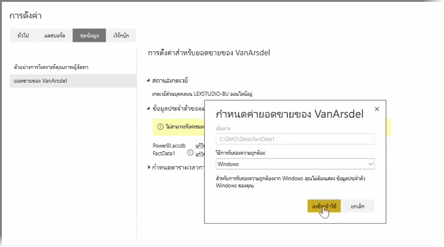
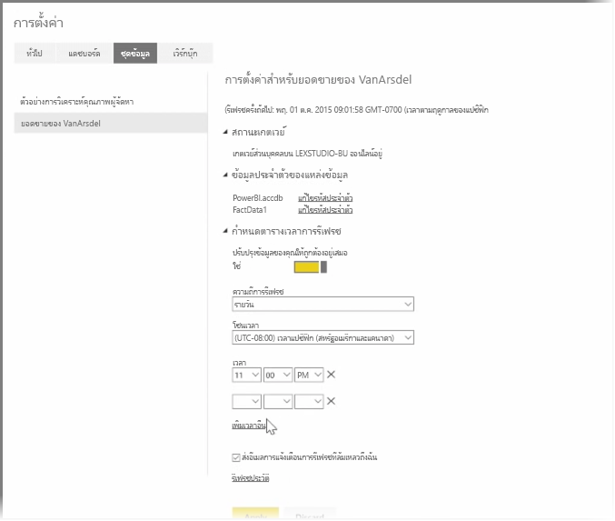

ในหัวข้อก่อนหน้า เราได้ดูเกี่ยวกับวิธีที่คุณสามารถใช้ Power BI ในการเชื่อมต่อแหล่งข้อมูล และวิธีรีเฟรชชุดข้อมูลด้วยตนเองในบริการของ Power BI อย่างไรก็ตาม คุณไม่จำเป็นต้องรีเฟรชด้วยตนเองทุกครั้งที่มีการเปลี่ยนแปลงข้อมูลของคุณ ดังนั้นคุณจึงสามารถใช้ Power BI ในการตั้งค่าการรีเฟรชตามกำหนดการซึ่งจะเชื่อมต่อกับแหล่งข้อมูลของคุณ และเผยแพร่ลงในบริการของ Power BI โดยอัตโนมัติ นอกจากนี้ยังช่วยให้คุณสามารถเชื่อมต่อบริการกับแหล่งข้อมูลในองค์กร รวมถึงไฟล์ Excel, ฐานข้อมูล Access, ฐานข้อมูล SQL และอื่นๆ

ระบบที่ช่วยให้คุณสามารถเชื่อมต่อแหล่งข้อมูลในองค์กรของคุณกับบริการของ Power BI ได้เรียกว่า **เกตเวย์ข้อมูล** ซึ่งเป็นแอปพลิเคชันขนาดเล็กที่ทำงานบนคอมพิวเตอร์ของคุณ และใช้กำหนดการที่จัดเรียงไว้ล่วงหน้าในการเชื่อมต่อกับข้อมูลของคุณ รวบรวมการอัปเดต และนำไปไว้ในบริการของ Power BI **Personal Gateway** คือ**เกตเวย์ข้อมูล**เวอร์ชันที่สามารถใช้โดยไม่ต้องมีการกำหนดค่าของผู้ดูแล

>[!NOTE]
>คอมพิวเตอร์ที่เรียกใช้ Power BI Personal Gateway *ต้อง*เปิดใช้งาน และเชื่อมต่อกับอินเทอร์เน็ตเพื่อให้ **Personal Gateway** ทำงานได้อย่างถูกต้อง
> 

เมื่อต้องการตั้งค่า**เกตเวย์ส่วนบุคคล** ก่อนอื่นให้ลงชื่อเข้าใช้บริการของ Power BI เลือกไอคอน **ดาวน์โหลด** ที่มุมบนขวาของหน้าจอ แล้วเลือก **เกตเวย์ข้อมูล** จากเมนู

จากนั้นคุณจะถูกนำไปยังเว็บเพจที่คุณสามารถเลือก **Power BI Gateway - Personal** ได้ ตามที่แสดงอยู่ด้านล่าง

เรียกใช้แอปพลิเคชันเมื่อเสร็จสิ้นการดาวน์โหลด และดำเนินตัวช่วยสร้างการติดตั้งให้แล้วเสร็จ

จากนั้นคุณจะได้รับพร้อมท์ให้เปิดใช้งานตัวช่วยสร้างการกำหนดค่าเพื่อตั้งค่าเกตเวย์ของคุณ

ระบบจะขอให้คุณลงชื่อเข้าใช้บัญชีบริการของ Power BI ก่อน จากนั้นให้ลงชื่อเข้าใช้บัญชี Windows ของเครื่อง เนื่องจากบริการเกตเวย์จะทำงานภายใต้บัญชีของคุณ

กลับไปยังบริการของ Power BI เลือกเมนูจุดไข่ปลา (สามจุด) ถัดจากชุดข้อมูลที่คุณต้องการรีเฟรช จากนั้นเลือก **จัดกำหนดการรีเฟรช** ซึ่งจะเปิดหน้า **การตั้งค่าการรีเฟรช** Power BI ตรวจพบว่าคุณได้ติดตั้ง **Personal Gateway** และบอกสถานะให้คุณทราบ

เลือก **แก้ไขข้อมูลประจำตัว** ถัดจากแต่ละแหล่งข้อมูล และตั้งค่าการรับรองความถูกต้อง

สุดท้าย ให้ตั้งค่าตัวเลือกภายใต้ **กำหนดตารางเวลาการรีเฟรช** เพื่อเปิดการใช้งานการอัปเดตอัตโนมัติ และตั้งค่าเวลาและความถี่ในการอัปเดต

เท่านี้ก็เรียบร้อย ตามเวลาที่กำหนดไว้ Power BI จะไปยังแหล่งข้อมูลเหล่านั้น โดยใช้ข้อมูลประจำตัวที่คุณให้และการเชื่อมต่อกับคอมพิวเตอร์ที่เรียกใช้ **Personal Gateway** ของคุณ และอัปเดตรายงานและชุดข้อมูลตามกำหนดการของคุณ ในครั้งถัดไปที่คุณไปที่ Power BI แดชบอร์ด รายงาน และชุดข้อมูลเหล่านั้นจะแสดงข้อมูลตามการรีเฟรชตามกำหนดการล่าสุด

## ขั้นตอนถัดไป
**ยินดีด้วย!** คุณได้ทำส่วน **การสำรวจข้อมูล** ของหลักสูตร **การเรียนรู้พร้อมคำแนะนำ** สำหรับ Power BI เสร็จเรียบร้อยแล้ว บริการของ Power BI เต็มไปด้วยวิธีที่น่าสนใจในการสำรวจข้อมูล แชร์ข้อมูลเชิงลึก และโต้ตอบกับภาพ และทั้งหมดนั้นสามารถเข้าถึงได้จากเบราว์เซอร์ จากบริการที่คุณเชื่อมต่อได้จากทุกที่ที่คุณไป

คู่หูที่มีประสิทธิภาพและเป็นที่รู้จักของ Power BI คือ **Excel** Power BI และ Excel ได้รับการออกแบบให้ทำงานร่วมกันได้ดี เวิร์กบุ๊กของคุณจะมีลักษณะเหมือนเดิมใน Power BI และสามารถนำเวิร์กบุ๊กไปที่นั่นได้อย่างง่ายดาย

ง่ายดายเพียงใดหรือ คุณจะได้คำตอบนั้นในส่วนถัดไป **Power BI และ Excel**

เจอกันในส่วนถัดไป!

