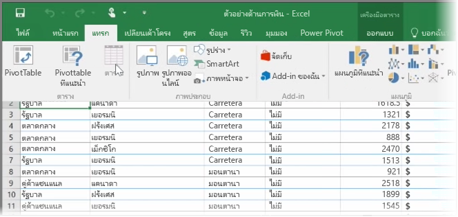
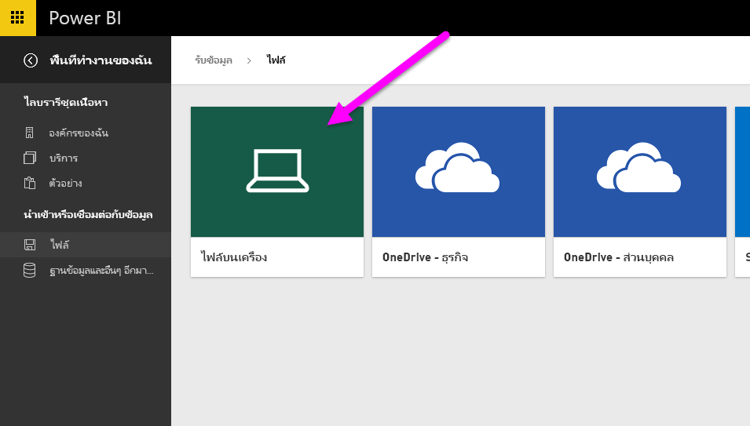
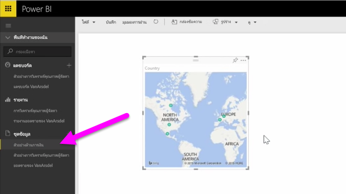

ในหัวข้อนี้ ก่อนอื่นเราจะมาดูวิธีที่คุณสามารถนำเข้าไฟล์เวิร์กบุ๊ก Excel ซึ่งมี**ตาราง**แบบง่ายๆ จากไดรฟ์ภายในลงใน Power BI จากนั้นคุณจะได้เรียนรู้วิธีที่คุณสามารถเริ่มสำรวจข้อมูลของตารางใน Power BI ด้วยการสร้างรายงาน

## ตรวจสอบให้แน่ใจว่าข้อมูลของคุณได้รับการจัดรูปแบบเป็นตารางแล้ว
เพื่อให้ Power BI นำเข้าข้อมูลจากเวิร์กบุ๊กของคุณได้ ข้อมูลดังกล่าวต้องได้รับการ**จัดรูปแบบเป็นตาราง** ง่ายมากๆ ใน Excel คุณสามารถเน้นช่วงของเซลล์ จากนั้นบนแท็บ **แทรก** ของ Ribbon ของ Excel ให้คลิก **ตาราง**

คุณจะต้องแน่ใจว่าแต่ละคอลัมน์มีชื่อที่ดี ซึ่งจะทำให้ง่ายต่อการค้นหาข้อมูลที่คุณต้องการเมื่อสร้างรายงานของคุณใน Power BI

## นำเข้าข้อมูลจากไดรฟ์ภายในเครื่อง
ไม่ว่าคุณจะเก็บไฟล์ไว้ที่ใด Power BI จะทำให้การนำเข้าเป็นเรื่องง่าย ใน Power BI คุณสามารถใช้ **รับข้อมูล** > **ไฟล์** > **ไฟล์บนเครื่อง** เพื่อค้นหาและเลือกไฟล์ Excel ที่เราต้องการ

เมื่อนำเข้าไฟล์ลงใน Power BI แล้ว คุณสามารถเริ่มสร้างรายงานได้

แน่นอนว่าไฟล์ของคุณจะไม่จำเป็นต้องอยู่บนไดรฟ์ภายในเครื่อง ถ้าคุณบันทึกไฟล์ของคุณบน OneDrive หรือทีมไซต์ SharePoint ได้ก็จะดียิ่งกว่า เราจะอธิบายรายละเอียดเพิ่มเติมเกี่ยวกับหัวข้อนี้ในภายหลัง

## เริ่มสร้างรายงาน
เมื่อนำเข้าข้อมูลของเวิร์กบุ๊กของคุณแล้ว ชุดข้อมูลจะถูกสร้างใน Power BI ซึ่งจะปรากฏขึ้นภายใต้ **ชุดข้อมูล** ขณะนี้คุณสามารถเริ่มสำรวจข้อมูลของคุณโดยการสร้างรายงานและแดชบอร์ด เพียงแค่คลิกบนไอคอน **เปิดเมนู** ถัดจากชุดข้อมูล จากนั้นคลิก **สำรวจ** พื้นที่รายงานเปล่าอันใหม่จะปรากฏขึ้น ทางด้านขวา ภายใต้ **เขตข้อมูล** คุณจะเห็นตารางและคอลัมน์ของคุณ เพียงแค่เลือกเขตขอมูลที่คุณต้องการสร้างการจัดรูปแบบการแสดงข้อมูลใหม่บนผืนผ้าใบ

คุณสามารถเปลี่ยนชนิดของการจัดรูปแบบการแสดงข้อมูล และใช้ **ตัวกรอง** และคุณสมบัติอื่นภายใต้ **การจัดรูปแบบการแสดงข้อมูล**

