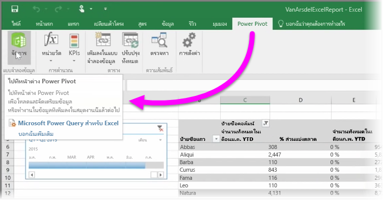

ถ้าคุณใช้ฟีเจอร์ BI ขั้นสูงของ Excel เช่น **Power Query** (ที่เรียกว่า **รับและแปลง** ใน Excel 2016) เพื่อทำคิวรีและโหลดข้อมูล, **Power Pivot** เพื่อสร้างรูปแบบข้อมูลที่มีประสิทธิภาพ และ **Power View** เพื่อสร้างรายงานแบบไดนามิก คุณสามารถนำเข้าลงใน Power BI ได้เช่นกัน

ถ้าคุณใช้ **Power Pivot** เพื่อสร้างรูปแบบข้อมูลขั้นสูง เช่นเดียวกับข้อมูลที่มีตาราง หน่วยวัด คอลัมน์จากการคำนวณ และลำดับชั้นที่เกี่ยวข้องหลายรายการ Power BI จะนำเข้าข้อมูลทั้งหมดเช่นกัน

ถ้าเวิร์กบุ๊กของคุณมี **แผ่นงาน Power View** ก็ไม่มีปัญหา Power BI จะสร้างเป็น**รายงาน**ใหม่อีกครั้งใน Power BI คุณสามารถเริ่มปักหมุดการจัดรูปแบบการแสดงข้อมูลกับแดชบอร์ดได้ทันที

และนี่เป็นหนึ่งฟีเจอร์ที่ยอดเยี่ยมของ Power BI: ถ้าคุณใช้ Power Query หรือ Power Pivot เพื่อเชื่อมต่อ ทำคิวรี และโหลดข้อมูลจากแหล่งข้อมูลภายนอก เมื่อคุณนำเข้าเวิร์กบุ๊กของคุณลงใน Power BI แล้ว คุณสามารถตั้งค่า **การรีเฟรชตามกำหนดการ** ได้ เมื่อใช้การรีเฟรชตามกำหนดการ Power BI จะใช้ข้อมูลการเชื่อมต่อจากเวิร์กบุ๊กของคุณเพื่อเชื่อมต่อโดยตรงกับแหล่งข้อมูล และทำคิวรีและโหลดข้อมูลที่มีการเปลี่ยนแปลง การจัดรูปแบบการแสดงข้อมูลในรายงานจะอัปเดตโดยอัตโนมัติเช่นกัน

