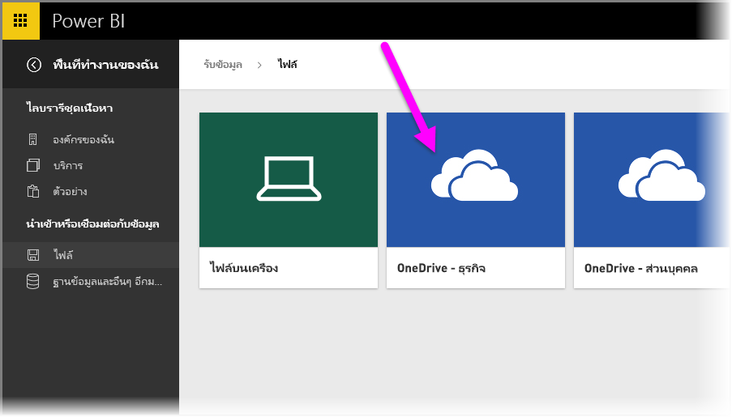
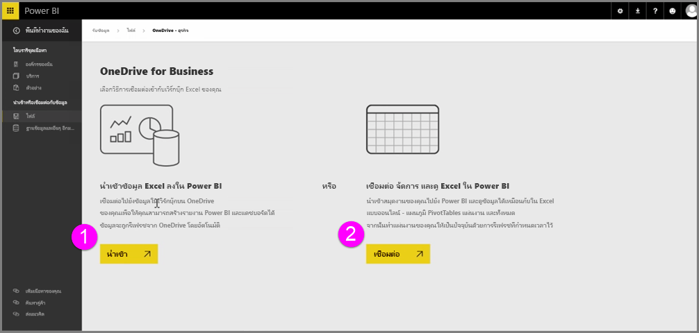
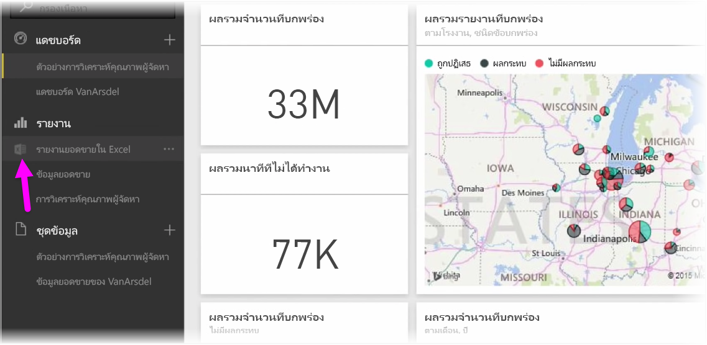
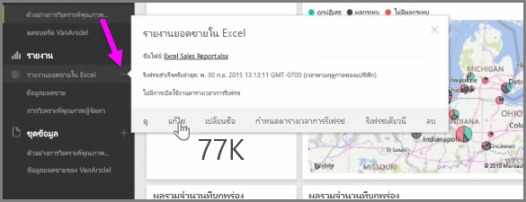

รับการรวมที่ราบรื่นระหว่าง Power BI และ Excel เมื่อคุณบันทึกเวิร์กบุ๊ก Excel ของคุณไปยัง OneDrive

เนื่องจาก OneDrive อยู่ในระบบคลาวด์ เช่นเดียวกับ Power BI การเชื่อมต่อสดจะถูกสร้างขึ้นระหว่าง Power BI และ OneDrive ถ้าคุณเปลี่ยนแปลงบางสิ่งในเวิร์กบุ๊กของคุณบน OneDrive การเปลี่ยนแปลงเหล่านั้นจะ *ซิงโครไนซ์โดยอัตโนมัติ* กับ Power BI การจัดรูปแบบการแสดงข้อมูลในรายงานและแดชบอร์ดจะได้รับการอัปเดตอยู่เสมอ ถ้าเวิร์กบุ๊กของคุณเชื่อมต่อกับแหล่งข้อมูลภายนอก เช่น ฐานข้อมูล หรือตัวดึงข้อมูล OData คุณสามารถใช้ฟีเจอร์ **กำหนดตารางเวลาการรีเฟรช** ของ Power BI เพื่อตรวจสอบการอัปเดต ต้องการถามคำถามเกี่ยวกับข้อมูลในเวิร์กบุ๊กของคุณหรือไม่ ไม่มีปัญหา คุณสามารถใช้ฟีเจอร์ **ถามและตอบ** ของ Power BI เพื่อทำเช่นนั้นได้

มีสองวิธีในการเชื่อมต่อกับไฟล์ Excel ของคุณบน OneDrive for Business:

1. นำเข้าข้อมูล Excel ลงใน Power BI
2. เชื่อมต่อ จัดการ และดู Excel ใน Power BI

### นำเข้าข้อมูล Excel ลงใน Power BI
เมื่อคุณเลือกที่จะนำเข้าข้อมูล Excel ลงใน Power BI ข้อมูลตารางจากเวิร์กบุ๊กของคุณจะถูกโหลดลงในชุดข้อมูลใหม่ใน Power BI ถ้าคุณมีแผ่นงาน **Power View** ในเวิร์กบุ๊กของคุณ ข้อมูลเหล่านั้นจะถูกนำเข้า และรายงานใหม่จะถูกสร้างใน Power BI โดยอัตโนมัติเช่นกัน

Power BI จะรักษาการเชื่อมต่อระหว่างตนเองกับไฟล์เวิร์กบุ๊กบน OneDrive for Business ของคุณ ถ้าคุณเปลี่ยนแปลงบางสิ่งในเวิร์กบุ๊กของคุณ เมื่อคุณบันทึก การเปลี่ยนแปลงเหล่านั้นจะ *ซิงโครไนซ์โดยอัตโนมัติ** กับ Power BI ซึ่งโดยปกติจะภายในหนึ่งชั่วโมง ถ้าเวิร์กบุ๊กของคุณเชื่อมต่อกับแหล่งข้อมูลภายนอก คุณสามารถตั้งค่าการรีเฟรชตามกำหนดการ เพื่อให้ชุดข้อมูลใน Power BI ได้รับการอัปเดตอยู่เสมอ เนื่องจากการจัดรูปแบบการแสดงข้อมูลในรายงานและแดชบอร์ดใน Power BI จะใช้ข้อมูลจากชุดข้อมูล เมื่อคุณสำรวจ คิวรีของคุณจะทำงานอย่างรวดเร็ว

### เชื่อมต่อ จัดการ และดู Excel ใน Power BI
เมื่อคุณเลือกที่จะเชื่อมต่อกับเวิร์กบุ๊ก Excel คุณจะได้รับประสบการณ์ที่ราบรื่นในการทำงานกับเวิร์กบุ๊กของคุณใน Excel และ Power BI เมื่อคุณเชื่อมต่อด้วยวิธีนี้ รายงานของเวิร์กบุ๊กจะมีไอคอน Excel ขนาดเล็กอยู่ข้างๆ

ในรายงาน คุณจะเห็นเวิร์กบุ๊ก Excel ของคุณใน Power BI แบบเดียวกับที่คุณเห็นใน **Excel Online** คุณสามารถสำรวจและแก้ไขเวิร์กชีตของคุณใน Excel Online ด้วยการเลือก แก้ไข จากเมนูจุดไข่ปลา เมื่อคุณเปลี่ยนแปลงบางสิ่ง การจัดรูปแบบการแสดงข้อมูลที่คุณปักหมุดกับแดชบอร์ดจะได้รับการอัปเดตโดยอัตโนมัติ

จะไม่มีชุดข้อมูลถูกสร้างใน Power BI ข้อมูลทั้งหมดจะอยู่ในเวิร์กบุ๊กบน OneDrive หนึ่งในสิทธิประโยชน์หลายประการของวิธีนี้คือ คุณสามารถตั้งค่า **การรีเฟรชตามกำหนดการ** ถ้าเวิร์กบุ๊กของคุณเชื่อมต่อกับแหล่งข้อมูลภายนอก คุณสามารถเลือกองค์ประกอบ เช่น PivotTable และแผนภูมิ และ **ปักหมุด** ข้อมูลเหล่านั้นกับแดชบอร์ดใน Power BI ถ้าคุณเปลี่ยนแปลงบางสิ่ง ข้อมูลเหล่านั้นจะแสดงใน Power BI โดยอัตโนมัติ นอกจากนี้ คุณสามารถใช้ฟีเจอร์ **ถามและตอบ** ที่ยอดเยี่ยมของ Power BI เพื่อถามคำถามเกี่ยวกับข้อมูลในเวิร์กบุ๊กของคุณ  

