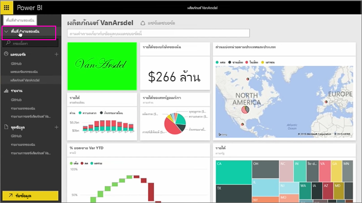
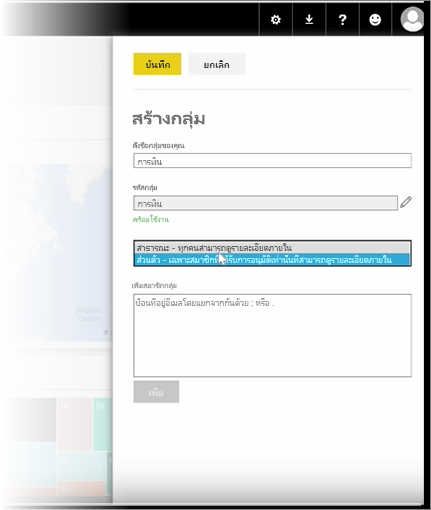
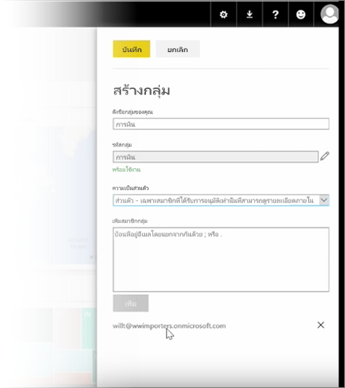

ในบทเรียนนี้ เราจะเริ่มโดยการสร้าง *กลุ่ม* **กลุ่ม** จะกำหนดเซตของผู้ใช้ที่มีสิทธิ์เข้าถึงแดชบอร์ด รายงาน และข้อมูลที่ระบุ

กลุ่มใน Power BI จะขึ้นอยู่กับกลุ่มใน Office 365 ดังนั้นถ้าคุณใช้กลุ่ม Office 365 เพื่อจัดการอีเมล ปฏิทิน และเอกสารของกลุ่มของคุณ คุณจะเห็นว่า Power BI มีฟีเจอร์เหมือนกัน และอื่นๆ เมื่อคุณสร้างกลุ่มใน Power BI จริงๆ แล้วคุณจะสร้างกลุ่ม Office 365 ขึ้นมา

โมดูลนี้ใช้สถานการณ์สมมติในการจัดตั้งกลุ่มการเงินใหม่ เราจะแสดงวิธีการตั้งค่ากลุ่ม แชร์แดชบอร์ด รายงาน และชุดข้อมูลลงในกลุ่ม และเพิ่มสมาชิกที่มีสิทธิ์เข้าถึงรายการในกลุ่ม

ฉันเริ่มต้นที่นี่ในพื้นที่ทำงานของฉัน นี่คือแดชบอร์ด รายงาน และชุดข้อมูลที่ฉันสร้าง หรือบุคคลอื่นแชร์กับฉัน

ถ้าฉันจะขยายพื้นที่ทำงานของฉัน ฉันสามารถเลือก **สร้างกลุ่ม**

ในตอนนี้ฉันสามารถตั้งชื่อกลุ่มได้ เรากำลังใช้สถานการณ์สมมติหรือก็คือกลุ่มการเงิน ดังนั้นฉันจะเรียกว่า การเงิน Power BI ตรวจสอบให้แน่ใจว่าไม่มีชื่ออยู่บนโดเมนอยู่แล้ว

ฉันสามารถตั้งค่าระดับความเป็นส่วนตัวด้วยการกำหนดว่า บุคคลในองค์กรของฉันสามารถดูเนื้อหาของกลุ่มได้หรือไม่ หรือเฉพาะสมาชิกเท่านั้น

ฉันพิมพ์ที่อยู่อีเมล กลุ่มความปลอดภัย และรายชื่อการแจกจ่ายที่นี่ ฉันเลือก **เพิ่ม** เพื่อทำให้พวกเขาเป็นสมาชิกของกลุ่ม และบันทึกกลุ่ม

ไปต่อสู่บทเรียนถัดไป!

