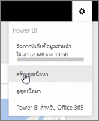
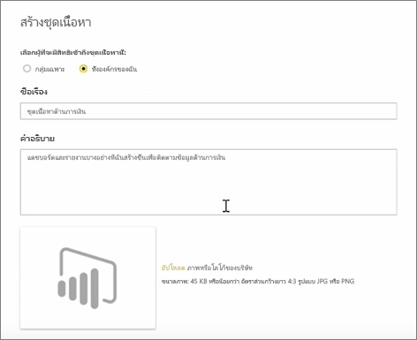
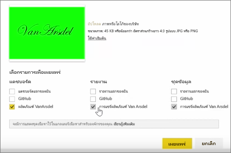

ในบทเรียนนี้ เราสร้าง*ชุดเนื้อหา*ด้วยอาร์ทิแฟกต์ที่มีอยู่แล้วใน Power BI จากนั้นแชร์ชุดเนื้อหากับเพื่อนร่วมงาน 

ใน **พื้นที่ทำงานของฉัน** ฉันมีแดชบอร์ด รายงานด้านล่าง และชุดข้อมูล ฉันต้องการแชร์สิ่งเหล่านั้นเป็นแพคเกจกับผู้คนในองค์กรของฉัน เพื่อให้พวกเขานำไปใช้ใหม่อีกครั้ง

เมื่อฉันเลือกคำ**ตั้งค่า**ไอคอน (เกียร์ด้านบนขวาของบริการ), ฉันสามารถดูปริมาณพื้นที่เก็บข้อมูลที่ฉันใช้ และฉันสามารถสร้างแอป (ก่อนหน้านี้เรียกว่าชุดเนื้อหา)

ในกล่องโต้ตอบที่ปรากฏขึ้น ฉันสามารถเลือกว่าจะแจกจ่ายให้บุคคลหรือกลุ่มที่ระบุ และสามารถตั้งชื่อได้เช่นกัน จะแนะนำให้ใส่คำอธิบายโดยละเอียดในการ**คำอธิบาย**กล่อง บุคคลเรียกดูสำหรับแอปเมื่อต้องทราบว่าประกอบด้วยอะไรหรือมีอะไร

ที่ด้านล่างของกล่องโต้ตอบ ฉันมีโอกาสในการอัปโหลดรูปภาพสำหรับแอป และขั้นตอนที่สำคัญที่สุด: ฉันเลือกแดชบอร์ดฉันต้องการรวมในแอป และเมื่อฉันทำเช่นนั้น Power BI โดยอัตโนมัติเลือกรายงานและชุดข้อมูลที่ใช้ในแดชบอร์ด ฉันไม่สามารถยกเลิกเลือกรายงานหรือชุดข้อมูล เนื่องจากแดชบอร์ดที่ฉันต้องการรวมในแอปจำ

ฉันสามารถเลือกแดชบอร์ด รายงาน และชุดข้อมูลอื่นได้ แต่ฉันยังไม่ทำเช่นนั้นในตอนนี้

เมื่อฉันเผยแพร่ แอจะถูกเพิ่มไปแกลเลอรีเนื้อหาขององค์กร

ไปต่อสู่บทเรียนถัดไป!

