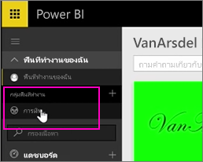
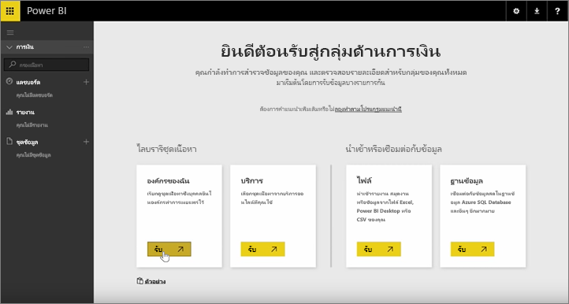
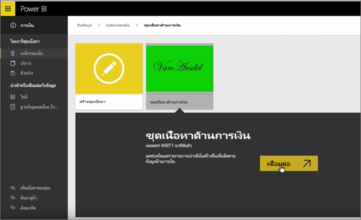
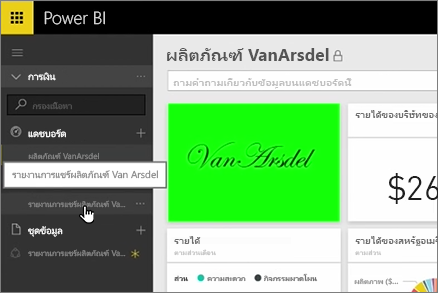
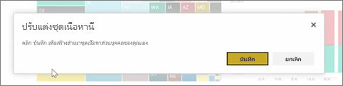
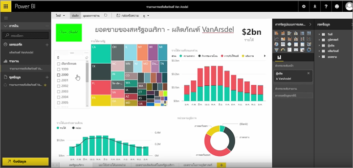

ในบทเรียนที่แล้ว เราได้สร้างชุดเนื้อหาและกลุ่มไปแล้ว ในบทเรียนนี้ เราจะสร้างอินสแตนซ์ของชุดเนื้อหาสำหรับทุกคนในกลุ่ม

ฉันเริ่มต้นในพื้นที่ทำงานของฉัน...

...และสลับกลับไปยังกลุ่มการเงินที่ฉันสร้างในบทเรียนก่อนหน้านี้

กลุ่มนี้ยังไม่มีแดชบอร์ด รายงาน หรือชุดข้อมูล ฉันจะใช้ชุดเนื้อหาที่ฉันสร้างขึ้น ฉันเรียกดูชุดเนื้อหาจากองค์กรของฉันแทนที่จะใช้ชุดเนื้อหาจากบริการของบริษัทอื่น

ฉันค้นหาชุดเนื้อหาที่ฉันสร้างขึ้นเมื่อนาทีที่แล้ว ฉันสังเกตว่าเพราะเหตุใดการใส่ชื่อ คำอธิบาย และรูปที่ดีให้ชุดเนื้อหาจึงเป็นสิ่งสำคัญ นั่นก็เพื่อให้ผู้คนค้นหาเจอ ฉันเชื่อมต่อกับชุดเนื้อหา

Power BI นำเข้าแดชบอร์ด รายงาน และชุดข้อมูลที่อยู่ในชุดเนื้อหา

เมื่อฉันเลือกชุดข้อมูล Power BI ถามว่าฉันต้องการปรับแต่งชุดเนื้อหาหรือไม่

ฉันกำลังสร้างสำเนาของชุดเนื้อหาที่ฉันสามารถเปลี่ยนแปลง และยกเลิกการเชื่อมต่อกับชุดเนื้อหาเวอร์ชันที่เผยแพร่ออกไปได้ ถ้าผู้สร้างของชุดเนื้อหาเปลี่ยนแปลงในเวอร์ชันที่เผยแพร่ ฉันจะไม่ได้รับการอัปเดตนั้นในทันที

แต่ฉันสามารถแก้ไขแดชบอร์ด รายงาน และแม้แต่ชุดข้อมูลได้ถ้าฉันต้องการ

ชุดเนื้อหาจึงเป็นวิธีที่ง่ายดายในการใช้เนื้อหาที่สร้างโดยผู้อื่นในองค์กรของคุณใหม่อีกครั้ง

ไปต่อสู่บทเรียนถัดไป!

