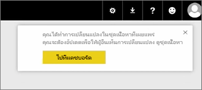
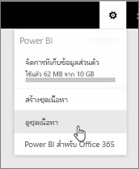
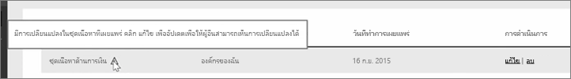
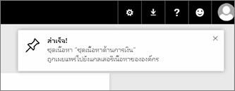

ใบบทเรียนนี้ เราจะแก้ไขชุดเนื้อหาต้นฉบับที่เราสร้างขึ้นก่อนหน้านี้ และดูว่าการแก้ไขจะอัปเดตคนอื่นที่เชื่อมต่อกับชุดเนื้อหานี้อย่างไร

ฉันกลับมาที่พื้นที่ทำงานของฉันอีกครั้ง และแก้ไขแดชบอร์ดเดิมของฉัน

ทุกครั้งที่ฉันเปลี่ยนแปลงอะไรในแดชบอร์ด ฉันจะได้รับตัวเตือนว่าฉันได้เปลี่ยนแปลงสิ่งที่ฉันแชร์กับผู้อื่นในชุดเนื้อหา และพร้อมท์ให้ฉันอัปเดตเวอร์ชันที่แชร์

ฉันกลับไปที่ไอคอนการตั้งค่าแล้วเลือก **ดูชุดเนื้อหา** เพื่อดูชุดเนื้อหาที่ฉันเผยแพร่ออกไปแล้ว

ฉันเห็นชุดเนื้อหาที่ฉันสร้างขึ้น ไอคอนเล็กๆ นี้บอกฉันว่าฉันได้เปลี่ยนแปลงบางอย่างในชุดเนื้อหา และฉันจำเป็นต้องแก้ไขชุดเนื้อหาเพื่อให้คนอื่นเห็นการเปลี่ยนแปลงของฉัน

เมื่อฉันเลือก **แก้ไข** ฉันกลับไปที่หน้าจอที่ฉันสามารถแก้ไขชื่อและคำอธิบายได้ แต่คราวนี้หน้าจอนี้มีปุ่ม **อัปเดต** ฉันจึงเลือกปุ่มนั้น

Power BI รับเปลี่ยนแปลงนั้นไป และเผยแพร่ชุดเนื้อหาที่อัปเดตแล้วลงในแกลเลอรีชุดเนื้อหา

ผู้ใดก็ตามที่สามารถเชื่อมต่อกับชุดเนื้อหาของฉันได้จะได้รับข้อความที่บอกว่าชุดเนื้อหามีการเปลี่ยนแปลง และถามว่าพวกเขาต้องการยอมรับการเปลี่ยนแปลงหรือเก็บเวอร์ชันเก่าไว้

เช่นเดียวกับเจ้าของชุดเนื้อหา คุณสามารถจัดการเวอร์ชันที่เพื่อนร่วมงานของคุณกำลังใช้งานอยู่ได้

