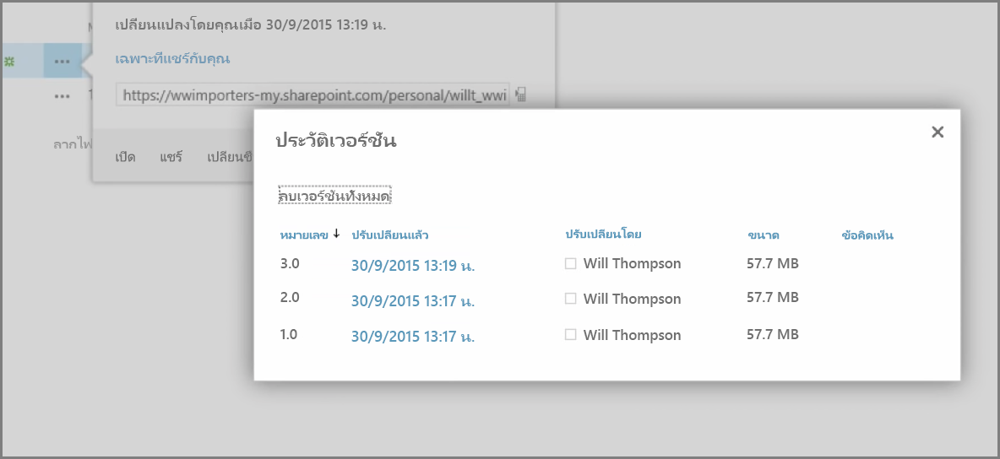
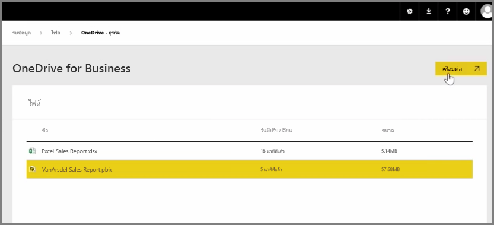
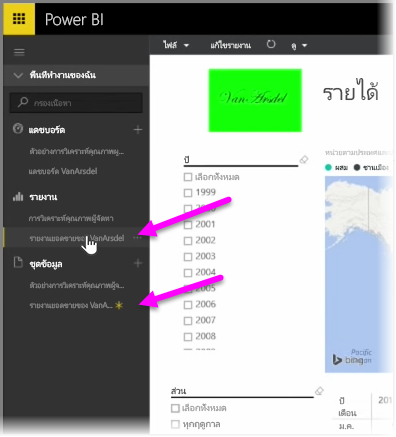

ในบทความก่อนหน้านี้ เราได้รีวิวการสร้างกลุ่มเพื่อช่วยให้องค์กรของคุณจัดการและทำงานร่วมกันในเนื้อหาที่อยู่ใน Power BI ได้ คุณสามารถใช้กลุ่ม Power BI / Office 365 เพื่อทำงานร่วมกันและแชร์โดยใช้ **OneDrive for Business** ได้เช่นกัน

การใช้ OneDrive for Business เป็นแหล่งสำหรับเนื้อหาของ Power BI ทำให้คุณสามารถเข้าถึงเครื่องมือที่มีประโยชน์จำนวนหนึ่งได้ เช่น ประวัติรุ่น คุณสามารถแชร์ไฟล์ของคุณด้วยกลุ่ม Office 365 จากภายใน OneDrive for Business เพื่อทำให้หลายคนสามารถเข้าถึงและทำงานใน Power BI หรือไฟล์ Excel เดียวกันได้

เมื่อต้องการเชื่อมต่อกับไฟล์ PBIX (Power BI Desktop) บน OneDrive for Business ให้ลงชื่อเข้าใช้ในบริการของ Power BI แล้วเลือก**รับข้อมูล** เลือก **ไฟล์** ภายใต้ นำเข้าหรือเชื่อมต่อกับข้อมูล จากนั้นเลือก **OneDrive for Business** เน้นไฟล์ที่ต้องการ แล้วเลือก **เชื่อมต่อ**

เนื้อหาของคุณจะปรากฏในแถบนำทางด้านซ้าย

ทีนี้ การเปลี่ยนแปลงใดๆ ที่เกิดขึ้นกับไฟล์บน **OneDrive for Business** จะถูกแสดงในสภาพแวดล้อม Power BI โดยอัตโนมัติเช่นกัน และถูกบันทึกในประวัติรุ่น

