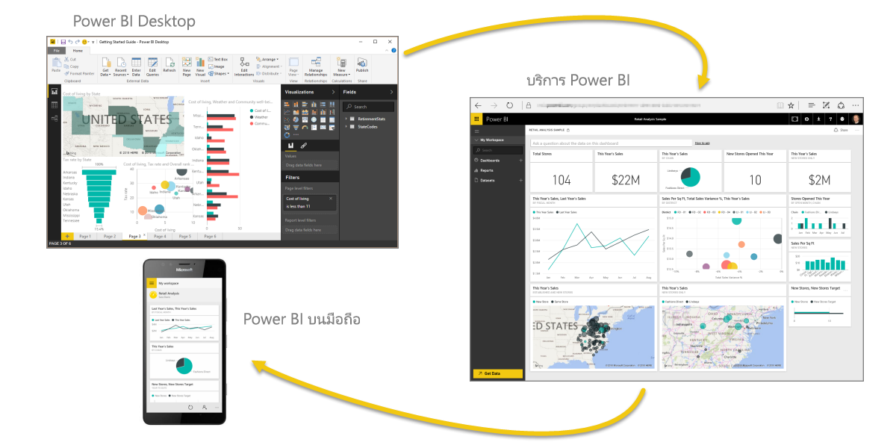

คุณทำสำเร็จแล้ว! **ยินดีด้วย!** คุณได้จบส่วนแรกของหลักสูตร **การเรียนรู้พร้อมคำแนะนำ** สำหรับ Power BI แล้ว คุณได้วนครบรอบจากการเรียนรู้องค์ประกอบพื้นฐานของ Power BI รับการแนะนำผ่านฟีเจอร์และองค์ประกอบของซอฟต์แวร์ และเรียนรู้วิธีที่สิ่งเหล่านั้นทำงานด้วยกันแล้ว

นี่คือส่วนสุดท้าย (และหัวข้อสุดท้าย เว้นแต่ว่าคุณต้องการเรียนรู้ DAX) ของบทเรียน ดังนั้นถ้าคุณผ่านส่วนต่างๆ เหล่านั้นมาตามลำดับ ให้หยุดสักครู่เพื่อให้กำลังใจตนเองก่อน ทำได้ดีมาก! ตอนนี้คุณเข้าใจ**แนวคิดที่สำคัญ**เหล่านี้อย่างถี่ถ้วนแล้ว:

* อะไรคือ [Power BI](../gettingstarted.yml#step-1)
* [โครงสร้างพื้นฐาน](../gettingstarted.yml#step-3)ของ Power BI
* [การรับ](../gettingdata.yml#step-3)และ[การวางรูปแบบ](../modeling.yml#step-1)ข้อมูล
* [การแสดงภาพของข้อมูล](../visualizations.yml#step-1)
* [การสำรวจข้อมูล](../exploringdata.yml#step-1)ในบริการ Power BI
* การใช้ [Excel และ Power BI](../powerbiandexcel.yml#step-1) ร่วมกัน
* และ[การเผยแพร่และการแชร์](../publishingandsharing.yml#step-1)งานของคุณ

นั่นคือความรู้จำนวนมาก และในเมื่อคุณจำสิ่งเหล่านั้นได้ทั้งหมดแล้ว คุณก็พร้อมที่จะจำสิ่งเหล่านั้นไปใช้! ต่อไปนี้คือ**ลิงก์เพื่อดาวน์โหลด**หรือเพื่อทำให้เบราว์เซอร์ของคุณ**เชื่อมต่อกับบริการ Power BI**:

* คุณสามารถ[รับ Power BI Desktop รุ่นล่าสุด](https://powerbi.microsoft.com/desktop)ได้ตลอดเวลา
* การไปยัง[บริการ Power BI](https://powerbi.microsoft.com/) นั้นเป็นเรื่องง่าย
* การรับ[แอปสำหรับอุปกรณ์เคลื่อนที่สำหรับ Power BI](https://powerbi.microsoft.com/mobile/) นั้นง่ายเพียงแตะครั้งเดียว

และยังมีเนื้อหา**วิธีใช้และการอ้างอิง**พร้อมให้ใช้งานเช่นกัน เพียงไปที่ด้านบนของหน้านี้แล้วเลือก **การเรียนรู้ > คู่มือ** เพื่อดูเนื้อหาอ้างอิงเพิ่มเติมของ Power BI ของเรา

เราหวังว่าคุณจะเพลิดเพลินกับประสบการณ์ของคุณใน**การเรียนรู้พร้อมคำแนะนำของ Power BI** นี้ ขอให้คุณโชคดี และขอให้ภาพของ Power BI ของคุณน่าดึงดูดและน่าสนใจอยู่เสมอ

## อีกส่วนหนึ่งที่เหลือสำหรับผู้ใช้ DAX
ต้องการเพิ่มอีกใช่ไหม สนใจการใช้งาน **DAX (นิพจน์การวิเคราะห์ข้อมูล)** เพื่อสร้าง กรอง หรือใช้คอลัมน์และตารางที่กำหนดเองใน Power BI ใช่ไหม ยังเหลืออีกส่วนที่มีไว้สำหรับคนที่สนใจการเขียนโค้ดใน Power BI และส่วนนั้นเรียกว่า **บทนำสู่ DAX** ลองดูหากคุณสนใจ ส่วนนี้ใช้วิธีการอธิบายอย่างง่ายเช่นเดียวกับส่วนอื่นของการเรียนรู้พร้อมคำแนะนำ

