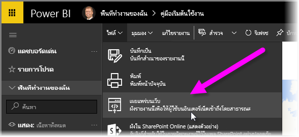
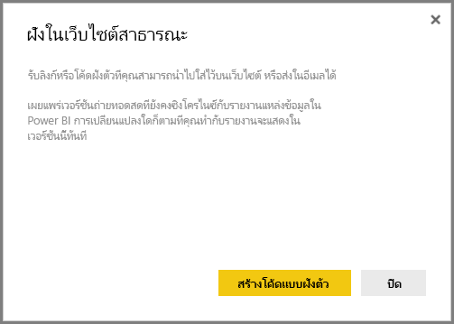
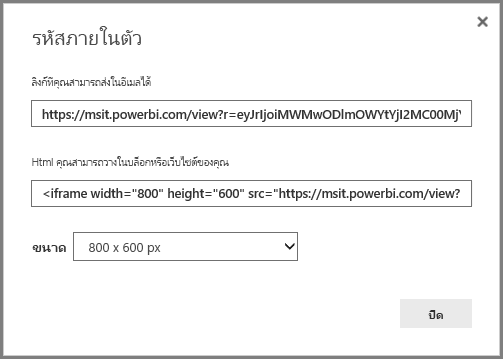
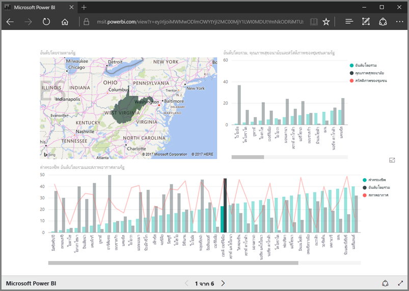
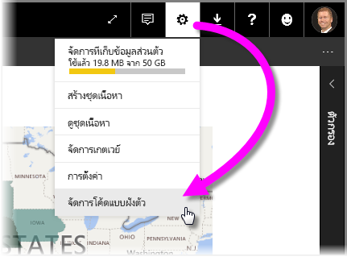
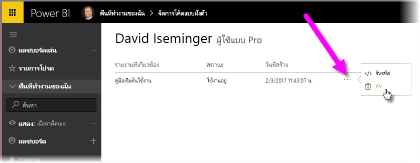

ในบทเรียนนี้ เราเรียนรู้วิธีแชร์รายงาน Power BI บนเว็บเพจ หรือแชร์ผ่านอีเมลในขั้นตอนง่ายๆ เพียงไม่กี่ขั้นตอน ฟีเจอร์นี้ของ Power BI มักถูกเรียกว่า **เผยแพร่ไปยังเว็บ** และใช้งานและจัดการได้ง่าย

ใน Power BI ให้เลือกรายงานที่คุณต้องการแชร์ เพื่อให้รายงานแสดงขึ้นมาบนพื้นที่ทำงาน แล้วจากเมนู ให้เลือก **ไฟล์ > เผยแพร่ไปยังเว็บ**

จากนั้นคุณจะเห็นกล่องโต้ตอบที่อธิบายว่าคุณจะได้รับ*โค้ดฝังตัว*ที่ให้คุณใส่รายงานลงในเว็บไซต์หรือในจดหมายได้

เมื่อคุณเลือก **สร้างโค้ดฝังตัว** Power BI จะแสดงกล่องโต้ตอบอีกกล่องที่บอกคุณอีกครั้งว่าคุณกำลังจะแชร์ข้อมูลของคุณกับผู้อื่นบนอินเทอร์เน็ต ตรวจสอบให้มั่นใจว่าข้อมูลนั้นสามารถแชร์ได้!

Power BI จะแสดงกล่องโต้ตอบที่มีสองลิงก์:

* ลิงก์หนึ่งคุณสามารถแชร์ในอีเมล ซึ่งจะแสดงรายงานเป็นเว็บเพจ
* โค้ด HTML (ลิงก์ที่มี IFrame) เพื่อให้คุณสามารถฝังรายงานลงในเว็บเพจได้โดยตรง

สำหรับลิงก์ HTML คุณสามารถเลือกรายงานที่ฝังตัวเป็นขนาดที่กำหนดไว้ล่วงหน้า หรือคุณสามารถปรับเปลี่ยนโค้ด IFrame ด้วยตัวเองและปรับขนาดของรายงานได้

คุณเพียงวางลิงก์อีเมลลงในเบราว์เซอร์ และดูรายงานของคุณเป็นเว็บ คุณสามารถโต้ตอบกับเว็บเพจนั้นได้เช่นเดียวกับเวลาที่คุณดูรายงานนั้นใน Power BI รูปต่อไปนี้แสดงหน้า **เผยแพร่ไปยังเว็บ** เมื่อลิงก์ถูกคัดลอกจากกล่องโต้ตอบลงในเบราว์เซอร์โดยตรง:

คุณยังสามารถฝังลิงก์ IFrame นั้นลงในบล็อกโพสต์หรือเว็บไซต์ หรือลงใน Sway ได้เช่นกัน

ต้องการลบโค้ดฝังตัวที่คุณสร้างขึ้นใช่ไหม ไม่มีปัญหา ใน Power BI ให้เลือกไอคอน**เกียร์**ที่มุมขวาบน จากนั้นเลือก **จัดการโค้ดฝังตัว**

พื้นที่ทำงาน Power BI แสดงโค้ดฝังตัวที่คุณสร้าง (ในรูปด้านล่างมีเพียงโค้ดเดียว) เมื่อคุณคลิกที่วงรี คุณสามารถเลือกได้ว่าจะรับโค้ดสำหรับโค้ดฝังตัว หรือลบโค้ดฝังตัวทิ้งไป

และนั่นคือทั้งหมดในการเผยแพร่รายงาน Power BI ของคุณไปยังเว็บ และแชร์รายงานนั้นกับคนทั่วโลก ง่ายมากๆ

