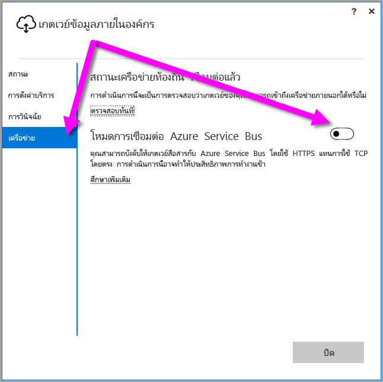

## <a name="sign-in-account"></a>ลงชื่อเข้าใช้บัญชี

ผู้ใช้ลงชื่อเข้าใช้ด้วยบัญชีทำงานหรือบัญชีโรงเรียน บัญชีนี้คือ **บัญชีองค์กร** ของคุณ หากคุณลงชื่อสมัครใช้ข้อเสนอของ Office 365 และไม่ได้ใส่อีเมลที่ใช้ทำงานจริงของคุณ อาจส่งผลให้มีลักษณะคล้ายnancy@contoso.onmicrosoft.comได้ บัญชีของคุณภายในบัญชีผู้เช่าใน Azure Active Directory (AAD) ในกรณีส่วนใหญ่ UPN ของบัญชี AAD ของคุณจะตรงกับที่อยู่อีเมล

## <a name="windows-service-account"></a>บัญชีบริการ Windows

เกตเวย์ข้อมูลแบบติดตั้งภายในองค์กรได้รับการกำหนดค่าให้ใช้*NT SERVICE\PBIEgwService*สำหรับข้อมูลประจำตัวการเข้าสู่ระบบบริการ Windows ซึ่งมีสิทธิ์เข้าระบบเป็นการบริการ ในบริบทของเครื่องที่คุณกำลังใช้เพื่อติดตั้งเกตเวย์ ตามค่าเริ่มต้น บัญชีนี้ไม่ใช่บัญชีเดียวกันกับที่ใช้เชื่อมต่อกับแหล่งข้อมูลแบบติดตั้งภายในองค์กร บัญชีนี้ไม่ใช่บัญชีทำงานหรือบัญชีโรงเรียนที่คุณจะใช้เข้าสู่ระบบบริการคลาวด์ได้

> [!NOTE]
> หากคุณเลือกโหมดส่วนบุคคล ให้คุณกำหนดค่าบัญชีบริการ Windows แยกต่างหาก

หากคุณประสบปัญหาเกี่ยวกับการรับรองความถูกต้องด้วยพร็อกซีเซิร์ฟเวอร์ของคุณ ให้ลองเปลี่ยนบัญชีบริการ Windows เป็นผู้ใช้โดเมนหรือบัญชีบริการที่ได้รับการจัดการ สำหรับข้อมูลเพิ่มเติม โปรดดู[การกำหนดค่าพร็อกซี](../service-gateway-proxy.md#changing-the-gateway-service-account-to-a-domain-user)

## <a name="ports"></a>พอร์ต

เกตเวย์สร้างการเชื่อมต่อขาออกไปยัง Azure Service Bus ซึ่งจะสื่อสารบนพอร์ตขาออก: TCP 443 (ค่าเริ่มต้น), 5671, 5672, 9350 ไปจนถึง 9354  เกตเวย์ไม่จำเป็นต้องใช้พอร์ตขาเข้า

เราแนะนำให้คุณเพิ่มที่อยู่ IP ในรายการที่อนุญาตสำหรับเขตข้อมูลของคุณไว้ในไฟร์วอลล์ คุณสามารถดาวน์โหลด[รายการ IP ของศูนย์ข้อมูล Microsoft Azure](https://www.microsoft.com/download/details.aspx?id=41653) ได้ โดยมีการอัปเดตทุกสัปดาห์ อีกวิธีหนึ่งคือ คุณสามารถขอรับรายการพอร์ตที่กำหนด โดยทำการ[ทดสอบพอร์ตเครือข่าย](../service-gateway-onprem-tshoot.md#network-ports-test)บนแอปพลิเคชันเกตเวย์ข้อมูลแบบติดตั้งภายในองค์กรได้ เกตเวย์จะสื่อสารกับ Azure Service Bus โดยใช้ที่อยู่ IP พร้อมกับชื่อโดเมนแบบที่มีคุณสมบัติครบถ้วน (FQDN) ถ้าคุณกำลังบังคับให้เกตเวย์สื่อสารโดยใช้ HTTPS เกตเวย์จะใช้ FQDN เท่านั้นและจะไม่มีการสื่อสารโดยใช้ที่อยู่ IP เกิดขึ้น


> [!NOTE]
> ที่อยู่ IP ที่ระบุในรายการ Azure Datacenter IP อยู่ในรูปแบบสัญลักษณ์ CIDR ตัวอย่างเช่น 10.0.0.0/24 ไม่ได้หมายความว่า 10.0.0.0 ถึง 10.0.0.24 เรียนรู้เพิ่มเติมเกี่ยวกับ [รูปแบบสัญลักษณ์ CIDR ](http://whatismyipaddress.com/cidr)

นี่คือรายชื่อของชื่อโดเมนที่มีคุณสมบัติครบถ้วนที่ใช้โดยเกตเวย์

| ชื่อโดเมน | พอร์ตขาออก | คำอธิบาย |  |
|-----------------------------|----------------|--------------------------------------------------------------------------------------------------------------------|---|
| *.download.microsoft.com | 80 | ใช้เพื่อดาวน์โหลดตัวติดตั้ง นอกจากนี้ยังใช้เพื่อตรวจสอบเวอร์ชันและเขตของเกตเวย์โดยแอปเกตเวย์ข้อมูลอีกด้วย |  |
| *.powerbi.com | 443 | ใช้ระบุคลัสเตอร์ Power BI ที่เกี่ยวข้อง |  |
| *.analysis.windows.net | 443 | ใช้ระบุคลัสเตอร์ Power BI ที่เกี่ยวข้อง |  |
| *.login.windows.net | 443 | ใช้เพื่อรับรองความถูกต้องของแอปเกตเวย์ข้อมูลกับ Azure Active Directory / OAuth2 |  |
| *.servicebus.windows.net | 5671-5672 | ใช้กับโปรโตคอลการจัดคิวข้อความขั้นสูง (AMQP) |  |
| *.servicebus.windows.net | 443, 9350-9354 | ใช้โดยตัวรอรับการติดต่อบน Service Bus Relay บน TCP (ต้องใช้ 443 สำหรับการรับโทเค็นควบคุมการเข้าถึง) |  |
| *.frontend.clouddatahub.net | 443 | ยกเลิก - ไม่จำเป็นอีกต่อไป จะมีการลบออกจากเอกสารอ้างอิงในอนาคต |  |
| *.core.windows.net | 443 | ใช้โดยกระแสข้อมูลใน Power BI เพื่อเขียนข้อมูลไปยัง Azure Data Lake |  |
| login.microsoftonline.com | 443 | ใช้เพื่อรับรองความถูกต้องของแอปเกตเวย์ข้อมูลกับ Azure Active Directory / OAuth2 |  |
| *.msftncsi.com | 443 | ใช้เพื่อทดสอบการเชื่อมต่ออินเทอร์เน็ตและระบุว่าเกตเวย์ไม่สามารถเข้าถึงได้โดยบริการ Power BI |  |
| *.microsoftonline-p.com | 443 | ใช้เพื่อรับรองความถูกต้องของแอปเกตเวย์ข้อมูลกับ Azure Active Directory / OAuth2 |  |
| | |

> [!NOTE]
> เมื่อติดตั้ง และลงทะเบียนเกตเวย์ พอร์ต/IP ที่กำหนดเท่านั้นคือ พอร์ต/IP ที่จำเป็นต่อ Azure Service Bus (servicebus.windows.net ที่สูงกว่า) คุณสามารถขอรับรายการพอร์ตที่กำหนด โดยทำการ[ทดสอบพอร์ตเครือข่าย](../service-gateway-onprem-tshoot.md#network-ports-test)บนแอปพลิเคชันเกตเวย์ข้อมูลแบบติดตั้งภายในองค์กรได้

## <a name="forcing-https-communication-with-azure-service-bus"></a>บังคับให้ HTTPS สื่อสารกับ Azure Service Bus

คุณสามารถบังคับให้เกตเวย์สื่อสารกับ Azure Service Bus โดยใช้ HTTPS แทนการใช้ TCP โดยตรง

> [!NOTE]
> การติดตั้งใหม่ (ไม่อัปเดต) ตั้งเป็นค่าเริ่มต้นเป็น HTTPS แทน TCP ตามคำแนะนำจาก Azure Service Bus โดยเริ่มต้นด้วยการเผยแพร่ในเดือนมิถุนายน 2019

เพื่อบังคับใช้การสื่อสารผ่าน HTTPS ให้แก้ไขไฟล์*Microsoft.PowerBI.DataMovement.Pipeline.GatewayCore.dll.config*โดยการเปลี่ยนค่าจาก`AutoDetect`เป็น`Https`ตามที่แสดงในข้อมูลรหัสโดยตรงตามย่อหน้านี้ ไฟล์อยู่ที่ (ตามค่าเริ่มต้น) ที่*C:\Program Files\เกตเวย์ข้อมูลที่ติดตั้งภายในองค์กร*

```xml
<setting name="ServiceBusSystemConnectivityModeString" serializeAs="String">
    <value>Https</value>
</setting>
```

ค่าสำหรับพารามิเตอร์ *ServiceBusSystemConnectivityModeString* ไวต่อตัวอักษรตัวใหญ่-ตัวเล็ก ค่าที่ถูกต้องคือ *AutoDetect* และ *Https*

อีกวิธีหนึ่งคือ คุณสามารถบังคับให้เกตเวย์ปรับใช้ลักษณะการทำงานนี้โดยใช้หน้าจอผู้ใช้เกตเวย์ได้ ในหน้าจอผู้ใช้เกตเวย์ เลือก**เครือข่าย**แล้วสลับโหมดการเชื่อมต่อ **Azure Service Bus**เป็น**เปิดใช้งาน**



เมื่อเปลี่ยนแล้ว หากคุณเลือก**นำไปใช้** (ปุ่มที่จะปรากฏเฉพาะเมื่อคุณทำการเปลี่ยนแปลง) *gateway Windows service*จะเริ่มต้นใหม่โดยอัตโนมัติ ดังนั้นการเปลี่ยนแปลงจึงจะมีผล

สำหรับการอ้างอิงในอนาคต คุณสามารถรีสตาร์ท*gateway Windows service*จากกล่องโต้ตอบส่วหน้าจอผู้ใช้โดยเลือก**การตั้งค่า Serive**แล้วเลือก*รีสตาร์ททันที*


## <a name="support-for-tls-12"></a>สนับสนุน TLS 1.1/1.2

เกตเวย์ข้อมูลแบบติดตั้งภายในองค์กร จะใช้ Transport Layer Security (TLS) 1.2 หรือ 1.2 ในการสื่อสารกับ Power BI service เป็นค่าเริ่มต้น เพื่อให้แน่ใจว่าการรับส่งข้อมูลทั้งหมดของเกตเวย์ใช้ TLS 1.2 คุณต้องเพิ่มหรือแก้ไขรีจิสทรีคีย์ต่อไปนี้บนเครื่องที่ใช้งาน service ของเกตเวย์:

```
[HKEY_LOCAL_MACHINE\SOFTWARE\Microsoft\.NETFramework\v4.0.30319]"SchUseStrongCrypto"=dword:00000001
[HKEY_LOCAL_MACHINE\SOFTWARE\Wow6432Node\Microsoft\.NETFramework\v4.0.30319]"SchUseStrongCrypto"=dword:00000001
```

> [!NOTE]
> การเพิ่มหรือแก้ไขรีจิสทรีคีย์เหล่านี้จะนำการเปลี่ยนแปลงไปใช้กับแอปพลิเคชัน .NET ทั้งหมด สำหรับข้อมูลเกี่ยวกับการเปลี่ยนแปลงรีจิสทรีที่มีผลต่อ TLS สำหรับแอปพลิเคชันอื่นๆ ดูที่[การตั้งค่ารีจิสทรี Transport Layer Security (TLS)](https://docs.microsoft.com/windows-server/security/tls/tls-registry-settings)

## <a name="how-to-restart-the-gateway"></a>วิธีการรีสตาร์ทเกตเวย์

เกตเวย์ทำงานเป็น windows service คุณสามารถเริ่มและหยุดได้เหมือนกับ windows service อื่นๆ นี่คือวิธีคุณสามารถทำได้จากพรอมต์คำสั่ง

1. เรียกใช้พรอมต์คำสั่งการจัดการบนเครื่องที่เกตเวย์ทำงานอยู่
2. ใช้คำสั่งต่อไปนี้เพื่อหยุด service
   
   net stop PBIEgwService
3. ใช้คำสั่งต่อไปนี้เพื่อเริ่ม service
   
   net start PBIEgwService

