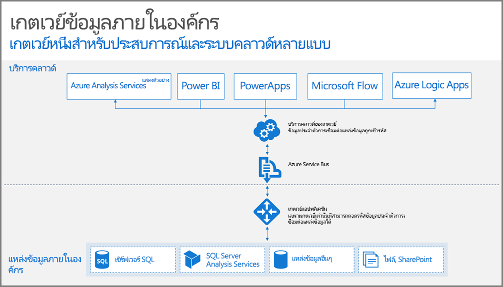

## วิธีการทำงานของเกตเวย์

ก่อนอื่นมาดูสิ่งที่จะเกิดขึ้นเมื่อผู้ใช้โต้ตอบกับองค์ประกอบที่เชื่อมต่อกับแหล่งข้อมูลภายในองค์กร 

> [!NOTE]
> สำหรับ Power BI คุณจะต้องกำหนดค่าแหล่งข้อมูลสำหรับเกตเวย์
> 
> 

1. แบบสอบถามจะถูกสร้างขึ้นโดย cloud service พร้อมด้วยข้อมูลประจำตัวเข้ารหัสลับสำหรับแหล่งข้อมูลภายในองค์กร และส่งไปยังคิวเพื่อประมวลผลเกตเวย์
2. Cloud service ของเกตเวย์จะวิเคราะห์แบบสอบถาม และส่งคำขอไปยัง[Azure Service Bus](https://azure.microsoft.com/documentation/services/service-bus/)
3. เกตเวย์ข้อมูลภายในองค์กรจะทำการสำรวจ[Azure Service Bus](https://azure.microsoft.com/documentation/services/service-bus/)สำหรับคำขอที่ค้างอยู่
4. เกตเวย์รับแบบสอบถาม ถอดรหัสข้อมูลประจำตัว และเชื่อมต่อกับแหล่งข้อมูลด้วยข้อมูลประจำตัวเหล่านั้น
5. เกตเวย์ส่งแบบสอบถามไปยังแหล่งข้อมูลเพื่อดำเนินการ
6. ผลลัพธ์จะส่งจากแหล่งข้อมูล กลับไปยังเกตเวย์ และไปยัง cloud service จากนั้น serivice จะใช้ผลลัพธ์นั้น

