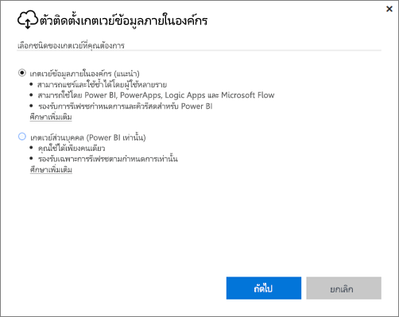
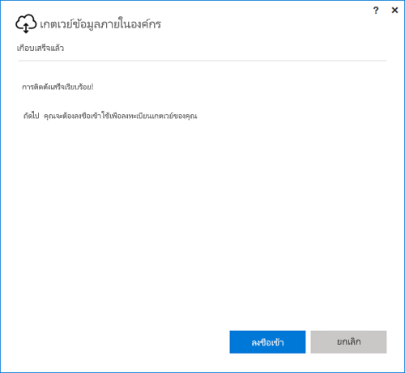
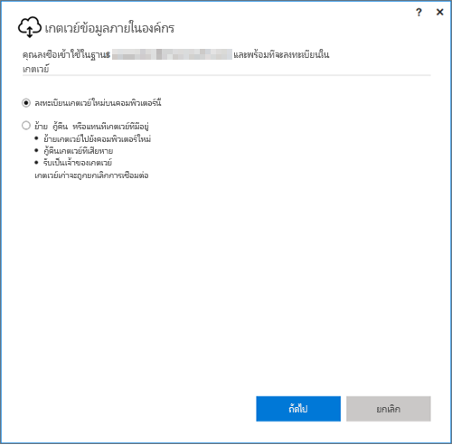
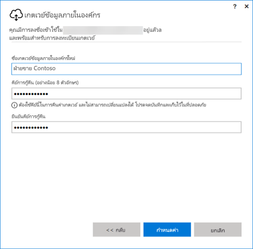

## ติดตั้งเกตเวย์ข้อมูลภายในองค์กร
เกตเวย์ข้อมูลได้รับการติดตั้งและทำงานบนคอมพิวเตอร์ของคุณ การติดตั้งเกตเวย์บนเครื่องที่สามารถปล่อยให้ทำงานได้งานตลอดเวลาเป็นสิ่งที่ดีที่สุด

> [!NOTE]
> เกตเวย์ได้รับการสนับสนุนบนระบบปฏิบัติการ Windows รุ่น 64 บิตเท่านั้น
> 
> 

สำหรับ Power BI สิ่งแรกที่คุณต้องทำคือเลือกโหมดของเกตเวย์

* **เกตเวย์ข้อมูลภายในองค์กร:** ผู้ใช้หลายคนสามารถใช้ร่วมกันและนำเกตเวย์ในโหมดนี้กลับมาใช้ซ้ำได้ สามารถใช้เกตเวย์นี้โดย Power BI, PowerApps, Flow หรือ Logic Apps สำหรับ Power BI รวมถึงการสนับสนุนการรีเฟรชตามกำหนดการและ DirectQuery
* **ส่วนบุคคล:** ใช้สำหรับ Power BI เท่านั้น และสามารถใช้เป็นรายบุคคลโดยไม่ต้องกำหนดค่าผู้ดูแล ซึ่งสามารถใช้สำหรับการรีเฟรชตามความต้องการและตามกำหนดการเท่านั้น การเลือกนี้จะปล่อยการติดตั้งของเกตเวย์ส่วนบุคคล

มีบางสิ่งที่ต้องทราบเกี่ยวกับการติดตั้งโหมดของเกตเวย์:

* เกตเวย์ทั้งสองแบบจะต้องใช้ระบบปฏิบัติการ Windows รุ่น 64 บิต
* เกตเวย์ไม่สามารถติดตั้งบนตัวควบคุมโดเมน
* คุณสามารถติดตั้งเกตเวย์ข้อมูลภายในองค์กรได้สูงสุดสองตัวบนคอมพิวเตอร์เครื่องเดียวกัน โดยมีหนึ่งตัวต่อหนึ่งโหมด (ส่วนบุคคลและมาตรฐาน) 
* คุณไม่สามารถมีเกตเวย์มากกว่าหนึ่งตัวที่ทำงานในโหมดเดียวกันบนคอมพิวเตอร์เครื่องเดียวกัน
* คุณสามารถติดตั้งเกตเวย์ข้อมูลภายในองค์กรหลายตัวบนคอมพิวเตอร์คนละเครื่อง และจัดการเกตเวย์เหล่านั้นทั้งหมดจากหน้าจอการจัดการเกตเวย์ Power BI เดียวกันได้ (ยกเว้นกรณีเกตเวย์ส่วนบุคคล ให้ดูข้อต่อไป)
* คุณสามารถมีเกตเวย์โหมดส่วนบุคคลหนึ่งตัวต่อผู้ใช้ Power BI หนึ่งคนเท่านั้น ถ้าคุณติดตั้งเกตเวย์โหมดส่วนบุคคลอีกตัวสำหรับผู้ใช้เดียวกัน ถึงแม้ว่าจะอยู่บนคอมพิวเตอร์คนละเครื่อง การติดตั้งล่าสุดจะแทนที่การติดตั้งก่อนหน้า

ต่อไปนี้คือสิ่งที่ควรพิจารณาก่อนการติดตั้งเกตเวย์

* ถ้าคุณกำลังติดตั้งบนแล็ปท็อป และแล็ปท็อปของคุณปิดใช้งาน หรือไม่ได้เชื่อมต่อกับอินเทอร์เน็ต หรืออยู่ในโหมดพัก เกตเวย์จะไม่ทำงานและข้อมูลใน cloud service จะไม่เชื่อมกับข้อมูลแบบภายในองค์กรของคุณ
* ถ้าเครื่องของคุณเชื่อมต่อกับเครือข่ายไร้สาย เกตเวย์อาจทำงานช้าซึ่งอาจใช้เวลานานในการเชื่อมข้อมูลใน cloud service กับข้อมูลภายในองค์กรของคุณ

เมื่อติดตั้งเกตเวย์แล้ว คุณจะต้องลงชื่อเข้าใช้ด้วยบัญชีทำงานหรือบัญชีโรงเรียนของคุณ

หลังจากที่คุณลงชื่อเข้าใช้แล้ว คุณจะมีตัวเลือกในการกำหนดค่าเกตเวย์ใหม่ หรือการโยกย้าย คืนค่า หรือควบคุมเกตเวย์ที่มีอยู่

## กำหนดค่าเกตเวย์ใหม่
1. ป้อน**ชื่อ**สำหรับเกตเวย์
2. ป้อน**คีย์การกู้คืน** ซึ่งจะต้องมีอย่างน้อย 8 อักขระ
3. เลือก**กำหนดค่า**

> [!NOTE]
> หากคุณต้องการโยกย้าย คืนค่า หรือควบคุมเกตเวย์ คุณจะต้องมีคีย์การกู้คืน ตรวจสอบให้แน่ใจว่าเก็บคีย์นี้ไว้ในที่ปลอดภัย
> 
> 

### โยกย้าย กู้คืน หรือควบคุมเกตเวย์ที่มีอยู่
คุณจะต้องเลือกเกตเวย์ที่คุณต้องการกู้คืน และใส่คีย์การกู้คืนที่ใช้ในการสร้างเกตเวย์ครั้งแรก

### เชื่อมต่อเกตเวย์ข้อมูลภายในองค์กรแล้ว
เมื่อกำหนดค่าเกตเวย์แล้ว คุณจะสามารถทำใช้เกตเวย์เพื่อเชื่อมต่อกับแหล่งข้อมูลภายในองค์กรได้

ถ้าเป็นเกตเวย์ใช้สำหรับ Power BI คุณจะต้องเพิ่มแหล่งข้อมูลของคุณไปยังเกตเวย์ภายใน Power BI service ซึ่งดำเนินการเสร็จแล้วภายพื้นที่**จัดการเกตเวย์** คุณสามารถดูข้อมูลเพิ่มเติมได้ที่บทความแหล่งข้อมูลจัดการ

สำหรับ PowerApps คุณจะต้องเลือกเกตเวย์สำหรับการเชื่อมต่อที่กำหนดไว้สำหรับแหล่งข้อมูลที่ได้รับการสนับสนุน สำหรับ Flow และ Logic Apps เกตเวย์นี้พร้อมใช้งานกับการเชื่อมต่อแบบภายในองค์กรของคุณ

