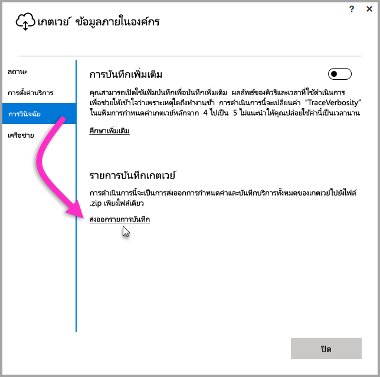
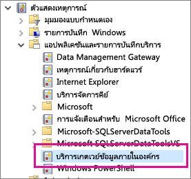

## เครื่องมือสำหรับการแก้ไขปัญหา
<a name="logs" />

### รวบรวมไฟล์บันทึกจากตัวกำหนดค่าเกตเวย์
มีไฟล์บันทึกมากมายที่คุณสามารถรวบรวมสำหรับเกตเวย์ และคุณควรเริ่มต้นด้วยไฟล์บันทึกเสมอ วิธีง่ายที่สุดในการรวบรวมไฟล์บันทึกหลังจากติดตั้งเกตเวย์คือรวบรวมผ่านหน้าจอผู้ใช้ ในหน้าจอผู้ใช้ของ**เกตเวย์ข้อมูลภายในองค์กร** เลือก**การวินิจฉัย**แล้วเลือก**ส่งออกไฟล์บันทึก**ลิงก์ที่ใกล้กับด้านล่างของหน้าดังที่แสดงต่อไปนี้

**บันทึกตัวติดตั้ง**

    %localappdata%\Temp\On-premises_data_gateway_*.log

**บันทึกการกำหนดค่า**

    %localappdata%\Microsoft\On-premises Data Gateway\GatewayConfigurator*.log

**ไฟล์บันทึกบริการเกตเวย์ข้อมูลภายในองค์กร**

    C:\Users\PBIEgwService\AppData\Local\Microsoft\On-premises Data Gateway\Gateway*.log

### ไฟล์บันทึกเหตุการณ์
ไฟล์บันทึกเหตุการณ์**บริการเกตเวย์ข้อมูลภายในองค์กร**มีอยู่ภายใต้**แอปพลิเคชันและไฟล์บันทึกบริการ**

<a name="fiddler" />

### ติดตาม Fiddler
[Fiddler](http://www.telerik.com/fiddler)เป็นเครื่องมือแบบไม่เสียค่าใช้จ่ายจาก Telerik ที่ใช้ตรวจดูการรับส่งข้อมูลของ HTTP  คุณสามารถดูด้านหลังและข้างหน้าด้วยบริการ Power BI จากเครื่องไคลเอ็นต์ ซึ่งอาจจะแสดงข้อผิดพลาดและข้อมูลอื่นๆที่เกี่ยวข้อง

