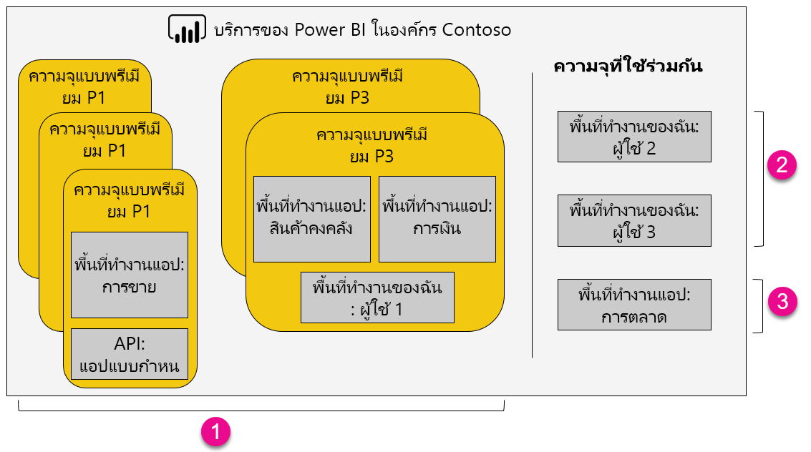

1. รายการภายในความจุพรีเมียม
   
   * การเข้าถึงพื้นที่ทำงานแอป (ในฐานะสมาชิกหรือผู้ดูแล) และการเผยแพร่แอปจำเป็นต้องมีสิทธิ์การใช้งาน Power BI Pro
   * ผู้อ่านแอปสามารถเป็นผู้ใช้ Power BI Pro หรือผู้ใช้ฟรี
   * การแชร์จำเป็นต้องมีสิทธิ์การใช้งาน Power BI Pro แต่ผู้รับสามารถเป็นผู้ใช้ Power BI Pro หรือผู้ใช้ฟรี
   * ไม่ว่าพวกเขาจะมีสิทธิ์การใช้งาน Power BI Pro หรือฟรี ผู้รับแดชบอร์ดสามารถตั้งค่าการแจ้งเตือนข้อมูล
   * REST API สำหรับการฝังตัวใช้ประโยชน์จากบัญชีบริการ ด้วยสิทธิ์การใช้งาน Power BI Pro แทนที่จะเป็นผู้ใช้
2. พื้นที่ทำงานของฉันในความจุที่แชร์
   
   * แชร์จำเป็นต้องมีสิทธิ์การใช้งาน Pro ผู้รับก็ต้องมีสิทธิ์การใช้งาน Pro ด้วย
3. พื้นที่ทำงานแอปในความจุที่แชร์
   
   * การใช้งานใดก็ตามของแอป จำเป็นต้องมีสิทธิ์การใช้งาน Pro

