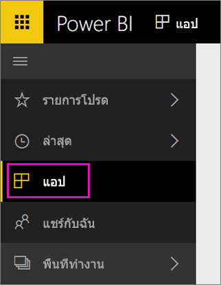

เมื่อการนำเข้าเสร็จสมบูรณ์ แอปใหม่จะปรากฏขึ้นบนหน้าแอป

1. เลือก**แอป**ในบานหน้าต่างนำทางด้านซ้าย > เลือกแอป
   
     
2. คุณสามารถถามคำถามโดยการพิมพ์ในกล่องถามตอบ หรือคลิกที่ไทล์เพื่อเปิดรายงานพื้นฐาน 

