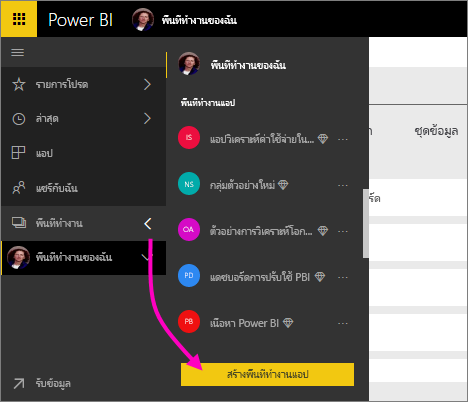
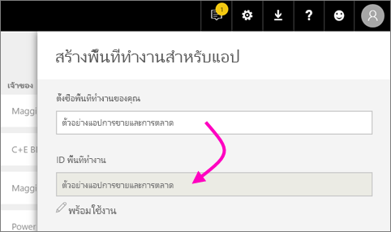
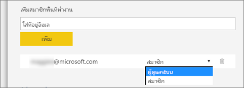
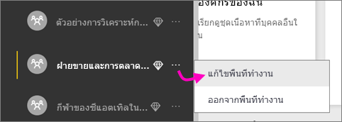

1. เริ่มต้นโดยการสร้างพื้นที่ทำงาน เลือก**พื้นที่ทำงาน** > **สร้างพื้นที่ทำงานแอป** 
   
     
   
    นี่เป็นตำแหน่งที่จะวางเนื้อหาที่คุณและเพื่อนร่วมงานของคุณทำงานร่วมกัน

2. ตั้งชื่อพื้นที่ทำงาน ถ้าชื่อ **ID พื้นที่ทำงาน**ที่ตรงกันไม่สามารถใช้ได้ แก้ไขให้ ID ใหม่มีค่าไม่ซ้ำกัน
   
     นี่จะเป็นชื่อของแอปด้วย
   
     

3. คุณมีสองสามตัวเลือกที่จะตั้งค่า ถ้าคุณเลือก**สาธารณะ** ทุกคนในองค์กรคุณสามารถดูสิ่งที่อยู่ในพื้นที่ทำงานได้ ในทางกลับกัน **ส่วนตัว** หมายถึง เฉพาะสมาชิกของพื้นที่ทำงานเท่านั้นที่สามารถดูเนื้อหา
   
     
   
    คุณไม่สามารถเปลี่ยนการตั้งค่า สาธารณะ/ส่วนตัว ได้หลังจากคุณสร้างกลุ่มแล้ว

4. คุณยังสามารถเลือกว่าสมาชิกสามารถเข้าถึงแบบ**แก้ไข**ได้หรือ**ดูเท่านั้น**
   
     
   
     แค่เพิ่มบุคคลลงในพื้นที่ทำงานแอปเพื่อให้พวกเขาสามารถแก้ไขเนื้อหาได้ ถ้าพวกเขาแค่ดูเนื้อหาเท่านั้น ไม่ต้องเพิ่มลงในพื้นที่ทำงาน คุณสามารถเพิ่มพวกเขาเมื่อคุณเผยแพร่แอป

5. ใส่ที่อยู่อีเมลของบุคคลที่คุณต้องการให้เข้าถึงพื้นที่ทำงาน และเลือก**เพิ่ม** คุณไม่สามารถเพิ่มนามแฝงของกลุ่ม เพิ่มได้แค่บุคคลอย่างเดียว

6. ตัดสินใจว่า แต่ละคนเป็นสมาชิกหรือผู้ดูแลระบบ
   
     
   
    ผู้ดูแลระบบสามารถแก้ไขพื้นที่ทำงาน รวมถึงการเพิ่มสมาชิกคนอื่น ๆ สมาชิกสามารถแก้ไขเนื้อหาในพื้นที่ทำงาน นอกจากว่าพวกเขามีสิทธิ์เข้าถึงแบบดูเท่านั้น ทั้งผู้ดูแลระบบและสมาชิกสามารถเผยแพร่แอป

7. เลือก**บันทึก**

Power BI จะสร้างพื้นที่ทำงาน และเปิดพื้นที่ทำงานนั้น ซึ่งจะปรากฏขึ้นในรายการของพื้นที่ทำงานที่คุณเป็นสมาชิก เนื่องจากคุณเป็นผู้ดูแล คุณสามารถเลือกจุดไข่ปลา (...) เพื่อกลับมา และทำการเปลี่ยนแปลง เพิ่มสมาชิกใหม่ หรือเปลี่ยนแปลงสิทธิ์ของพวกเขาได้

