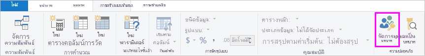
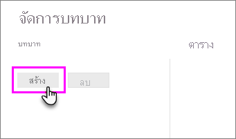
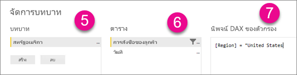
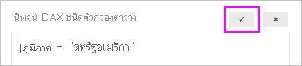

## <a name="define-roles-and-rules-in-power-bi-desktop"></a>กำหนดบทบาทและกฎใน Power BI Desktop
คุณสามารถกำหนดบทบาทและกฎภายใน Power BI Desktop เมื่อคุณเผยแพร่ไปยัง Power BI ระบบจะเผยแพร่ไปยังคำจำกัดความบทบาทด้วยเช่นกัน

เมื่อต้องการกำหนดบทบาทความปลอดภัย กรุณาทำตามขั้นตอนเหล่านี้

1. นำเข้าข้อมูลลงในรายงาน Power BI Desktop ของคุณหรือกำหนดค่าการเชื่อมต่อ DirectQuery
   
   > [!NOTE]
   > คุณไม่สามารถกำหนดบทบาทภายใน Power BI Desktop สำหรับข้อมูล Analysis Services แบบ live connection คุณต้องดำเนินการดังกล่าวภายในแบบจำลอง Analysis Services
   > 
   > 
2. จากแท็บ**การวางรูปแบบ** ให้เลือก**จัดการบทบาท**
   
   
3. จากหน้าต่าง **จัดการบทบาท** เลือก **สร้าง**
   
   
4. ภายใต้ **บทบาท** ระบุชื่อสำหรับบทบาทดังกล่าว 
5. ภายใต้ **ตาราง** เลือกตารางที่คุณต้องการนำกฎ DAX ไปใช้
6. ในกล่อง **นิพจน์ DAX ตัวกรองตาราง** ป้อนนิพจน์ DAX นิพจน์นี้จะแสดงค่าจริงหรือเท็จ ตัวอย่างเช่น: ```[Entity ID] = “Value”```
      
   

   > [!NOTE]
   > คุณสามารถใช้*username()* ภายในนิพจน์นี้ได้ โปรดทราบว่า*username()* จะมีรูปแบบของ*DOMAIN\username*ภายใน Power BI Desktop ภายในบริการ Power BI และเซิร์ฟเวอร์รายงาน Power BI นั้นอยู่ในรูปแบบของชื่อผู้ใช้หลัก (UPN) ของผู้ใช้ อีกวิธีหนึ่งคือคุณสามารถใช้ *userprincipalname()* ซึ่งจะส่งกลับผู้ใช้ในรูปแบบของชื่อหลักเสมอ *ชื่อผู้ใช้\@contoso.com*
   > 
   > 

7. หลังจากสร้างนิพจน์ DAX แล้ว ให้เลือกเครื่องหมายถูกเหนือกล่องนิพจน์เพื่อตรวจสอบความถูกต้องของนิพจน์ดังกล่าว
      
   
   
   > [!NOTE]
   > ในช่องนิพจน์นี้ คุณจะต้องใช้จุลภาคเพื่อคั่นการ์กิวเมนต์ฟังก์ชั่น DAX แม้ว่าคุณจะใช้ตำแหน่งที่ตั้งที่ปกติจะใช้เครื่องหมายอัฒภาค (เช่น ฝรั่งเศสหรือเยอรมัน) 
   >
   >
   
8. เลือก **บันทึก**

คุณไม่สามารถกำหนดผู้ใช้ให้กับบทบาทภายใน Power BI Desktop คุณกำหนดในบริการ Power BI คุณสามารถเปิดใช้งานความปลอดภัยแบบไดนามิกภายใน Power BI Desktop ด้วยการใช้ฟังก์ชัน DAX*username()* หรือ*userprincipalname()* และกำหนดค่าความสัมพันธ์ที่เหมาะสม 

