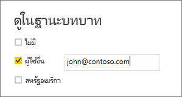

## ตรวจสอบบทบาทภายใน Power BI Desktop
คุณสามารถทดสอบผลลัพธ์ของบทบาทภายใน Power BI Desktop ได้หลังจากที่คุณสร้างบทบาทของตัวเองแล้ว

1. เลือก **มุมมองในฐานะบทบาท** 

    

    ใน **ดูในฐานะบทบาท** คุณสามารถดูบทบาทที่คุณสร้างขึ้นได้

    

3. เลือกบทบาทที่คุณสร้าง >**ตกลง** เพื่อใช้บทบาทนั้น รายงานจะแสดงข้อมูลที่เกี่ยวข้องกับบทบาทนั้น 

4. นอกจากนี้คุณยังสามารถเลือก **ผู้ใช้อื่น** และใส่ผู้ใช้ที่กำหนด การใส่ชื่อผู้ใช้หลัก (UPN) เป็นสิ่งบริการ Power BI และเซิร์ฟเวอร์รายงาน Power BI จะใช้เป็นสิ่งที่ดีที่สุด

    

1. เลือก **ตกลง** และรายงานจะแสดงตามสิ่งที่ผู้ใช้สามารถดู 

หากคุณกำลังใช้การรักษาความปลอดภัยแบบไดนามิกที่ยึดตามนิพจน์ DAX ของคุณ ใน Power BI Desktop ซึ่ง**ผู้ใช้อื่น** จะแสดงผลลัพธ์ที่แตกต่างกันเท่านั้น 

