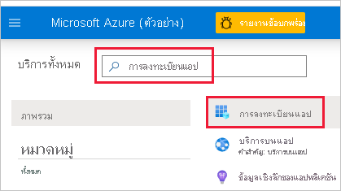
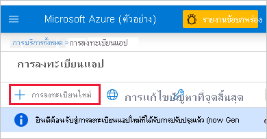

1. ลงชื่อเข้าใช้ใน [Microsoft Azure](https://ms.portal.azure.com/#allservices)

2. ค้นหา **การลงทะเบียนแอป** และคลิกลิงก์ **การลงทะเบียนแอป**

    

3. คลิก **การลงทะเบียนใหม่**

    

4. ระบุข้อมูลที่จำเป็น:
    * **ชื่อ** - กรอกชื่อสำหรับแอปพลิเคชันของคุณ
    * **ชนิดบัญชีที่ได้รับการสนับสนุน** - เลือกประเภทบัญชีที่ได้รับการสนับสนุน
    * (ไม่บังคับ) **เปลี่ยนเส้นทาง URI** - กรอก URI ถ้าจำเป็น

5. คลิก **ลงทะเบียน**

6. หลังจากลงทะเบียนแล้ว *รหัสแอปพลิเคชัน* จะพร้อมใช้งานจากแท็บ **ภาพรวม** คัดลอกและบันทึก *รหัสแอปพลิเคชัน* สำหรับใช้งานในภายหลัง

    