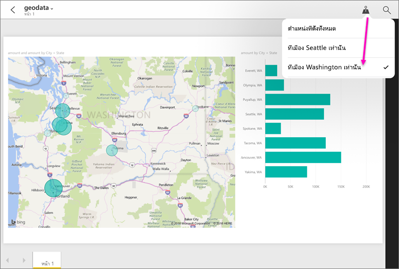

# กรองรายงานตามตำแหน่งที่ตั้งทางภูมิศาสตร์ในแอป Power BI สำหรับอุปกรณ์เคลื่อนที่
ใช้ได้กับ:

|  |  |  |  |  |
|:--- |:--- |:--- |:--- |:--- |
| iPhones |iPads |มือถือ Android |แท็บเล็ต Android |มือถือ Windows 10 |

เมื่อคุณดูที่รายงาน Power BI บนอุปกรณ์เคลื่อนที่ของคุณ คุณเห็นไอคอนรูปเข็มหมุดเล็ก ๆ ที่มุมบนขวาหรือไม่? ถ้าเป็นเช่นนั้น คุณสามารถกรองรายงานตามตำแหน่งที่ตั้งทางภูมิศาสตร์ของคุณ

> [!NOTE]
> คุณสามารถกรองตามตำแหน่ง ถ้าชื่อทางภูมิศาสตร์ในรายงานเป็นภาษาอังกฤษเท่านั้น &#150; ตัวอย่างเช่น "New York City" หรือ "Germany" แท็บเล็ต Windows 10 และพีซีไม่สนับสนุนการกรองทางภูมิศาสตร์ แต่มือถือ Windows 10 ทำได้
> 
> 

## กรองรายงานของคุณตามที่ตั้งทางภูมิศาสตร์ของคุณ
1. เปิดรายงานในแอป Power BI สำหรับอุปกรณ์เคลื่อนที บนอุปกรณ์เคลื่อนที่ของคุณ
2. ถ้ารายงานมีข้อมูลทางภูมิศาสตร์ คุณเห็นข้อความขออนุญาตให้ Power BI เข้าถึงตำแหน่งที่ตั้งของคุณ คลิก**อนุญาต** แล้วให้แตะ**อนุญาต**อีกครั้ง
3. แตะที่เข็มหมุด . คุณสามารถกรองตาม เมือง รัฐ/จังหวัด หรือ ประเทศ/ภูมิภาค ขึ้นอยู่กับข้อมูลในรายงาน ตัวกรองแสดงรายการตัวเลือก เฉพาะที่ตรงกับตำแหน่งปัจจุบันของคุณ
   
    

## ทำไมฉันจึงไม่เห็นแท็กตำแหน่งที่ตั้งในรายงาน
เงื่อนไขทั้งสามข้างล่างนี้ต้องเป็นจริง เพื่อคุณจะได้เห็นแท็กตำแหน่งที่ตั้ง 

* บุคคลที่สร้างรายงานใน Power BI Desktop [จัดประเภทข้อมูลทางภูมิศาสตร์](desktop-mobile-geofiltering.md)ให้กับคอลัมน์อย่างน้อยหนึ่งคอลัมน์ เช่น เมือง รัฐ หรือประเทศ/ภูมิภาค
* คุณอยู่ในตำแหน่งที่มีข้อมูลในคอลัมน์นั้น
* คุณกำลังใช้อุปกรณ์เคลื่อนที่อย่างใดอย่างหนึ่งในนี้:
  * iOS (iPad, iPhone, iPod)
  * มือถือหรือแท็บเล็ต Android
  * มือถือ Windows 10 (อุปกรณ์ Windows 10 อื่น ๆ เช่นพีซีและแท็บเล็ตไม่สนับสนุนการกรองทางภูมิศาสตร์)

อ่านเพิ่มเติมเกี่ยวกับ[การตั้งค่าการกรองทางภูมิศาสตร์](desktop-mobile-geofiltering.md)ใน Power BI Desktop

### ขั้นตอนถัดไป
* [เชื่อมต่อกับข้อมูล Power BI จากโลกแห่งความจริง](mobile-apps-data-in-real-world-context.md)ด้วยแอปสำหรับอุปกรณ์เคลื่อนที่
* [จัดประเภทข้อมูลใน Power BI Desktop](desktop-data-categorization.md) 
* คำถามหรือไม่ [ลองถามชุมชน Power BI](http://community.powerbi.com/)

